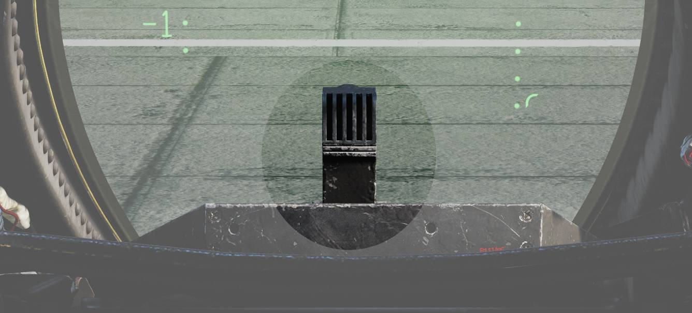
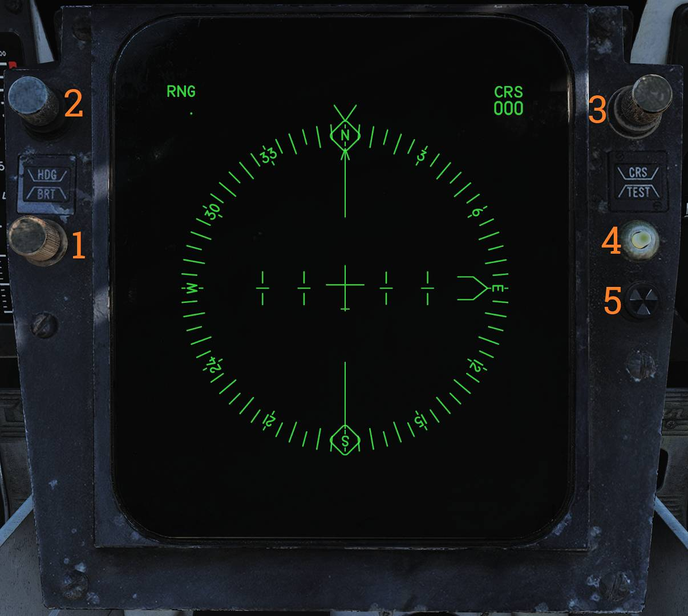

# Center Panel

## Heads-Up Display

The heads-up display (HUD) projects flight and weapon delivery information onto the forward portion
of the canopy/windscreen.

Night mode is selected using the control on the right side of the VDI.

Two engine stall warning lights, L STALL and R STALL, are mounted on the left and right sides of the
HUD, respectively. Each light indicates an engine stall condition in the corresponding engine.

> 💡 For more information see relevant chapters under
> [Navigation](../../systems/nav_com/overview.md) and
> [Weapons and Weapons Employment Overview](../../stores/overview.md).

## Cockpit Television Sensor (CTVS)

The cockpit television sensor (CTVS) records the HUD for registration of weapons delivery.

> 💡 Currently not implemented in DCS.

## Air Combat Maneuver Panel

Main pilot armament control panel.

### ACM Switch/Cover

The ACM (Air Combat Maneuver) switch/cover (<num>1</num>) enables ACM mode when lifted and provides
access to the ACM JETT button.

### ACM Jettison Button

The ACM JETT button (<num>2</num>) is located under the ACM cover and commands jettison of stores
selected on the RIO’s ARMAMENT panel.

Sidewinders are not jettisoned even if selected.

### SEAM Lock Light

The SEAM LOCK light (<num>3</num>) illuminates to indicate that Sidewinder acquisition is in
progress while in slaved and boresight SEAM modes.

The light illuminates during the 4.5-second SEAM acquisition attempt and remains illuminated if the
seeker locks onto a target.

### Collision Light

The COLLISION light (<num>4</num>) indicates collision steering has been selected during AWG-9 STT
operation.

### Hot Trigger Light

The HOT TRIG light (<num>5</num>) illuminates when HOT TRIGGER conditions are satisfied. When
illuminated, pulling the trigger will release a weapon.

### Gun Rate Pushbutton

Toggle pushbutton with light indication (<num>6</num>) selecting the M61 gun firing rate.

- HIGH - Selects 6,000 rounds per minute. Normally used for air-to-air operation.
- LOW - Selects 4,000 rounds per minute. Normally used for air-to-ground operation.

The gun rate is automatically set to HIGH when ACM mode is selected.

### Sidewinder Cooling Pushbutton

Toggle pushbutton with light indication (<num>7</num>) providing manual control of Sidewinder seeker
cooling.

Sidewinder cooling is automatically set to ON when ACM mode is selected.

### Missile Preparation Pushbutton

Toggle pushbutton with light indication (<num>8</num>) commanding the WCS to prepare AIM-54 and
AIM-7 missiles.

Missile preparation is automatically set to ON when ACM mode is commanded.

### Missile Mode Pushbutton

Toggle pushbutton with light indication (<num>9</num>) selecting missile launch mode.

- NORM - Normal missile launch mode.
- BRSIT - Boresight missile launch mode.

Controlled by the WCS when in ACM mode.

### Master Arm Switch

The MASTER ARM switch (<num>10</num>) enables weapons release and selective and auxiliary jettison.

- OFF - Disables electrical power to release circuitry.
- ON - Enables electrical power to release circuitry. Position is locked until the master arm cover
  is lifted.
- TNG - Enables in-flight training mode.

> 💡 The MASTER ARM bus is interlocked with the landing gear control lever, disabling all releases
> except emergency jettison while the gear is down.

> 💡 ACM jettison and emergency jettison are not disabled by MASTER ARM.

### Station Status Flags

Station status flags (<num>11</num>) indicate weapon readiness for each station.

- BLACK - Station not loaded or weapon not ready.
- WHITE - Station and weapon ready.
- CHECKERBOARD - Weapon selected and ready for launch. While on the ground, this indicates fuselage
  rails are up and locked and that loaded weapons are armed.

### Master Caution Light and Button

The MASTER CAUTION light and reset button (<num>12</num>) flashes to indicate a status change on the
pilot caution/advisory panel.

Press to acknowledge and extinguish the light until the next event.

### Engine Fire Warning Lights

The L FIRE and R FIRE lights (<num>13</num>) illuminate when fire is detected in the respective
engine.

### Turn-and-Slip Indicator

The turn-and-slip indicator (<num>14</num>) displays rate of turn about the aircraft vertical axis
and slip/skid.

The upper section contains an electrically driven pointer, where one needle deflection corresponds
to a 360° turn in four minutes. The lower section contains an inclinometer with a ball suspended in
damping fluid.

## Vertical Display Indicator (VDI)

The vertical display indicator (VDI) complements the HUD by displaying flight and weapon
information.

> 💡 The VDI has a red night filter that can be installed by clicking in the middle of the VDI
> screen.

### HUD Brightness Control

The HUD BRT control (<num>1</num>) adjusts HUD brightness.

### VDI Brightness Control

The VDI BRT control (<num>2</num>) adjusts VDI brightness.

### VDI Contrast Control

The VDI CONT control (<num>3</num>) adjusts VDI contrast.

### Filter Handle

The FILTER handle (<num>4</num>) inserts the night filter for HUD night operation when pulled.

### HUD Trim Control

The HUD TRIM control (<num>5</num>) adjusts/aligns pitch lines on the HUD.

### VDI Trim Control

The VDI TRIM control (<num>6</num>) adjusts/aligns pitch lines on the VDI.

### VDI Caution Lights

VDI-mounted caution lights (<num>7</num>) provide data link warning and caution indications. See VDI
Caution Indication below.

### VDI Caution Indication

Data link warning and caution lights situated at the VDI panel.

| Indicator    | Function                                                                                                                                                                                   |
| ------------ | ------------------------------------------------------------------------------------------------------------------------------------------------------------------------------------------ |
| ADJ A/C      | Advisory light indicating other aircraft close to own traffic pattern.                                                                                                                     |
| LANDING CHK  | Advisory light indicating carrier has a channel ready for ACL and that the crew should prepare for carrier landing.                                                                        |
| ACL READY    | Warning light indicating CATCC has acquired the aircraft and is transmitting glidepath information to the aircraft.                                                                        |
| A/P CPLR     | Warning light indicating CATCC is ready to control the aircraft.                                                                                                                           |
| CMD CONTROL  | Warning light indicating the aircraft is under data link control for landing.                                                                                                              |
| 10 SECONDS   | Warning light indicating that carrier motion is added to data link info and commands during landing. Indicates 10 seconds to arrival at the next point in approach pattern in other modes. |
| TILT         | Warning light indicating no data link command received for the last 2 seconds during ACL. When not in ACL, it indicates no data link messages during the last 10 seconds.                  |
| VOICE        | Warning light indicating CATCC not ready for ACL, switch to standard voice procedures.                                                                                                     |
| A/P REF      | Warning light indicating autopilot selected but not engaged. Exception: altitude and heading hold.                                                                                         |
| WAVEOFF      | Warning light indicating waveoff commanded.                                                                                                                                                |
| WING SWEEP   | Warning light indicating failure in both wing-sweep channels or disengagement of spider detent.                                                                                            |
| REDUCE SPEED | Warning light indicating flap retraction failure with greater than 225 knots indicated airspeed. Also indicates safe Mach number exceeded.                                                 |
| ALT LOW      | Non-functional, light on radar altimeter is used instead.                                                                                                                                  |

## Horizontal Situation Display Indicator (HSD)

The horizontal situation display (HSD) displays navigational information to the pilot and can repeat
the RIO’s TID.

### HSD Brightness Control

The BRT control (<num>1</num>) adjusts HSD brightness.

### Heading Bug Control

The HDG control (<num>2</num>) adjusts the heading reference bug in TACAN mode.

### Course Control

The CRS control (<num>3</num>) sets desired course in MAN (manual) and TACAN modes.

### Test Button

The TEST button (<num>4</num>) resets the HSD if overload protection has tripped and displays the
HSD IR field test display.

### BIT Indicator

The BIT indicator (<num>5</num>) indicates HSD failure by displaying white flags. Reset by rotating
clockwise.

> 💡 For more information see relevant chapters under
> [Navigation](../../systems/nav_com/overview.md) and for the TID repeat Tactical Information
> Display (TID) and Associated Controls.

## Cabin Pressure Altimeter

Displays cabin pressure in 1,000-foot increments from 0 to 50,000 feet.

## Emergency Brake Pressure Indicator

Displays hydraulic pressure available from the emergency brake accumulators to the auxiliary and
parking wheel brake systems.

### Parking Brake Pressure

The PARK indication shows brake pressure available for parking brakes.

The green segment indicates 2,150 to 3,000 psi and the red segment indicates 1,900 to 2,150 psi.
When in the green, sufficient pressure is available for approximately three brake applications.

### Auxiliary Brake Pressure

The AUX indication shows brake pressure available for the auxiliary brake system, usable via toe
brakes.

The green segment indicates 2,150 to 3,000 psi (approximately 13 to 14 applications) and the red
segment indicates 1,900 to 2,150 psi (approximately five applications).

## Control Stick

The control stick provides aircraft roll and pitch control and contains additional weapon and
aircraft control functions.

### Bomb Release Button

The bomb release button (<num>1</num>) is the stores release control used for air-to-ground ordnance
(except rockets) and loaded external countermeasures.

### Pitch and Roll Trim Hat

The pitch and roll trim hat (<num>2</num>) controls aircraft trim.

Up/down commands pitch trim and left/right commands roll trim.

### Weapon Select Hat

Selector hat (<num>3</num>) moveable up and down and depressible. Used to select weapon type and
variants.

- SP or PH - Selects AIM-7 or AIM-54. Depression toggles between types.
- SW - Selects AIM-9. Depression toggles between stations.
- GUN - Selects M61A1 Vulcan gun.
- OFF - Inhibits weapon release.

### DLC and Maneuver Flap Command Wheel

The DLC and maneuver flap command wheel (<num>4</num>) controls DLC or maneuver flaps depending on
configuration.

With DLC engaged, forward rotation extends spoilers and aft rotation retracts spoilers.

With flaps up and DLC disengaged, forward rotation retracts maneuvering flaps/slats and aft rotation
extends them.

The control logic is that pulling the wheel toward the pilot increases lift and pushing it away
decreases lift.

### DLC Engage/Disengage and Countermeasure Dispense Button

The DLC engage/disengage and countermeasure dispense button (<num>5</num>) engages DLC when flaps
are down, throttles are below MIL, and no spoiler system failure is present.

With flaps up, this button commands the ALE-39 to dispense chaff or flares per RIO settings.

DLC disengages with another momentary press, raising flaps, or advancing either throttle to MIL.

### Autopilot Reference and Nosewheel Steering Button

The autopilot reference and nosewheel steering button (<num>6</num>) toggles nosewheel steering with
weight on wheels.

With weight off wheels, it engages enabled autopilot modes.

### Autopilot Emergency Disengage Paddle

The autopilot emergency disengage paddle (<num>7</num>) disengages all autopilot modes and DLC and
releases autopilot switches and roll and pitch SAS switches to OFF.

With weight on wheels, it additionally reverts throttle mode to MAN (manual) while depressed.

### Weapon Firing Trigger

The weapon firing trigger (<num>8</num>) is a two-stage trigger.

The first detent enables CTVS and gun camera. The second detent releases the selected forward-firing
weapon.

> 💡 CTVS and gun camera are not implemented in DCS.
