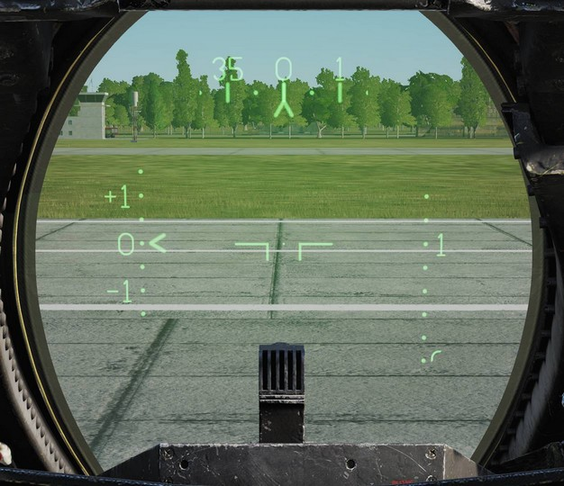
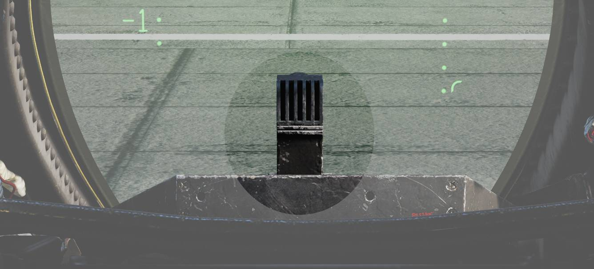
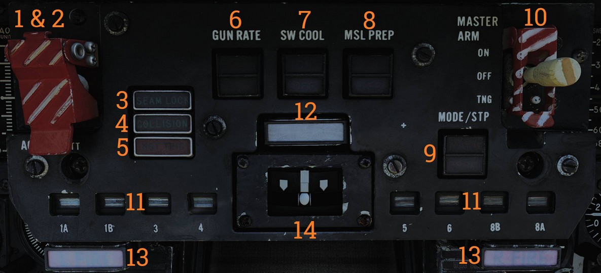
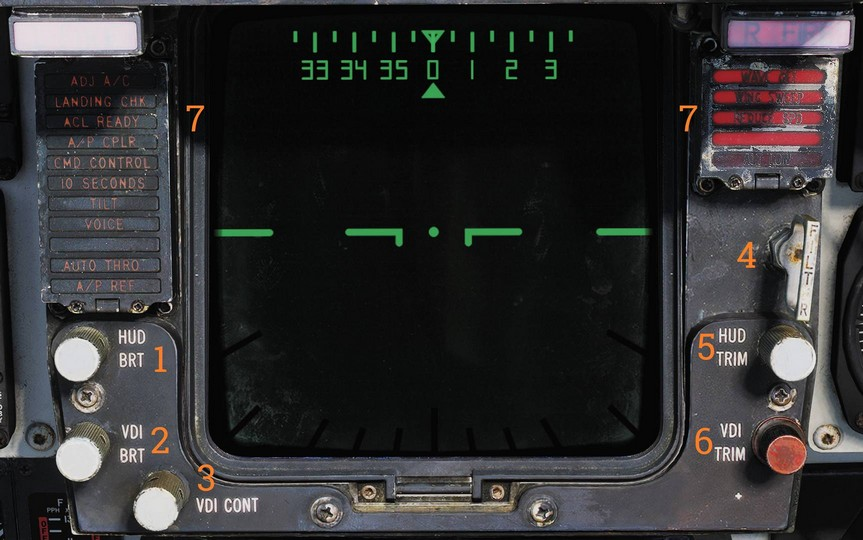
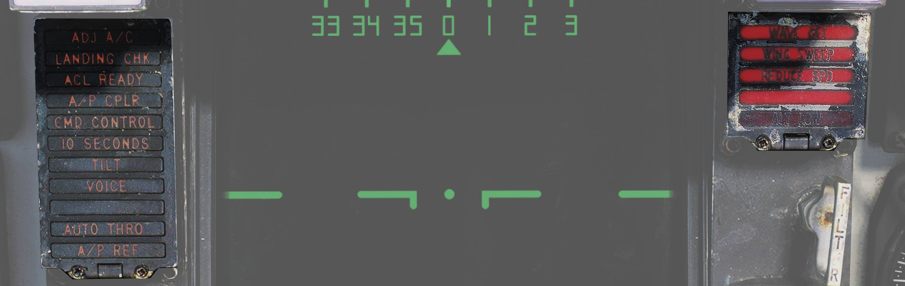

# 中央仪表板

## 平视显示器

平视显示器用于在驾驶舱前部/风挡玻璃上投影飞行和武器投放数据。

使用位于 VDI 右侧的 FILTER 手柄可以选择夜间模式。

HUD 的左侧和右侧分别装有失速告警灯（L STALL 和 R STALL 告警灯）。它们分别指示对应一侧发动机失速。

> 💡 请查阅 [导航](../../systems/nav_com/overview.md) 和
> [武器和武器使用概述](../../stores/overview.md) 来获得更多相关信息。

## 驾驶舱电视传感器（CTVS）

驾驶舱电视传感器（CTVS）录制 HUD 视频，用于记录武器投放信息。

> 💡 目前在 DCS 中尚未模拟。

## 空战格斗面板

飞行员主要的武器控制面板。

### ACM 开关 / 保护盖

升起 ACM（空战格斗）保护盖 (<num>1</num>) 会激活 ACM 模式并允许使用 ACM 抛弃按钮。

### ACM JETT（抛弃）按钮

ACM 保护盖开关下的抛弃按钮 (<num>2</num>) 用于抛弃 RIO 武器控制面板上选择的挂载。

即使 RIO 选择了“响尾蛇”导弹，按下抛弃按钮也不会抛弃“响尾蛇”导弹。

### SEAM LOCK 提示灯

当“响尾蛇”导弹在隶属或瞄准轴下进入 SEAM 模式，且导引头正进行尝试捕获目标时，SEAM
LOCK 提示灯将会亮起。

SEAM LOCK 提示灯会在 SEAM 尝试进行锁定的4.5秒期间内亮起，如果导引头成功锁定目标则继续保持亮起。

### COLLISION 注意灯

COLLISION 注意灯 (<num>4</num>) 亮起表示 AWG-9 STT（单目标跟踪）操作时选择了恒量角度拦截转向模式。

### HOT TRIG 告警灯

红指示灯 (<num>5</num>) 亮起起表示满足武器发射逻辑的条件（HOT
TRIGGER）。指示灯亮起时，按下扳机会发射武器。

### GUN RATE 按钮开关

航炮射速选择开关 (<num>6</num>) ，用于切换航炮射速模式，开关中的指示灯显示了当前选择的模式。

- HIGH - 高射速，选择6000发每分钟的航炮射速。通常用于空对空攻击。
- LOW - 低射速，选择4000发每分钟的航炮射速。通常用于空对地攻击。

进入 ACM 模式后系统会自动选择 HIGH 模式。

### SW COOL 按钮开关

“响尾蛇”冷却开关 (<num>7</num>) ，这是一个带有指示灯的按钮开关。按下按钮来手动开启或关闭“响尾蛇”导引头冷却。

选择 ACM 模式后将自动切换至 ON（开启）。

### MSL PREP 按钮开关

导弹发射准备开关 (<num>8</num>) ，这是一个带有指示灯的按钮开关。按下开关来指令 WCS（武器控制系统）开始 AIM-54 和 AIM-7 导弹的准备工作。

进入 ACM 模式时，开关将被自动设置为 ON。

### MSL MODE 按钮开关

导弹模式选择开关 (<num>9</num>)，这是一个带有指示灯的按钮开关。

- NORM - 正常导弹发射模式。
- BRSIT - 瞄准轴导弹发射模式。

在 ACM 模式下，导弹发射模式由 WCS 控制。

### 主军械开关

主军械开关 (<num>10</num>) ，开启主军械开关将允许武器发射、挂载选择抛弃和辅助抛弃。

- OFF - D断开武器发射电路的电源。
- ON - 接通武器发射电路的电源。主军械保护盖升起后才可选择该档位。
- TNG - 启用飞行训练模式。

> 💡 MASTER
> ARM（主军械）总线控制与起落架控制手柄互锁，起落架放下时，将禁用除应急抛弃以外的所有发射电路。

> 💡 主军械开关并不会禁用 ACM JETT 和应急抛弃功能。

### 挂点状态标识旗

挂点状态标识旗 (<num>11</num>) 显示每个挂点的武器状态。

- 黑色 - 挂点未挂载武器，或武器未就绪。
- 白色 - 挂点和武器准备就绪。
- 方格 - 已选择挂点中的武器并准备好发射。在地面时，方格图案表示机身导轨已安装并锁定，且挂载的武器已解除保险。

### MASTER CAUTION 指示灯以及按钮

主注意灯和复位按钮 (<num>12</num>)，灯光闪烁表示飞行员注意/提示灯面板上灯光状态发生变化。

按下来复位主注意灯并熄灭灯光，直到下一个事件被触发。

### L FIRE 和 R FIRE 告警灯

发动机失火告警灯 (<num>13</num>) 。当感测到对应一侧发动机内失火时指示灯将会亮起。

### 转弯侧滑仪

转弯侧滑仪(<num>14</num>) 显示飞机绕纵轴旋转的速率以及侧滑。

转弯侧滑仪上半部分是一个电动指针，一个指针的宽度表示4分钟内完成一个360°转弯。转弯侧滑仪下半部分由一个测斜仪——一个用于指示侧滑的悬浮在阻尼液中的小球组成。

## 垂直显示指示器（VDI）

为 HUD 补充显示飞行和武器数据。

> 💡 点击 VDI 屏幕中央可以加装一个夜间滤光片。

### HUD 亮度控制旋钮

(<num>1</num>)用于控制 HUD 的亮度。

### VDI BRT（亮度）控制旋钮

(<num>2</num>) 用于控制 VDI 的亮度。

### VDI CONT（对比度）控制旋钮

(<num>3</num>)用于控制 VDI 的对比度。

### FILTER 手柄

(<num>4</num>)抽出手柄来插入滤光片以便在夜间使用 HUD。

### HUD TRIM 旋钮

HUD 调节旋钮 (<num>5</num>)，使用这个旋钮来调整 HUD 上的俯仰梯度。

### VDI TRIM 旋钮

VDI 调节旋钮 (<num>6</num>)，使用这个旋钮来调整 VDI 上的俯仰梯度。

### VDI Caution Lights

安装在 VDI 面板上的注意灯 (<num>7</num>)，提供数据链路警告和注意知识。

| 指示器       | 功能                                                                                                                                |
| ------------ | ----------------------------------------------------------------------------------------------------------------------------------- |
| ADJ A/C      | 提示灯，指示有其他飞机接近本机当前的起降航线。                                                                                      |
| LANDING CHK  | 提示灯，亮起表示母舰存在可用于 ACL 作业的波道，且机组成员应做好着舰准备。                                                           |
| ACL READY    | 告警灯，指示 CATCC（母舰空中交通管制中心）已经获取本机信息，且正在向本机传输下滑道信息。                                            |
| A/P CPLR     | 告警灯，指示 CATCC 已准备控制飞机。                                                                                                 |
| CMD CONTROL  | 告警灯，指示飞机正由数据链路控制进行助降。                                                                                          |
| 10 SECONDS   | 告警灯，指示在 ACL 着舰过程中，母舰的运动也被添加至下滑道信息和数据链路指令中。在其它模式下则表示还有10秒抵达着舰航线的下一特殊点。 |
| TILT         | 告警灯，指示 ACL 过程中，超过2秒未接收到数据链路指令。非 ACL 模式下，报警指示灯亮起起表示过去的10秒内未接收任到何数据链路信息。     |
| VOICE        | 告警灯，指示 CATCC 未准备好进行 ACL，切换至标准的话音进近流程。                                                                     |
| A/P REF      | 告警灯，指示已选择自动驾驶，但未接通自动驾驶。                                                                                      |
| WAVEOFF      | 告警灯，指示执行复飞指令。                                                                                                          |
| WING SWEEP   | 告警灯，亮起表示两侧的机翼后掠控制通道中出现故障，或表示应急机翼后掠手柄的随动限位器解除。                                          |
| REDUCE SPEED | 告警灯，亮起表示指示空速超过225节以及襟翼故障无法收上。也用于指示飞机空速超过最大安全马赫数。                                       |
| ALT LOW      | 无功能，改用无线电高度表上的灯光。                                                                                                  |

## 水平状态显示器（HSD）

水平状态显示器用于向飞行员显示导航信息。HSD 也用于复显 RIO TID 中显示的内容。

### BRT 旋钮

亮度旋钮 (<num>1</num>)，用于控制 HSD 的亮度。

### HDG 旋钮

航向选择旋钮 (<num>2</num>)，用于 TACAN 模式下设定参考航向游标。

### CRS 旋钮

航线旋钮 (<num>3</num>)，用于在 TACAN 和 MAN（手动）模式下设定所需航线。

### TEST 按钮

测试按钮 (<num>4</num>)，如果触发了过载保护，HSD 显示消失，则可以通过这个按钮来复位 HSD 显示。同时也用于在 HSD 上显示 HSD
IR 视场测试。

### BIT 指示灯

(<num>5</num>) 显示白色标识旗时，表示 HSD 故障。逆时针转动旋钮来复位指示灯。

> 💡 请查阅 [导航](../../systems/nav_com/overview.md)
> 和 战术信息显示器（TID）与相关控制开关/按钮 中的相关章节来获取更多相关信息。

## 座舱压力高度表

以千英尺为单位显示从0至50000英尺的座舱气压高度。

## 应急刹车压力表

显示应急刹车蓄压器中的可用于备用刹车和停放刹车系统的油液压力。

### 停放刹车压力

PARK 显示停放刹车可用的刹车压强。

绿色区域对应的范围是2150至3000 psi（磅力每平方英寸），红色区域对应的范围是1900至2150
psi。指针指向绿色时，蓄压器中的液压压强可供刹车进行约三次制动操作。

### 辅助刹车压力

显示辅助刹车蓄压器中的压力，飞行员可以通过脚蹬刹车来使用蓄压器中的压力来进行制动。

绿色区域对应的范围是2150至3000 psi（约可提供13至14次刹车制动），而红色区域对应的范围则是1900至2150
psi（约可提供5次刹车制动）。

## 驾驶杆

用于控制飞机横滚和俯仰以及包含额外武器和飞机控制功能。

### 航弹投放按钮

挂载投放按钮 (<num>1</num>)，用于投放空对地挂载（航空火箭弹例外）或挂载的额外对抗措施。

### 俯仰和横滚配平开关

苦力帽开关 (<num>2</num>) 用于控制配平。

上下来进行俯仰配平，左右来进行横滚配平。

### 武器选择开关

选择开关 (<num>3</num>) 可上下移动，也可按下。用来选择武器类型。

- SP 或 PH - 选择 AIM-7 或 AIM-54，按下开关来切换选中的导弹类型。
- SW - 选择 AIM-9，按下开关来切换选中的 AIM-9 挂点。
- GUN - 选择M-61A1“火神”航炮。
- OFF - 禁止武器发射。

### DLC 和机动襟翼控制拨轮

拨轮 (<num>4</num>) 用于根据构型控制 DLC（直接升力控制）或机动襟翼。

启用 DLC 时，向前转动拨轮伸出扰流板，向后转动拨轮收起扰流板。

起落架和襟翼收上且 DLC 解除时，向前转动拨轮收起机动襟翼/缝翼，向后转动拨轮放下机动襟翼/缝翼。

这个功能背后的逻辑是，向后拨动拨轮来增加升力，向前拨动拨轮来减小升力。

### DLC 启用/解除和对抗措施弹射按钮

(<num>5</num>) 在襟翼放下、油门不超过 MIL（军用推力）、且扰流板系统无故障时，短按按钮来启用 DLC。

襟翼收上时，按下按钮会发送指令给 ALE-39 根据 RIO 的设置弹射箔条和红外干扰弹。

再次按下按钮、收起襟翼或将油门推至超过 MIL 位置，DLC 便会解除。

### 自动驾驶接通和前轮转向按钮

(<num>6</num>) 机轮负重时，按下按钮来启用或关闭前轮转向系统。

机轮不负重时，按下按钮来启用当前选定的自动驾驶模式。

### 自动驾驶应急断开宽柄开关

(<num>7</num>) 断开所有自动驾驶模式和 DLC，同时将所有自动驾驶模式开关弹回中立位置，并将横滚和俯仰 SAS（增稳系统）开关退回 OFF 位置。

机轮负重时，按下紧急断开开关也会将油门模式退回 MAN（手动）模式。

### 武器发射扳机

(<num>8</num>) 两段式扳机。

第一段激活 CTVS（驾驶舱电视传感器）和照相枪。第二段发射选中的前射武器。

> 💡 DCS 中未实装 CTVS 功能。
