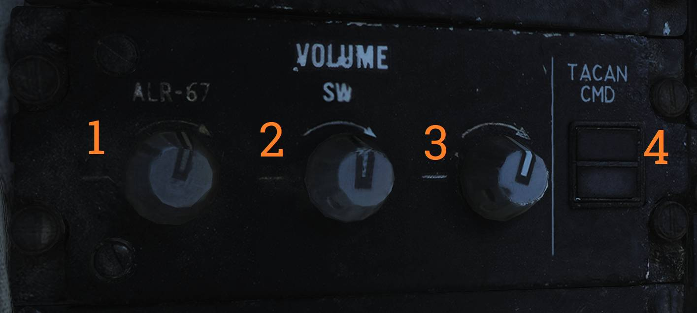
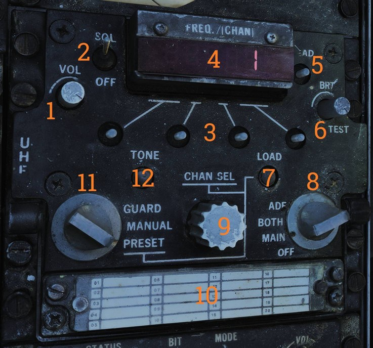
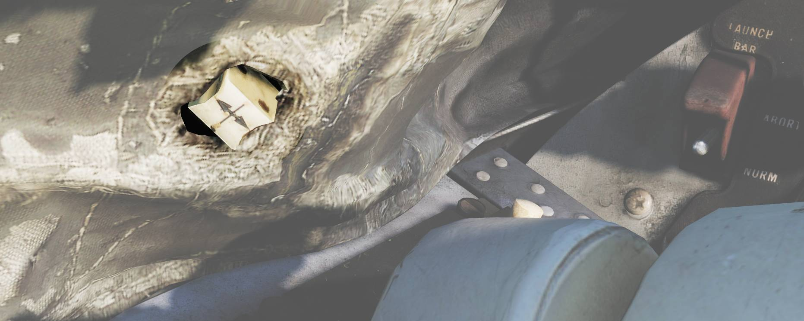
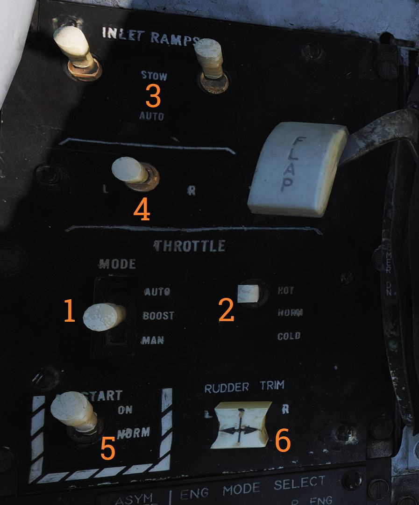

# Left Side Console

## G-valve Button

The G-valve button is pressed to test inflation of the g-suit.

## Oxygen-Vent Airflow Control Panel

Controls ventilation airflow to the pressure suit or seat cushions and controls oxygen flow to the
pilot mask.

### Vent Airflow Dial

The VENT AIRFLOW dial (<num>1</num>) controls ventilation airflow through the pressure suit or, if a
pressure suit is not worn, through the seat cushions.

### Oxygen Switch

The OXYGEN switch (<num>2</num>) controls oxygen flow to the pilot mask.

- ON — Enables oxygen flow.
- OFF — Disables oxygen flow.

## Volume/TACAN Command Panel

Controls pilot headset audio volumes and selects which crewmember is in command of TACAN operation.

### F-14B and F-14A (Late)

#### ALR-67 Volume Knob

The ALR-67 knob (<num>1</num>) controls audio volume from the ALR-67 to the pilot.

#### Sidewinder Tone Volume Knob

The SW knob (<num>2</num>) controls Sidewinder audio tone volume to the pilot.

#### V/UHF 2 Volume Knob

The V/UHF 2 knob (<num>3</num>) controls AN/ARC-182 (V/UHF 2) audio volume to the pilot.

#### TACAN Command Switch

The TACAN CMD switch (<num>4</num>) selects which crewmember controls TACAN and indicates the
current setting.

### F-14A (Early)

#### ALR-45 Volume Knob

The ALR-45 knob (<num>1</num>) controls audio volume from the ALR-45 to the pilot.

#### ALR-50 Volume Knob

The ALR-50 knob (<num>2</num>) controls audio volume from the ALR-50 to the pilot.

#### Sidewinder Tone Volume Knob

The SW knob (<num>3</num>) controls Sidewinder audio tone volume to the pilot.

#### V/UHF 2 Volume Knob

The V/UHF 2 knob (<num>4</num>) controls AN/ARC-182 (V/UHF 2) audio volume to the pilot.

#### TACAN Command Switch

The TACAN CMD switch (<num>5</num>) selects which crewmember controls TACAN.

## TACAN Control Panel

TACAN control panel used by the pilot when in command of TACAN.

### Channel Selector (Dual Rotary Switch)

The dual rotary switch (<num>1</num>) selects the TACAN channel.

The outer dial selects the first two digits and the inner dial selects the final digit.

### GO and NO-GO Lights

The GO and NO-GO lights (<num>2</num>) indicate the result of the TACAN BIT.

### BIT Button

The BIT button (<num>3</num>) initiates TACAN BIT.

### Mode Switches (X/Y and Operating Mode)

The MODE switches (<num>4</num>) select TACAN operating mode and X or Y channel operation.

INVERSE mode is not functional.

### TACAN Audio Volume Knob

The VOL knob (<num>5</num>) controls TACAN audio volume to the pilot.

### TACAN Mode Selector Knob

The mode knob (<num>6</num>) selects TACAN function.

The following modes are available:

- OFF — TACAN off.
- REC — Receive only.
- T/R — Transmit and receive. Enables range readout.
- A/A — Air-to-air TACAN mode.
- BCN — Beacon mode. Not functional.

## ICS Control Panel

Control panel for the intercommunications system (ICS).

### ICS Volume Knob

The VOL knob (<num>1</num>) controls intercommunication audio volume from the RIO to the pilot.

### Amplifier Selection Knob

The amplifier selection knob (<num>2</num>) selects which amplifier drives pilot headset audio.

The following amplifiers are available:

- B/U — Backup amplifier.
- NORM — Normal amplifier.
- EMER — Emergency amplifier. Uses the RIO’s amplifier and his volume settings and prevents
  monitoring of pilot-only audio such as Sidewinder tone and engine stall/overtemperature warnings.

### ICS Function Switch

The ICS switch (<num>3</num>) selects ICS operating function.

Available ICS functions are:

- RADIO OVERRIDE — ICS audio overrides radio audio.
- HOT MIC — Enables intercom without pressing PTT. Also allows ground crew communication through the
  external interphone.
- COLD MIC — Intercom only while PTT is pressed.

## AFCS Control Panel

Control panel for AFCS and autopilot control.

> 💡 All switches are spring-loaded to OFF but held in position by a solenoid, allowing automatic
> disengagement when applicable.

### Pitch Stability Augmentation Switch

The PITCH switch (<num>1</num>) enables pitch stability augmentation.

### Roll Stability Augmentation Switch

The ROLL switch (<num>2</num>) enables roll stability augmentation.

### Yaw Stability Augmentation Switch

The YAW switch (<num>3</num>) enables yaw stability augmentation.

### VEC/PCD/ACL Switch

The VEC/PCD/ACL switch (<num>4</num>) selects remote-control autopilot modes.

- VEC/PCD — Vector/PCD mode. Data link controls roll and pitch. Engaged using the NWS button on the
  pilot stick.
- OFF — Remote-control function off.
- ACL — Automatic carrier landing mode. Engaged using the NWS button on the pilot stick.

### Altitude Hold Switch

The ALT switch (<num>5</num>) enables altitude hold. The mode is engaged using the NWS button on the
pilot stick.

### Heading Mode Switch

The HDG switch (<num>6</num>) selects heading-related autopilot modes.

- HDG — Heading hold.
- OFF — Heading hold off.
- GT — Ground track mode. Engaged using the NWS button on the pilot stick.

### Autopilot Engage Switch

The ENGAGE switch (<num>7</num>) engages the autopilot.

- ENGAGE — Autopilot on.
- OFF — Autopilot off.

## UHF 1 (AN/ARC-159) Radio

Pilot UHF radio (UHF 1) and controls.

> 💡 ADF is nonfunctional with the AN/ARC-159. Use V/UHF 2 instead.

### Volume Knob

The VOL knob (<num>1</num>) controls UHF 1 audio volume to the pilot headset.

### Squelch Switch

The SQL switch (<num>2</num>) enables or disables squelch.

- ON — Squelch enabled.
- OFF — Squelch disabled.

### Frequency Select Switches

The frequency select switches (<num>3</num>) set the active frequency.

### Frequency/Channel Display

The FREQ/(CHAN) display (<num>4</num>) shows the selected frequency or channel.

### Read Button

The READ button (<num>5</num>) displays the selected channel while held.

### Brightness Knob

The BRT knob (<num>6</num>) controls display brightness.

### Load Button

The LOAD button (<num>7</num>) loads the set frequency into the selected preset channel.

### Function Selector Knob

The function selector knob (<num>8</num>) selects radio function.

### Channel Select Knob

The CHAN SEL knob (<num>9</num>) selects the preset channel.

### Preset Channels Chart

The preset channels chart (<num>10</num>) is used to record preset channel frequencies.

### Mode Selector Knob

The mode selector knob (<num>11</num>) selects frequency selection mode.

### Tone Button

The TONE button (<num>12</num>) transmits a tone on the current frequency.

## ASYM Limiter/Engine Mode Select (F-14B only)

Control panel for the asymmetric thrust limiter system and engine control mode selection.

### Asymmetry Limiter Switch

The ASYM LIMITER switch (<num>1</num>) enables or disables the afterburner thrust asymmetry limiter.

- ON — Limiter enabled.
- OFF — Limiter disabled.

### Engine Mode Select Switches

The ENG MODE SELECT switches (<num>2</num>) select control mode for each engine.

Selectable engine modes are:

- PRI — Primary engine control mode.
- SEC — Secondary engine control mode.

## Target Designate Switch

The target designate switch is used to designate ground targets on the HUD and to command pilot ACM
radar modes (except PLM).

The switch can be moved up, down, and forward (designate).

In air-to-ground mode, up and down move the designator and forward designates.

In other modes, up and down select VSL HI and VSL LO, respectively, and forward selects PAL.

## Inlet Ramps/Throttle Control Panel

Control panel for engine systems, throttle settings, and rudder trim.

### Throttle Mode Switch

The THROTTLE MODE switch (<num>1</num>) selects throttle operation mode.

- AUTO — Automatic.
- BOOST — Boosted.
- MAN — Manual.

### Throttle Temp Switch

The THROTTLE TEMP switch (<num>2</num>) selects throttle computer gain.

- HOT — Hot.
- NORM — Normal.
- COLD — Cold.

### Inlet Ramps Switches

The INLET RAMPS switches (<num>3</num>) select operational mode for the respective engine inlet
ramps.

- STOW — Stowed.
- AUTO — Automatic.

### Engine Crank Selector

The ENG CRANK selector (<num>4</num>) selects engine crank for left or right engine.

### Airstart/Backup Ignition Switch

The Airstart/BACK UP IGNITION switch (<num>5</num>) toggles engine backup ignition.

- ON — Airstart/Backup ignition enabled.
- OFF — Airstart/Backup ignition disabled.

### Rudder Trim Switch

The RUDDER TRIM switch (<num>6</num>) adjusts rudder trim.

## Throttle

The throttle grips contain HOTAS flight controls.

### Speed Brake Switch

The speed brake switch (<num>1</num>) controls speed brake extension and retraction.

- EXT — Momentary. Extends the speed brake incrementally while held and holds the achieved position
  when released.
- RET — Retracts the speed brake.

### Wing-Sweep Switch

The wing-sweep switch (<num>2</num>) controls wing sweep. Manual mode only allows positions aft of
the CADC commanded position.

- AUTO — Wing sweep controlled automatically by CADC.
- FWD — Sweeps wings forward manually.
- AFT — Sweeps wings aft manually.
- BOMB — Commands 55° wing sweep if currently forward of 55°. If CADC commanded position is aft of
  55°, wing sweep follows CADC instead.

### PLM Button

The PLM button (<num>3</num>) commands pilot lockon mode of the AWG-9 and disengages autopilot while
in ACL.

### CAGE/SEAM Button

The CAGE/SEAM button (<num>4</num>) commands AIM-9 CAGE/SEAM for lock-on and disengages APC when in
use.

### Exterior Light Switch

The exterior light switch (<num>5</num>) controls exterior lights.

- OFF — Disables exterior lights and increases approach light intensity.
- ON — Enables exterior lights and dims approach lights.

### ICS PTT Switch

The ICS PTT switch (<num>6</num>) keys radios and/or intercom for transmission.

- ICS — Keys intercommunication to the RIO.
- BOTH — Keys UHF 1 and V/UHF 2.
- UHF1 — Keys UHF 1.
- UHF2 — Keys V/UHF 2.

## Throttle Quadrant

| Quadrant                                                   | Schema                                                            |
| ---------------------------------------------------------- | ----------------------------------------------------------------- |
|  |  |

The throttle quadrant contains the two main engine throttle controls, the flap lever, and the manual
wing-sweep handle, in addition to HOTAS controls on the throttles.

The throttles have detents in the OFF, IDLE, and MIL positions.

Moving the throttles from OFF to IDLE arms ignition and disengages fuel cutoff.

The sideways throttle movements are not spring-loaded, allowing the pilot to rest the throttles at
MIL during catapult launches and preventing accidental spool-down.

A friction lever for throttle movement friction is located on the left side of the throttle quadrant
beneath the flap lever.

The flap lever has a stepless range of motion between up and down and includes two emergency
positions, emergency up and emergency down. Both have detents and require moving the lever outboard
to continue into the emergency range.

Emergency up forces the flaps up, overriding normal flap logic. Emergency down is non-functional.

The manual/emergency wing-sweep handle is guarded and normally stowed. The handle top is extended
for manual operation.

For more information see [Wing-Sweep System](../../systems/flight_controls_gear/wing_sweep.md).

## Hydraulic Hand Pump

The hydraulic hand pump is located inboard of the throttle quadrant near the pilot’s left leg.

It is used to manually build hydraulic pressure for brake operation (with the gear handle down) or
for refueling probe operation in the event of hydraulic system failure.
