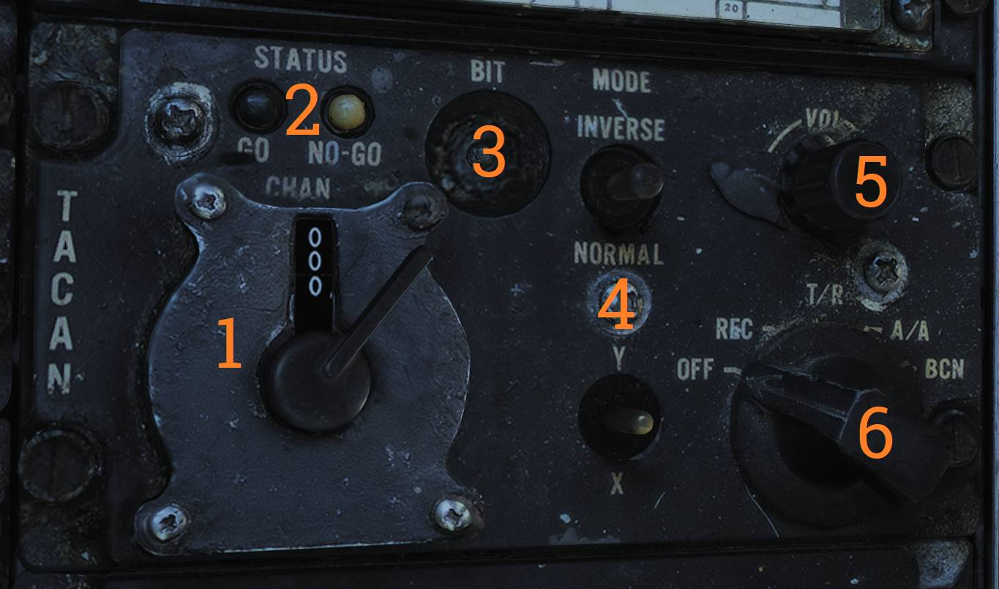
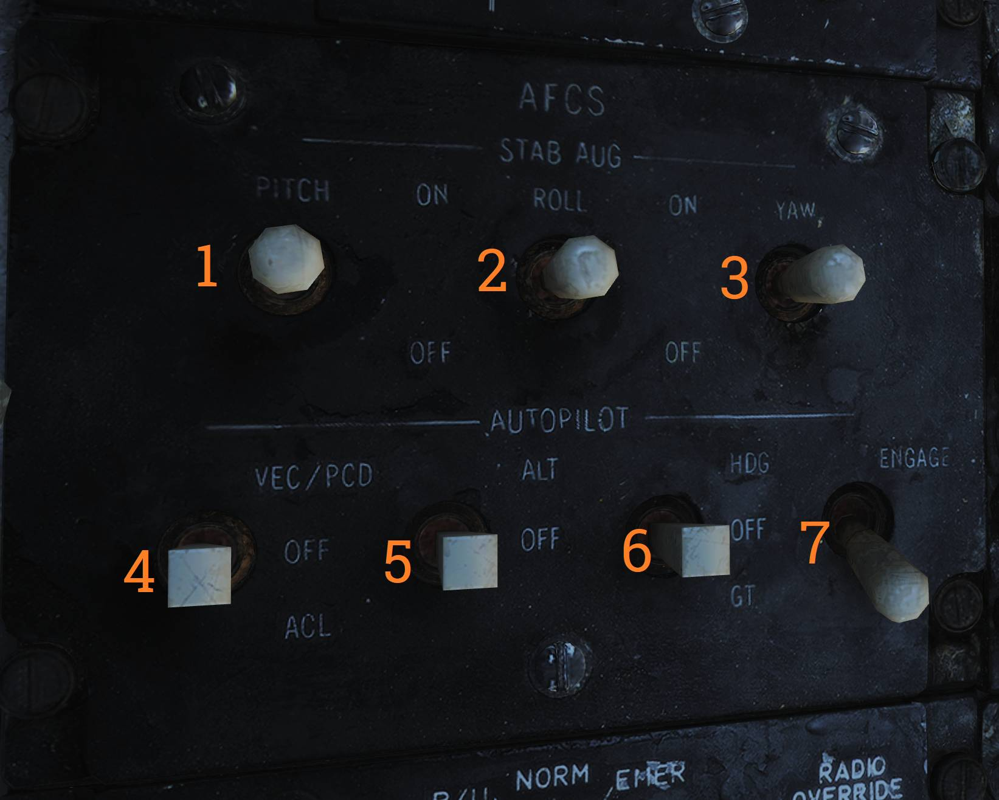
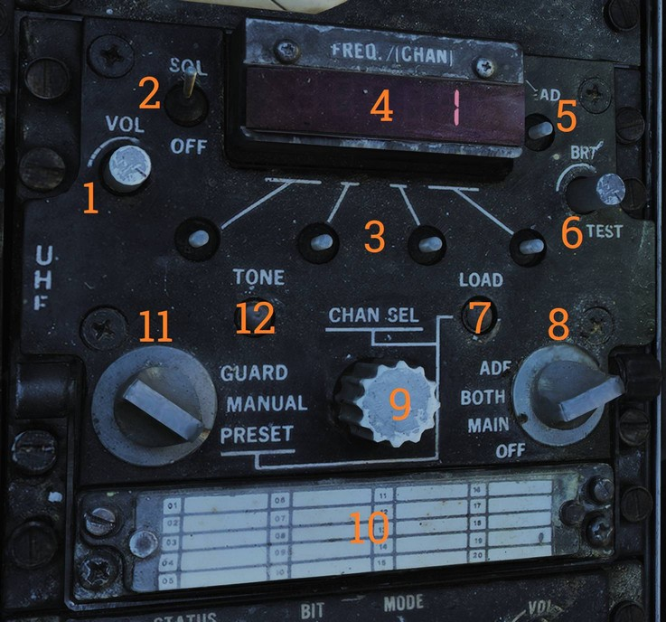
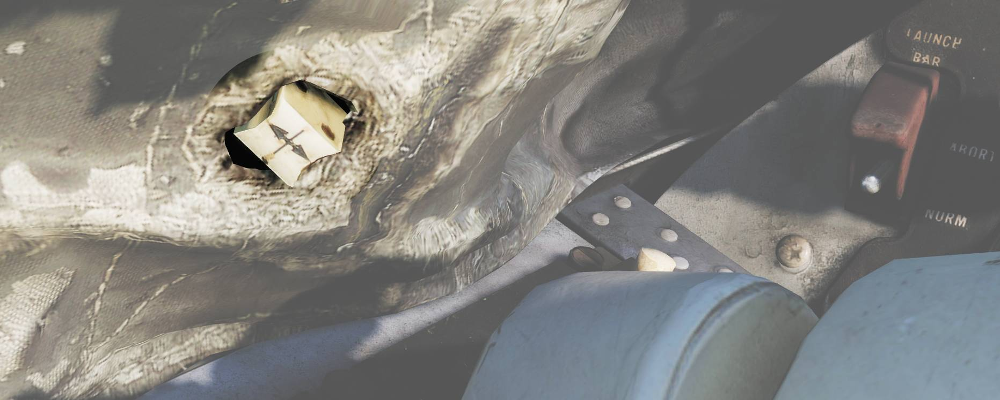
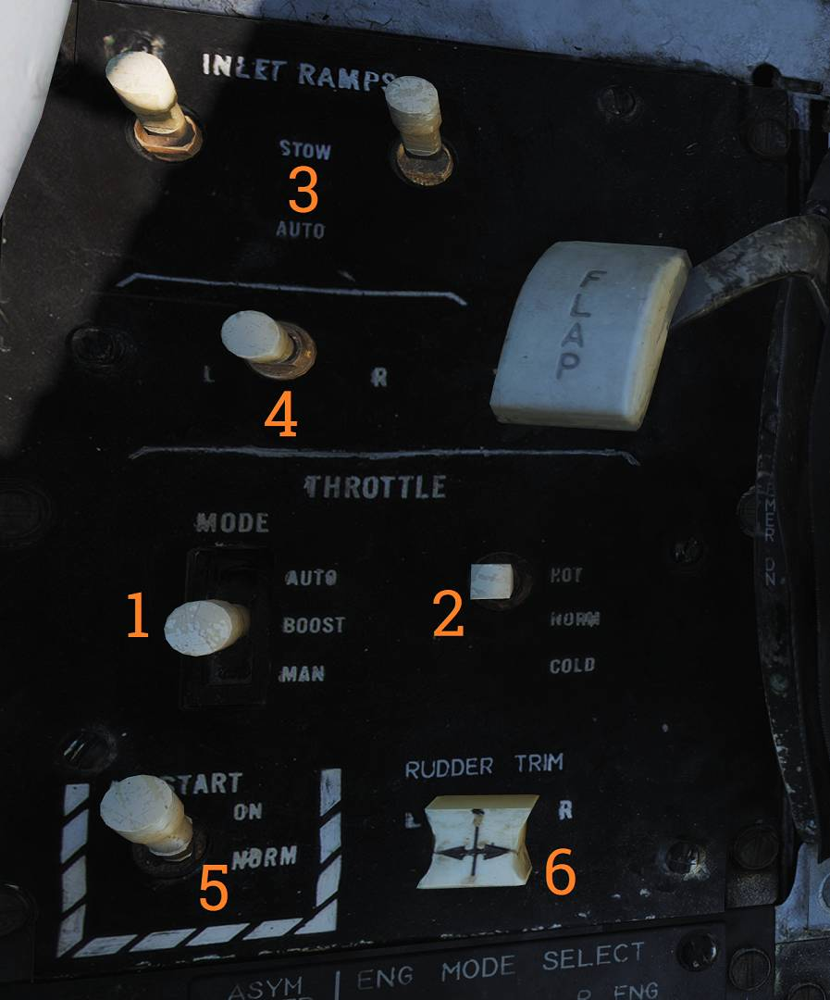
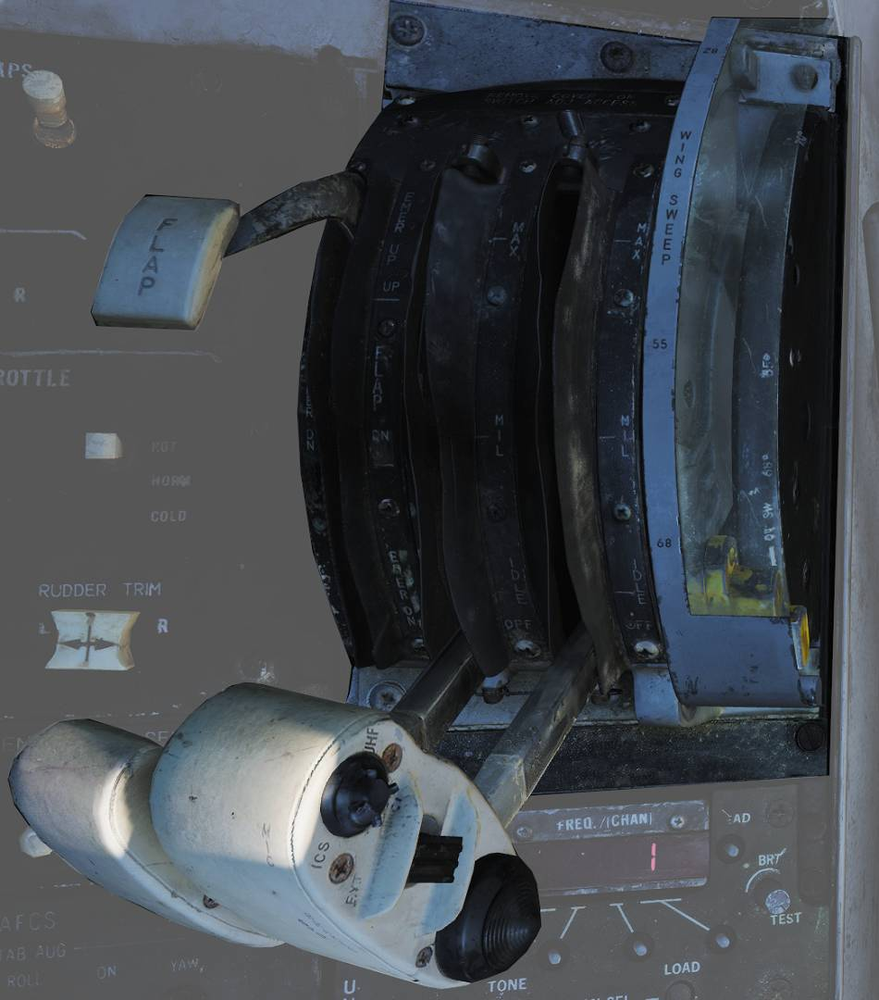
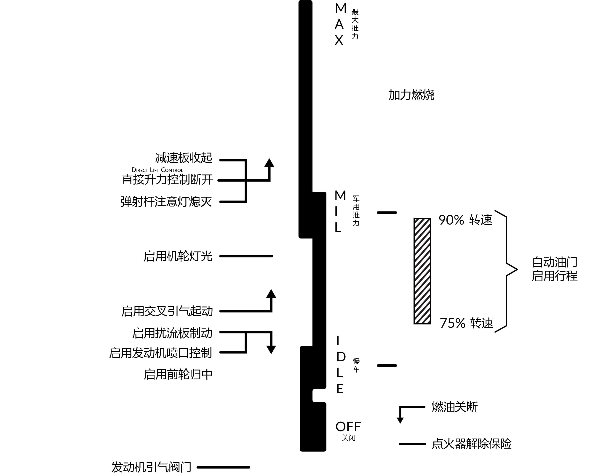

# 左侧控制台

## 抗荷服充气检测按钮

按下按钮来测试抗荷服充气。

## 供氧-通风控制面板

控制抗荷服或坐垫中的通风气流以及通向飞行员面罩的氧气。

### Vent Airflow 拨轮

通风气流调节拨轮 (<num>1</num>)，用于控制抗荷服气流进出，未连接抗荷服时则控制坐垫气流。

### Oxygen 开关

供氧开关 (<num>2</num>)，开关有 ON / OFF 两个档位。用于控制流向面罩的氧气。

- ON — 启用氧气流量。
- OFF — 禁用氧气流量。

## 音量 / TACAN 指令面板

用于调整飞行员头戴中的音量和指定控制 TACAN 的机组成员。

### F-14B 和 F-14A (后期)

#### ALR-67 旋钮

(<num>1</num>) 用于控制飞行员头戴中，ALR-67 的音量。

#### SW 旋钮

“响尾蛇”音量旋钮 (<num>2</num>)，用于调节飞行员头戴中“响尾蛇”导弹的音调音量。

#### V/UHF 2 旋钮

(<num>3</num>) 控制飞行员头戴中 AN/ARC-182 无线电台的音频音量。

#### TACAN CMD 按钮开关

带有指示灯的按钮开关 (<num>4</num>) ，用于指定控制 TACAN 的机组成员（飞行员 /
RIO）。指示灯显示当前的设定。

### F-14A (早期)

#### ALR-45 音量旋钮

ALR-45 旋钮 (<num>1</num>) 用于控制飞行员头戴中，ALR-45 的音量。

#### ALR-50 音量旋钮

ALR-50 旋钮 (<num>2</num>) 用于控制飞行员头戴中，ALR-50 的音量。

#### SW 旋钮 (F-14A 早期)

“响尾蛇”音量旋钮 (<num>3</num>)，用于调节飞行员头戴中“响尾蛇”导弹的音调音量。

#### V/UHF 2 旋钮 (F-14A 早期)

(<num>4</num>) 控制飞行员头戴中 AN/ARC-182 无线电台的音频音量。

#### TACAN CMD 按钮开关 (F-14A 早期)

带有指示灯的按钮开关 (<num>5</num>) ，用于指定控制 TACAN 的机组成员（飞行员 /
RIO）。指示灯显示当前的设定。

## TACAN 控制面板

如果飞行员有 TACAN 控制权，则可以通过该控制面板操作 TACAN。

### 波道选择旋钮 (双层旋转开关)

旋转开关 (<num>1</num>) 来选择 TACAN 波道。

使用外侧拨盘选择 TACAN 波道的前两位数字，使用内侧拨盘选择最后一位数字。

### GO 和 NO-GO 指示灯

通过/未通过指示灯 (<num>2</num>)，指示 TACAN 是否通过自检。

### BIT 按钮

自检按钮 (<num>3</num>)，按下按钮开始 TACAN 自检。

### MODE 开关 (X/Y 和工作模式)

模式开关 (<num>4</num>) ，用于切换 TACAN 的工作模式，可以选择 X 或 Y 波段。

INVERSE 模式无功能。

### TACAN VOL 旋钮

音量控制旋钮 (<num>5</num>)，用于调整通过 ICS 的 TACAN 台识别信号音频音量。

### TACAN 模式选择旋钮

(<num>6</num>) 用于选择 TACAN 功能模式。

以下模式可用：

- OFF — 关闭 TACAN。
- REC — 仅接收信号。
- T/R — 传输并接收信号，该模式下可进行距离读数。
- A/A — 空对空 TACAN 模式。
- BCN — 信标 TACAN 模式（无功能）。

## 机内通话系统控制面板

机内通话系统（ICS）的控制面板。

### ICS 音量旋钮

音量旋钮 (<num>1</num>) ，用于调节飞行员接收 RIO 对讲音频的音量。

### 放大器选择旋钮

(<num>2</num>) 用于选择将音频信号输出到飞行员头戴的放大器。

以下放大器可用：

- B/U — 备用放大器。 - NORM — 正常放大器。 - EMER
  — 应急放大器。这个档位会使用 RIO 的放大器和其的音量设定。启用应急放大器时，飞行员将无法监听只有正常放大器中飞行员才能听见的 “响尾蛇” 导弹音调和发动机失速 / 超温警告音。

### ICS 功能开关

(<num>3</num>) 用于选择 ICS 的功能。

可用 ICS 功能如下：

- RADIO OVERRIDE — 无线电台超控，使 ICS 音频超控无线电台音频。 - HOT MIC
  — 无需按下 PTT（Push-To-Talk，按键通话）开关即可进行对讲。同时允许地勤人员通过外部机内通话器与机组成员通话。 -
  COLD MIC — 需按下 PTT 开关才能对讲。

## AFCS 控制面板

用于控制自动飞控系统（AFCS）和自动驾驶。

> 💡 所有开关均采用弹簧复位至 OFF 档位，但由电磁铁保持在该档位，满足解除条件时，开关会自动弹回 OFF 位置。

### 俯仰增稳开关

PITCH 开关 (<num>1</num>) 启用俯仰增稳。

### 横滚增稳开关

ROLL 开关 (<num>2</num>) 启用横滚增稳。

### 偏航增稳开关

YAW 开关 (<num>3</num>) 启用偏航增稳。

### VEC/PCD/ACL 开关

(<num>4</num>) 用于切换自动驾驶远程控制模式。

- VEC/PCD
  — 引导航向/精确航线方向模式。通过数据链路控制飞机横滚和俯仰轴。这个模式通过飞行员驾驶杆上的 NWS（前轮转向）按钮启用。
- OFF — 功能关闭。
- ACL — 自动助降模式，通过飞行员驾驶杆上的 NWS 按钮启用 ACL。

### ALT 开关

高度保持开关 (<num>5</num>)，开关有 ALT /
OFF 两个档位，开关用来启用高度保持。这个功能通过飞行员驾驶杆上的 NWS 按钮启用。

### HDG 开关

航向保持开关 (<num>6</num>) ，用于选择航向保持模式。

- HDG — 启动航向保持模式。 - OFF — 关闭航向保持模式。 - GT
  — 启用地面航迹模式，通过飞行员驾驶杆上的 NWS 按钮启用。

### ENGAGE 开关

自动驾驶启用开关 (<num>7</num>) ，开关有 ENGAGE / OFF 两个档位。

- ENGAGE — 接通自动驾驶。
- OFF — 关断自动驾驶。

## UHF 1 (AN/ARC-159) 电台

UHF 1 无线电台及其控制开关/按钮。

> 💡 AN/ARC-159 中的 ADF 无功能，改为使用 V/UHF 2中的 ADF。

### VOL 旋钮

音量旋钮 (<num>1</num>)。用于调整飞行员头戴中 UHF 1 音频的音量。

### SQL 开关

静噪控制开关 (<num>2</num>) ，分别用于启用或关闭静噪。

- ON — 启用静噪。
- OFF — 禁用静噪。

### 频率选择开关

频率选择开关 (<num>3</num>) ，拨动开关来调制频率。

### FREQ./(CHAN) 显示窗

频率 /（波道）显示窗 (<num>4</num>)，用于显示当前选中的频率或波道。

### READ 开关

(<num>5</num>) 拨动并保持住开关来查看所选预设波道的频率。

### BRT 旋钮

亮度旋钮 (<num>6</num>)，用于调节显示屏的亮度。

### LOAD 按钮

加载按钮 (<num>7</num>)，按下按钮来加载显示窗中显示的频率至预设波道。

### 功能选择旋钮

(<num>8</num>) 用于选择无线电功能。

### CHAN SEL 旋钮

波道选择旋钮 (<num>9</num>)，用于选择预设波道。

### 预设波道表

(<num>10</num>) 用于记录预设波道频率。

### 模式选择旋钮

旋钮 (<num>11</num>) 用于选择无线电频率模式（GUARD - 救生频率，MANUAL - 手动频率，PRESET - 预设波道）。

### TONE 按钮

音调按钮 (<num>12</num>) ，按住按钮会在当前无线电频率上发送一个单音（频率为1020赫兹）。

## 不对称推力限制器 / 发动机模式选择（仅 F-14B 拥有）

这个面板用于控制不对称推力限制系统和发动机控制模式。

### ASYM LIMITER 开关

不对称推力限制器开关 (<num>1</num>)，带有保护盖，开关 ON /
OFF 两个档位分别启用和禁用不对称加力推力限制器。

- ON — 启用限制器。
- OFF — 禁用限制器。

### ENG MODE SELECT 开关

发动机模式选择开关(<num>2</num>)，用于选择左右发动机各自的控制模式。

可选发动机模式：

- PRI — 主要控制模式。 - SEC — 次要控制模式。

## 目标指定开关

用于在 HUD 中指定地面目标，也用于控制飞行员 ACM 雷达模式，但 PLM（飞行员锁定模式）模式除外。

开关可以上下拨动，也可以向前拨动至目标指定档位。

空对地模式中，上/下拨动开关来移动目标指示符，向前拨动开关来指定目标。

在其他模式中，上/下拨动开关分别选择 VSL HI（垂直扫描锁定 - 高目标）和VSL
LO（垂直扫描锁定 - 低目标）ACM模式，而向前拨动开关选择 PAL 模式。

## 进气道斜板 / 油门控制面板

这个面板用于控制多个发动机系统、油门设置以及方向舵配平。

### THROTTLE MODE 开关

油门模式开关 (<num>1</num>) ，用于选择油门工作模式。

- AUTO — 自动模式。
- BOOST — 助力模式。
- MAN — 手动模式。

### THROTTLE TEMP 开关

油门温控开关(<num>2</num>)，用于选择油门计算机增益。

- HOT — 增大标准油门计算机增益。
- NORM — 使用标准油门计算机增益。
- COLD — 减小标准油门计算机增益。

### INLET RAMPS 开关

进气道斜板开关 (<num>3</num>) ，用于选择左右发动机各自的进气道斜板工作模式。

- STOW — 收上。
- AUTO — 自动模式。

### ENG CRANK 开关

发动机起动开关 (<num>4</num>)，用于起动左发动机或右发动机。

### BACK UP IGNITION 开关

备用点火开关 (<num>5</num>)，用于开启或关闭备用点火。

- ON — 启用备用点火。
- OFF — 禁用备用点火。

### RUDDER TRIM 开关

方向舵配平开关 (<num>6</num>)，用于调整方向舵配平。

## 油门握把

油门握把上包括了各种飞行控制开关/按钮和 HOTAS（握杆控制）功能。

### 减速板开关

(<num>1</num>) 用于控制减速板展开和收起。

- EXT
  — 自复位档位，释放开关后回到中立位置。将开关保持在 EXT 档位会逐渐展开减速板。开关回中后，减速板仍会保持在当前位置。
- RET — 将开关拨至该位置来收起减速板。

### 机翼后掠控制开关

开关 (<num>2</num>) 用于控制机翼后掠功能。手动模式下选择的后掠位置只能比 CADC 设定的位置靠后。

- AUTO — 机翼后掠位置由 CADC（中央大气数据计算机） 自动设置。
- FWD — 手动向前调节机翼后掠位置。
- AFT — 手动向后调节机翼后掠位置。
- BOMB
  — 如果机翼后掠角度小于55°，则将机翼后掠至55°位置。如果 CADC 设置的后掠位置超过55°，那么后掠位置将被调整至 CADC 设定的角度。

### PLM 按钮

飞行员锁定模式按钮 (<num>3</num>) ，用于选择 AWG-9 的 ACM 飞行员锁定模式。也用于在 ACL（自动助降）过程中解除自动驾驶。

### CAGE/SEAM 按钮

CAGE/SEAM 按钮 (<num>4</num>) 用来指令 AIM-9 进行锁定。如果启用了 APC（进近推力补偿器），那么按下按钮用于解除 APC。

### 机外照明开关

(<num>5</num>) 用于控制机外照明。

- OFF — 关闭所有机外照明并增加进近指示灯亮起度。
- ON — 开启所有机外照明，并减小进近指示灯亮起度。

### ICS 按键通话开关

通过这个开关 (<num>6</num>)，飞行员可以选择在单个电台或两电台同时进行话音，或与 RIO 对讲。

- ICS — 与 RIO 通话。
- BOTH — 同时使用 UHF 1 和 V/UHF 2 电台进行话音。
- UHF1 — 在 UHF 1 电台进行话音。
- UHF2 — 在 V/UHF 2 电台进行话音。

## 油门弧座

| 油门弧座                                                   | 工作模式                                                          |
| ---------------------------------------------------------- | ----------------------------------------------------------------- |
|  |  |

油门弧座主要组成部分包括：两个发动机油门控制握把、襟翼控制杆和应急机翼后掠手柄，另外也包括油门握把上用于控制 HOTAS 系统的按钮和开关。

油门行程中的 OFF（关闭）、IDLE（慢车）和 MIL（军用推力）位置都有限位装置。

将油门握把从 OFF 位置推到 IDLE 档位将会使点火器解除保险并退出燃油关断装置。

除了 OFF 和 IDLE 限位机构外，油门握把并不会被弹簧拉回原位，因此飞行员在弹射起飞时，可以将油门握把置于 MIL（军用推力）档位，而不用担心油门握把的位置意外变动，导致发动机转速降低。

油门弧座左侧，襟翼控制杆的下方装有一个油门阻尼调节杆，用于选择所需的油门移动阻尼。

襟翼控制杆的可以在上下两个档位行程间进行无极调整，并且控制杆还拥有两个应急档位，一个是应急收上，一个是应急放下。两个应急档位拥有限位装置，襟翼控制杆移动至限动卡位置时，需向外推动才能继续移动至应急档位。

应急收上档位会强行收起襟翼，超控正常襟翼控制逻辑。应急放下档位无功能。

手动/应急机翼后掠手柄上方有一个保护盖，且手柄通常处于按下并收起的状态。握住手柄顶部，抽出手柄来手动对机翼后掠进行控制。

请查阅[机翼后掠系统](../../systems/flight_controls_gear/wing_sweep.md)来获得更多相关信息。

## 手动液压泵

手动液压泵位于油门弧座的内侧，靠近飞行员左腿的位置。

液压系统故障时，飞行员通过手动向机轮刹车蓄压器充压来进行制动操作（当起落架手柄处于放下档位时）或伸出受油管。
