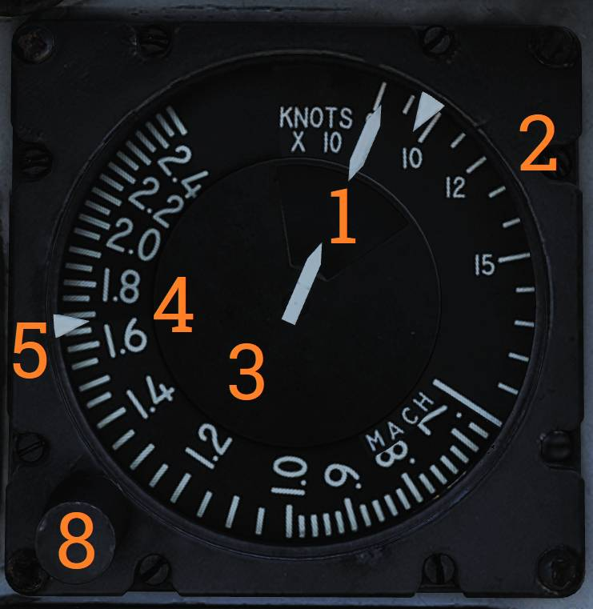
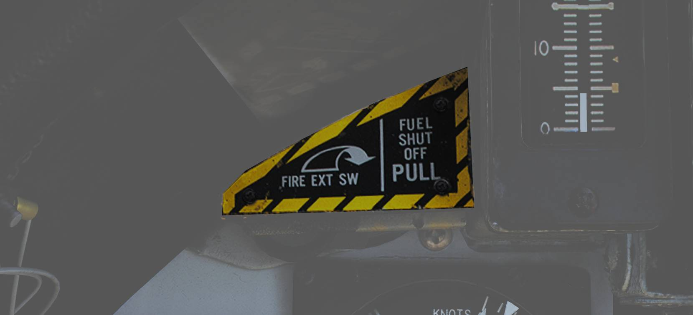
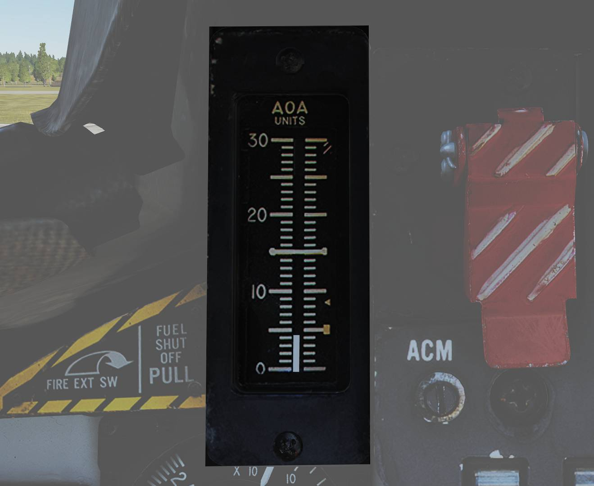

# Left Instrument Panel

## Radar Altimeter

Control and indicator for the radar altimeter.

### Radar Altimeter Control Knob

The radar altimeter control knob (<num>1</num>) controls radar altimeter power, sets the low
altitude warning threshold, and initiates BIT.

Fully counterclockwise turns the radar altimeter off. Rotating clockwise sets the altitude warning
level. Depressing the knob initiates radar altimeter BIT.

### OFF Flag

The OFF flag (<num>2</num>) is displayed when the radar altimeter is off, power is unavailable, or
the system loses ground lock.

### Low Altitude Warning Light

The low altitude warning light (<num>3</num>) illuminates red when the aircraft is below the set
altitude warning level.

### Self-Test Light

The self-test light (<num>4</num>) illuminates green when radar altimeter BIT is run.

During BIT, the readout should display 100 feet ±10.

### Low-Altitude Limit Index

The low-altitude limit index (<num>5</num>) is a triangular bug on the outer edge indicating the
selected altitude warning threshold.

> 💡 Radio override does not disable the low-altitude warning tone.

## Servopneumatic Altimeter

Control and indicator for the servopneumatic altimeter.

### Altimeter Readout

The altimeter readout (<num>1</num>) displays altitude using three digital drums for 10,000, 1,000,
and 100 feet, and a pointer on a circular scale indicating hundreds of feet.

### Baroset Knob

The baroset knob (<num>2</num>) sets local pressure in inches of mercury (in.Hg).

This setting only affects the local altimeter display. Other CADC-driven digital indicators use a
fixed 29.92 in.Hg reference.

### Mode Switch

The mode switch (<num>3</num>) selects altimeter operating mode and is spring-loaded from RESET.

If power and CADC altitude data are present, the switch may be held in RESET for three seconds to
enable normal (servoed) mode.

If set to STBY, or if power or CADC data is absent for more than three seconds, the altimeter
switches to backup (pressure) mode.

### STBY Flag

The STBY flag (<num>4</num>) is a red STBY indication that appears when the altimeter is operating
in backup (standby) mode.

> 💡 At high speeds and below 10,000 feet, pressure effects can produce significant readout errors:
> up to 1,200 feet when transonic and up to 4,000 feet when supersonic.

## Airspeed Mach Indicator

Indicated airspeed and Mach number display.

### Airspeed Dial

The airspeed dial (<num>1</num>) drives the airspeed and Mach indication across three scales.

### Indicated Airspeed Scale (Outer)

The outer indicated airspeed scale (<num>2</num>) provides readout up to 200 knots.

### Indicated Airspeed Scale (Inner)

The inner indicated airspeed scale (<num>3</num>) provides readout from 200 to 850 knots and is
covered by the dial until applicable.

### Mach Number Scale

The Mach number scale (<num>4</num>) provides Mach readout and shifts relative to indicated airspeed
to indicate the correct Mach number.

### Indicated Airspeed Index Pointer

The indicated airspeed index pointer (<num>5</num>) can be set to a desired indicated airspeed.

### Mach Number Index Pointer

The Mach number index pointer (<num>6</num>) can be set to a desired Mach number.

Not visible in the image.

### Safe Mach Number Index Pointer

The safe Mach number index pointer (<num>7</num>) indicates the CADC-computed safe Mach number.

Not visible in the image.

### Index Knob

The index knob (<num>8</num>) is a push-pull knob used to select which index pointer is adjusted.

One position adjusts the indicated airspeed index and the other adjusts the Mach number index.

## Vertical Velocity Indicator

Displays vertical velocity in thousands of feet per minute.

Sudden or abrupt attitude changes can produce erroneous indications due to airflow changes over the
static probe.

## Left Engine Fuel Shutoff Handle

Emergency fuel shutoff handle for the left engine.

Pulling the handle shuts off fuel flow to the left engine. Pushing the handle in restores fuel flow.

This handle should not be used to normally secure the engine.

A left engine fire extinguishing button is located behind the handle and is accessible when the
handle is pulled out.

## Angle-of-Attack Indicator

Displays angle of attack (AOA) on a tape scale from 0 to 30 units.

This corresponds approximately to -10° to +40° rotation of the AOA probe.

Reference markers are provided on the right side for climb (5), cruise (8.5), and stall (29). A
reference bar indicates on-speed approach (15).
