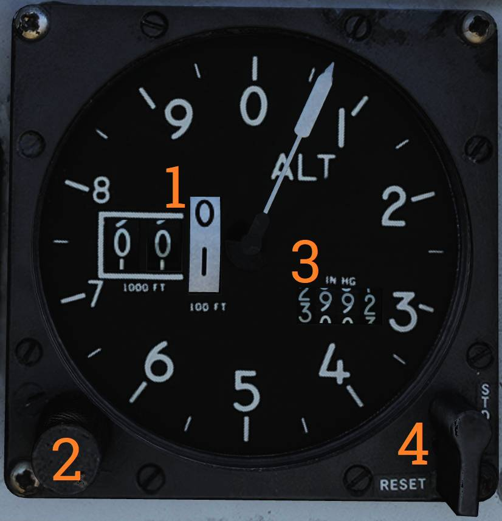
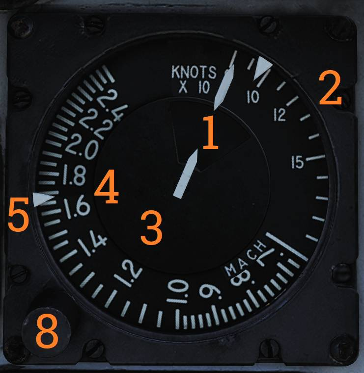
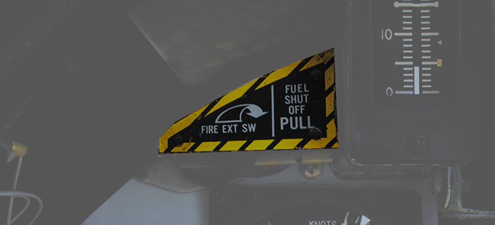

# 左仪表板

## 雷达高度表

雷达高度表用来雷达高度计进行控制并用来指示雷达高度。

### 雷达高度表控制旋钮

雷达高度表控制旋钮 (<num>1</num>) 用来控制电源模式、设置低高度告警阈值和启动 BIT。

逆时针旋转旋钮至最大档位将关闭雷达高度计。顺时针旋转旋钮来设置告警高度，顺时针转动控制旋钮来增加告警高度。按下旋钮开始高度计系统 BIT。

### OFF 警示旗

在系统关闭、电源关闭或丢失雷达信号时，雷达高度表会显示 OFF 警示旗 (<num>2</num>)。

### 低高度告警灯

当飞机低于雷达高度计上设置的告警高度时，红灯 (<num>3</num>) 会亮起。

### 自检状态灯

进行高度表自检时，绿灯 (<num>4</num>) 会亮起。

BIT 时高度表读数应显示100 ± 10 英尺。

### 低高度限制指示

沿着表盘外沿移动的小三角形游标(<num>5</num>)，游标显示了设定的告警高度。

> 💡 RADIO OVERRIDE（无线电台超控）并不会禁用低高度告警的音频。

## 气动伺服高度表

伺服气动高度表通过电系统和压力系统双重方式显示高度。

### 高度表读数

在三个滚筒上显示高度数字 (<num>1</num>)，三个数字分别对应10 000、1 000 和 100 英尺。

同时，表盘指针指向的环形排列的刻度表示百英尺高度。

### 气压调节旋钮

设置以英寸汞柱（in.Hg）为单位的本地气压。

只用于气压计本身的读数，所有其他（由 CADC 控制的）数字指示器都使用 29.92 英寸汞柱作为气压数值。

### 当地气压

(<num>3</num>)指示调定的局部气压值，这个显示框也被称为“Kollsman Window”。

### 模式选择开关

模式选择开关(<num>4</num>)为三档位开关，当松开开关时，开关从 RESET 位置弹回正常位置。

- RESET - 如果接通电源，且 CADC 可提供高度数据，那么将开关在 RESET 档位保持3秒后，高度表会进入正常（伺服）工作模式。
- STBY - 选择备用气压模式。

开关拨至 STBY 位置，或电源断开，或缺少 CADC 高度数据，那么3秒后，系统会切换至备用（气压）模式。

### STBY 警示旗

如果系统在备用模式下工作，那么表盘中会显示红色的标有 STBY 字样的警示旗。

> 💡 在 10000 英尺以下高速飞行时，由于气压变化较大，飞机跨声速飞行时，气压计读数误差最多可达到 1200 英尺，而超声速飞行时，误差可能高达 4000 英尺 。

## 空速马赫表

用来显示指示空速和马赫数。

### 空速表拨盘

(<num>1</num>)用三种刻度显示指示空速，其中两种刻度对应指示空速，一个随马赫数变化移动。

### 指示空速刻度（外圈）

指示空速的读数(<num>2</num>)，最高指示速度为200节。

### 指示空速刻度（内圈）

指示空速的读数(<num>3</num>)，刻度对应的空速从200节到850节。内圈的指示空速刻度被空速表拨盘未镂空的部分盖住，直到需要显示对应的空速时才显示出来。

### 马赫数刻度

马赫数的读数(<num>4</num>)。刻度将会转动来显示对应当前指示空速的正确的马赫数。

### 指示空速数值游标

可以将游标(<num>5</num>)调定到所需的指示空速上。

### 马赫数数值游标

可以将游标(<num>6</num>)调定到所需的马赫数上。

在上图中不可见。

### 最大安全马赫数游标

游标(<num>7</num>)显示 CADC 计算出的安全马赫数。

在上图中不可见。

### 游标设置旋钮

游标设置旋钮(<num>8</num>)这个旋钮有抽出和按下两个档位。

两个档位分别用于设置指示空速游标和马赫数游标。

## 垂直速率表

显示以千英尺为单位的垂直速率。

高度急剧或突然改变时，由于飞机皮托管表面的气流快速变化，垂直速率表读数可能出现巨大误差。

## 左发断油手柄

紧急情况下，抽出手柄来切断左发动机供油。

将手柄推入正常位置来重新向发动机注入燃油。

但这个手柄不应用于（降落后）关闭发动机。

左发灭火按钮在手柄后方，抽出手柄后方可使用灭火按钮。

## 迎角指示器

带状迎角指示器指示了飞机的迎角（AoA），指示器的显示范围在 0 至 30 个单位之间。

对应迎角探头在 -10° 至 +40° 范围内转动。

指示器右侧的标识分别指示各个飞行阶段对应的最佳迎角单位：爬升（5）、巡航（8.5）和失速（29），而 15 个单位处的参考横线表示最佳进近迎角（15）。
