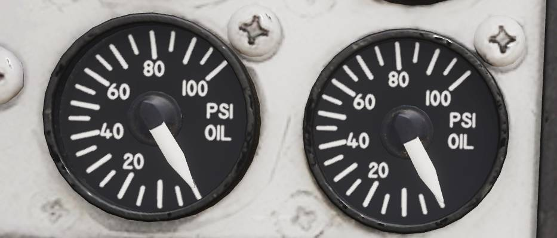

# 左膝仪表板

## 液压指示器

显示联合液压系统和飞行液压系统的油液压力。

- SPOIL (扰流板): ON/OFF 警示旗指示外侧扰流板模块增压。
- EMER FLT HI: ON/OFF 警示旗分别指示所选的备用飞行液压系统 HI 或 LOW 模式。

## 滑油压力表

显示每台发动机的滑油压力。显示范围从 0 到 100 psi，正常范围是 25 至 65 psi，随发动机转速而变化。

## 发动机喷口位置表

显示发动机喷口的位置。显示范围是 0 到 5，指针指向 5 则表示喷口完全张开。

## 发动机仪表组

显示对应发动机的 RPM（高压压缩机转子转速，也就是 N2）、EGT（排气温度）和 FF（燃油流量）。

> 💡 图中展示的是 TF-30 发动机的仪表组，F110 发动机的 EIG 即将实装。加力推力时 FF 不显示加力推力消耗的额外的燃油。
