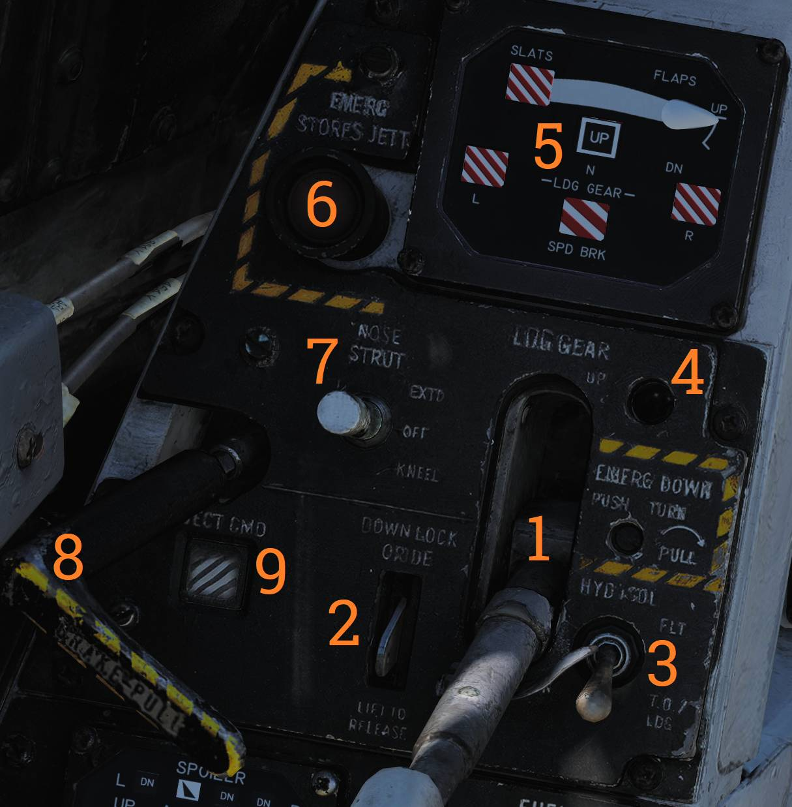

# Left Vertical Console

## Fuel Management Panel

Control panel for fuel system management, CADC master reset, and anti-skid and spoiler brake
control.

### Quantity Selector Switch

The QTY SEL switch (<num>1</num>) selects which fuel quantities are displayed on the fuel quantity
indicator tapes.

The switch is spring-loaded to FEED.

- FEED — Displays respective feed and fuselage tank quantities.
- WING — Displays respective wing tank quantities.
- EXT — Displays respective external tank quantities.

### Fuel Feed Switch

The FEED switch (<num>2</num>) selects fuel feed routing to the engines.

The guard locks the switch in NORM until lifted.

### Wing/External Transfer Switch

The WING/EXT TRANS switch (<num>3</num>) controls operation of wing and external fuel tank transfer.

- ORIDE — Overrides automatic transfer logic.
- AUTO — Normal automatic operation.
- OFF — Disables fuel feed from wing and external tanks.

### Refueling Probe Indicator Light

The refueling probe transition light (<num>4</num>) illuminates when the probe is neither fully
extended nor fully retracted.

### Fuel Dump Switch

The DUMP switch (<num>5</num>) enables fuel dumping when placed in DUMP.

Fuel dumping is permitted only when speed brakes are retracted, afterburner is off, and weight is
off wheels.

### Refueling Probe Switch

The REFUEL PROBE switch (<num>6</num>) controls refueling probe operation.

- ALL EXTD — Extends the refueling probe and allows refueling of all tanks. Also resets the WING/EXT
  TRANS switch to AUTO.
- FUS EXTD — Extends the refueling probe and allows refueling of fuselage tanks only.
- RET — Retracts the refueling probe.

### Anti-Skid / Spoiler Brake Switch

The ANTI SKID SPOILER BK switch (<num>7</num>) selects braking system operation with weight on
wheels.

- BOTH — Enables both anti-skid and spoiler brake functions.
- OFF — Disables both systems.
- SPOILER BK — Enables spoiler braking only.

### Master Reset Button

The MASTER RESET button (<num>8</num>) resets the CADC failure detection system and clears
associated fault indications.

## Control Surface Position Indicator

Provides indication of aircraft control surface positions.

### Spoiler Position Indicators

The spoiler indicators (<num>1</num>) show spoiler position.

- DN — Spoilers down and flush with the wing.
- Up-arrow — Spoilers extended above the wing.
- Down-arrow — Spoilers drooped below the wing surface.

### Rudder Position Indicators

The rudder indicators (<num>2</num>) display left and right rudder positions, identified by L and R
symbols.

### Horizontal Tail Position Indicators

The horizontal stabilizer indicators (<num>3</num>) display left and right tail positions,
identified by L and R symbols.

## Launch Bar Abort Panel

The launch bar abort switch is used to abort catapult launches.

When held in ABORT, the launch bar is raised. The switch is spring-loaded back to NORM, which is the
standard position.

> 💡 Not currently used in DCS.

## Landing Gear Control Panel

Control panel for landing gear operation and emergency stores jettison.

### Landing Gear Handle

The LDG GEAR handle (<num>1</num>) selects landing gear UP or DOWN.

For emergency extension with the handle in DOWN, push the handle in, rotate it clockwise, and pull
outward. This releases a compressed nitrogen charge to extend the gear.

### Down Lock Override

The DOWN LOCK ORIDE indicator (<num>2</num>) moves down by solenoid to indicate weight on wheels.

The indicator may be lifted to override the signal.

### Hydraulic Isolation Switch

The HYD ISOL switch (<num>3</num>) isolates landing gear, nosewheel steering, and wheel brakes from
the combined hydraulic system.

The switch is automatically moved to T.O./LDG when the landing gear handle is in the DOWN position.

- FLT — In-flight operation. Isolates listed systems.
- T.O./LDG — Takeoff and landing operation. Connects listed systems.

### Landing Gear Transition Light

The transition light (<num>4</num>) illuminates when landing gear position does not match handle
position.

### Wheels and Flaps Position Indicator

The wheels-flaps indicator (<num>5</num>) displays positions of flaps, slats, speed brakes, and
landing gear.

#### Slat Indications

| Indication                                                       | State                                 |
| ---------------------------------------------------------------- | ------------------------------------- |
|              | Power off or maneuver slats extended. |
|   | Slats extended.                       |
|  | Slats retracted.                      |

Flap position is shown by a pointer moving between UP and DOWN. The first marked segment represents
the maneuver flap range.

#### Landing Gear Indications

| Indication                                                                     | State                            |
| ------------------------------------------------------------------------------ | -------------------------------- |
|             | Power off or unsafe gear.        |
|                      | Gear down.                       |
|  | Gear retracted and doors closed. |

#### Speed Brake Indications

| Indication                                                         | State                                         |
| ------------------------------------------------------------------ | --------------------------------------------- |
|                | Speed brake system power off.                 |
|  | Speed brake partial extension, not in motion. |
|          | Speed brake fully extended.                   |
|            | Speed brake retracted.                        |

### Emergency Stores Jettison Button

The EMERG STORES button (<num>6</num>) commands emergency jettison of all expendable stores.

The button illuminates to indicate activation upon press.

### Nose Strut Switch

The NOSE STRUT switch (<num>7</num>) controls nosewheel strut position.

- EXTD — Extends the nose strut and raises and locks the launch bar.
- OFF — Turns off nosewheel strut movement. Spring-loaded to this position.
- KNEEL — Releases strut pressure to retract the nose strut, kneeling the aircraft and unlocking the
  launch bar.

### Brake Pull Handle

The BRAKE-PULL handle (<num>8</num>) applies or releases the parking brake.

Pull out to apply the parking brake. Push in to release.

### Eject Command Indicator

The EJECT CMD indicator (<num>9</num>) displays the current ejection command logic for the rear
cockpit.

- PILOT — Pilot ejects both crewmembers; RIO ejects only himself.
- MCO — Either crewmember ejects both crew.

> 💡 Currently non-functional in DCS.
