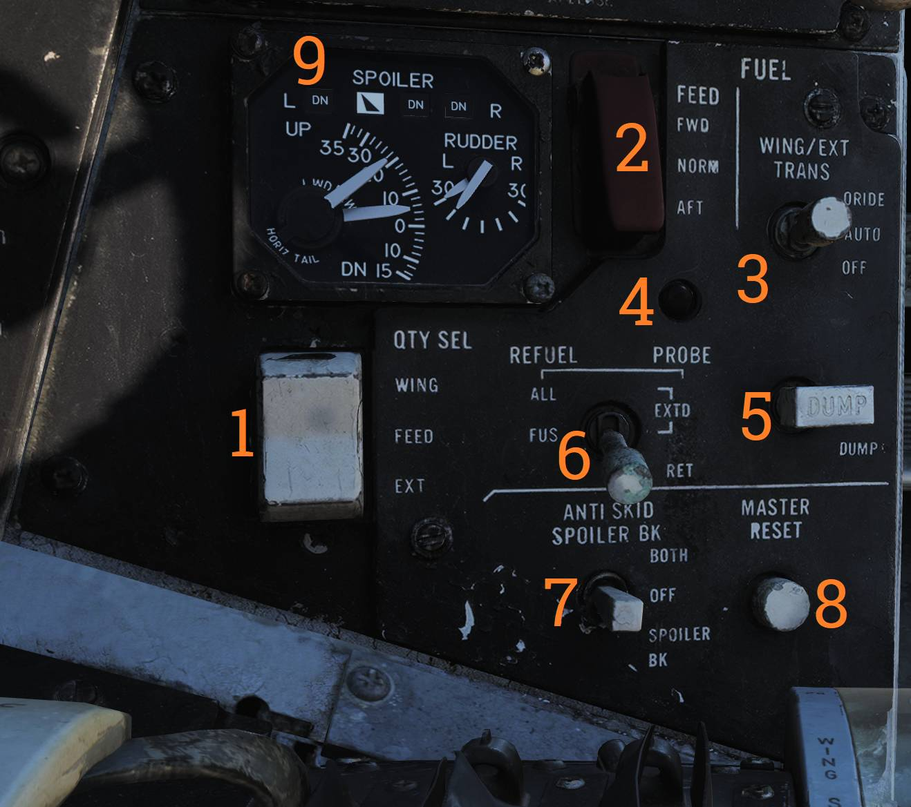
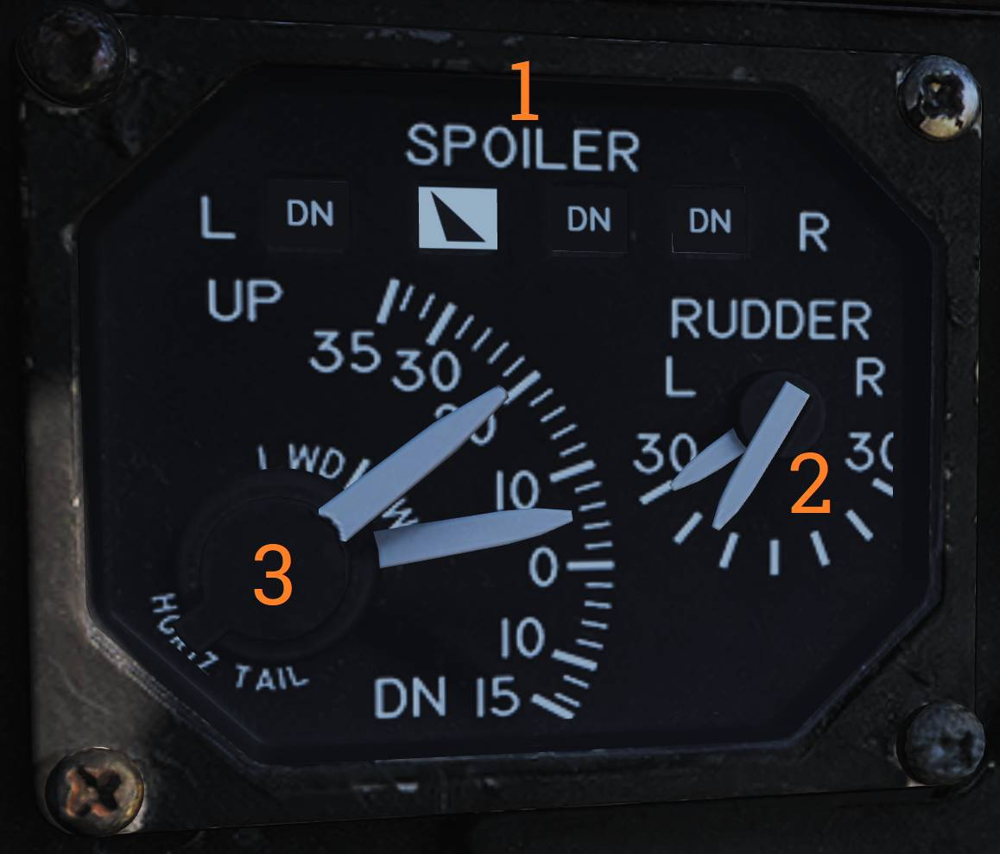
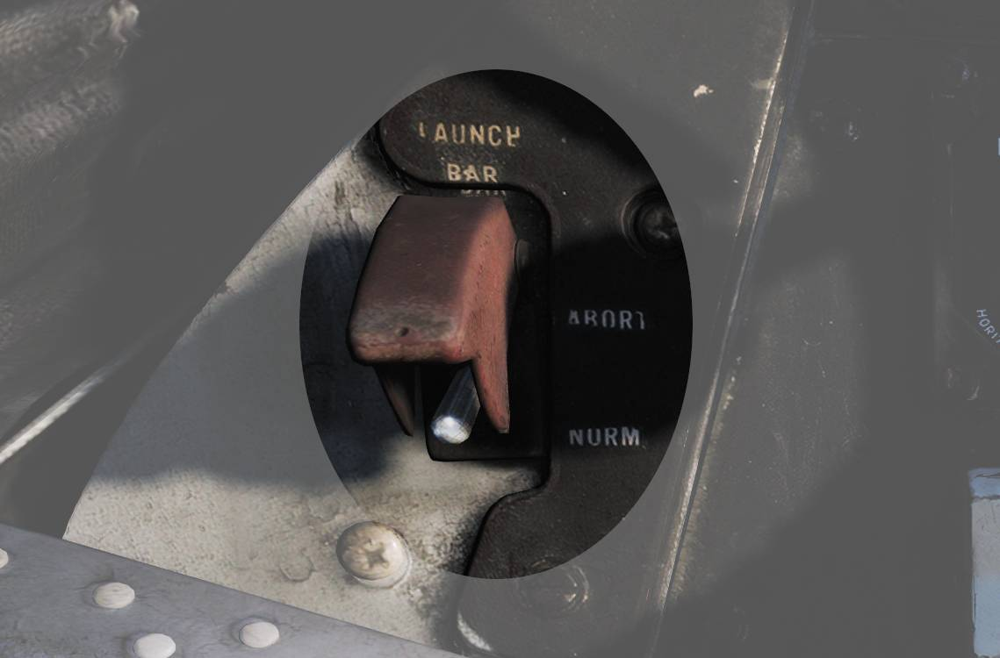
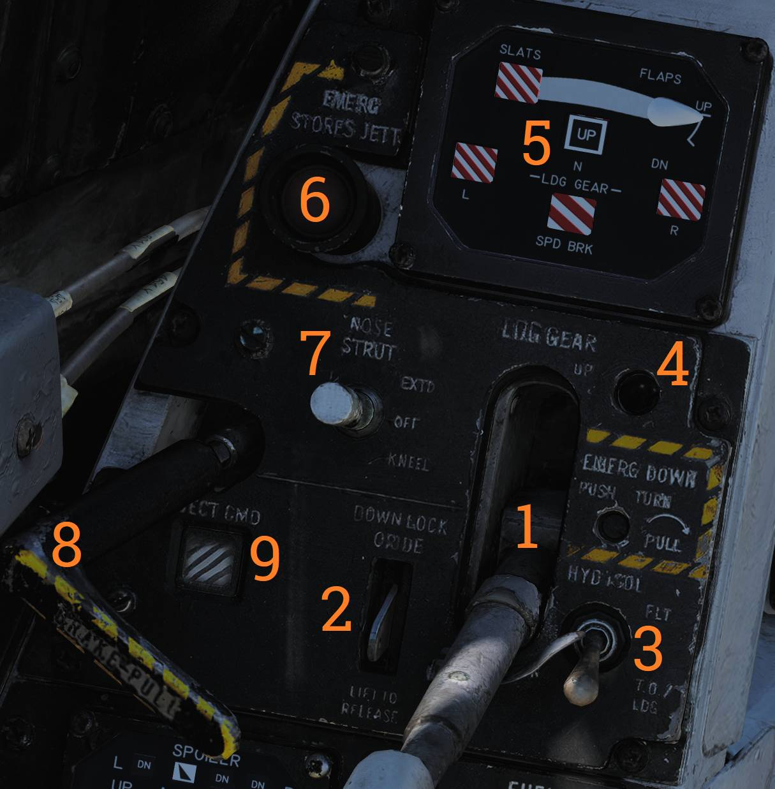

# 左侧垂直控制台

## 燃油管理面板

这个面板用于控制诸多燃油相关系统、CADC 主复位和防滑系统。

### QTY SEL 选择开关

燃油量选择开关 (<num>1</num>)，开关用来选中燃油量指示带中显示哪个油箱的燃油油量。

松开开关后，开关会弹回 FEED 档位。

- FEED — 显示左右供油油箱组的燃油油量。
- WING — 显示对应机翼油箱中的燃油油量。
- EXT — 显示对应副油箱中的燃油油量。

### FEED 开关

供油油箱选择开关 (<num>2</num>)，用于选择为发动机供油的油箱。

保护盖关闭时，开关被锁定在 NORM 档位。

### WING/EXT TRANS 开关

机翼/副油箱转输开关 (<num>3</num>)，用于控制机翼油箱和副油箱的燃油转输。

- ORIDE — 超控自动转输逻辑。
- AUTO — 正常使用的档位。
- OFF — 停止机翼和副油箱的燃油转输。

### 受油管指示灯

当受油管未完全伸出，或未完全收起时，过渡指示灯(<num>4</num>)便会亮起。

### DUMP 开关

放油开关(<num>5</num>)，用于开启或停止放油。

减速板收起、机轮不负重以及关闭加力时飞机可以进行放油操作。

### REFUEL PROBE 开关

受油管开关 (<num>6</num>) ，用于伸出或收起受油管。

- ALL EXTD
  — 全伸出，受油管移动至伸出档位，允许对所有油箱加油。同时也会将机翼/副油箱转移开关（WING/EXT
  TRANS）复位回 AUTO 档位。
- FUS EXTD — 机身伸出，受油管移动至伸出档位，但仅允许对机身（FUS）油箱加油。
- RET — 收起受油管。

### ANTI SKID SPOILER BK 开关

防滑和扰流板制动开关 (<num>7</num>) ，用于决定防滑系统和扰流板制动系统操作。

- BOTH — 机轮负重时，启用防滑系统和扰流板制动系统。
- OFF — 关闭防滑系统和扰流板制动系统。
- SPOILER BK — 扰流板制动，机轮负重时，启用扰流板制动功能。

### MASTER RESET 按钮

主复位按钮 (<num>8</num>)，用于复位 CADC 故障检测系统及相关的故障显示。

## 操纵面位置指示器

显示操纵面的位置。

### 操纵面位置指示器

操纵面位置指示器 (<num>1</num>) 是用于指示各个飞行操纵面位置的仪表。

- DN — 扰流板收起，收起到机翼表面。
- 向上箭头 - 扰流板伸出。
- 向下箭头 - 扰流板放下至机翼表面下方。

### RUDDER 指示器

方向舵位置指示器 (<num>2</num>) ，标注的“L”和“R”分别指示了左方向舵和右方向舵的位置。

### HORIZ TAIL 指示器

水平安定面位置指示器 (<num>3</num>) ，标注的“L”和“R”分别显示了左水平安定面和右水平安定面的位置。

## 弹射杆中止面板

LAUNCH BAR（弹射杆）开关，用来中止弹射程序。

将开关拨动并保持在 ABORT 档位时，弹射杆升起，终止弹射起飞。松开开关后，开关弹回 NORM （正常）档位，这也是弹射杆开关的正常档位。

> 💡 目前，这个开关在 DCS 中没有实际作用。

## 起落架控制面板

这个面板用于控制主起落架和应急挂载抛弃。

### LDG GEAR 手柄

起落架控制手柄 (<num>1</num>) ，用于选择起落架的 UP（收上）或 DOWN（放下）位置。

在 DOWN（放下）位置时应急放下起落架，首先将手柄推入，顺时针旋转手柄顶端然后抽出。这将会释放储存的压缩氮气，使起落架紧急放下。

### DOWN LOCK ORIDE 杆

起落架放下锁定超控杆(<num>2</num>)，被螺线管移动至向下位置时指示机轮负重。

可以升起至向上位置来超控（起落架手柄锁定在 DOWN 位置）。

### HYD ISOL 开关

起落架液压隔离开关 (<num>3</num>) ，用于将起落架、机轮刹车、防滑和前轮转向系统与联合液压系统隔离开来。

起落架手柄处于放下位置时，隔离开关将被起落架手柄自动移动至 T.O./LDG 档位。

- FLT — 空中飞行时，隔离上述系统中的液压。 - T.O./LDG
  — 起飞/降落，接通上述系统的液压，允许它们正常工作。

### 过渡指示灯

起落架实际位置与 LDG GEAR（起落架控制手柄）位置不符时，指示灯 (<num>4</num>) 会亮起。

### 机轮-襟翼位置指示器

(<num>5</num>)指示襟翼和前缘缝翼、减速板和起落架的位置。

#### 襟翼位置指示器

| 指示                                                             | 状态                     |
| ---------------------------------------------------------------- | ------------------------ |
|              | 电源断开或前缘缝翼伸出。 |
|   | 前缘缝翼伸出。           |
|  | 前缘缝翼收起。           |

在 UP 和 DN 之间移动的指示器用来指示襟翼的位置。带白色标记的区域指示了机动襟翼的移动行程。

#### 起落架位置指示

| 指示                                                                           | 状态                     |
| ------------------------------------------------------------------------------ | ------------------------ |
|             | 电源断开或起落架不安全。 |
|                      | 起落架放下。             |
|  | 起落架收上，轮舱盖关闭。 |

#### 减速板位置指示

| 指示                                                               | 状态                           |
| ------------------------------------------------------------------ | ------------------------------ |
|                | 减速板系统电源断开。           |
|  | 减速板部分展开，保持当前位置。 |
|          | 减速板完全展开。               |
|            | 减速板收起。                   |

### EMERG STORES JETT 按钮

应急挂载抛弃按钮 (<num>6</num>) 指令应急抛弃所有一次性挂载。

按下时，按钮将会亮起以表示激活应急挂载抛弃。

### NOSE STRUT 开关

前轮支柱开关 (<num>7</num>)，这个弹簧开关用于控制前起落架支柱伸缩。

- EXTD — 伸展前起落架支柱，升起并锁定弹射杆。
- OFF — 关闭前起落架支柱运动，松开开关时，开关弹回该位置。
- KNEEL — 释放前轮支柱中的液压压力，使支柱收缩，从而降低机头的高度。同时解锁弹射杆。

### BRAKE-PULL 手柄

用于控制停放刹车 (<num>8</num>)，使用或松开停放刹车。

抽出手柄来设置停放刹车，推入手柄释放停放刹车

### EJECT CMD 指示器

弹射指令指示器 (<num>9</num>)，指示后座驾驶舱的弹射系统的模式。

- PILOT — 飞行员弹射时弹射所有机组乘员，RIO 弹射时只弹射自己。
- MCO — 飞行员或 RIO 弹射时，另一名机组乘员也会被弹射。

> 💡 目前 DCS 中无功能。
