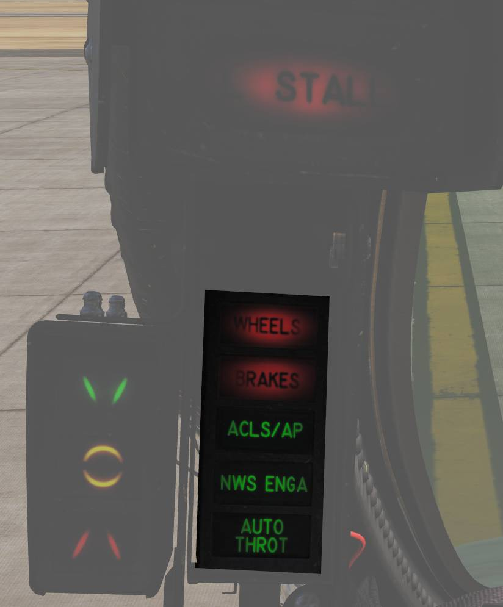

# Left Windshield Frame

## Approach Indexer

The approach indexer provides visual indication of aircraft angle of attack relative to on-speed AOA
during landing.

Three lights are displayed:

- Green — Indicates aircraft is slow (AOA too high).
- Amber — Indicates on-speed AOA.
- Red — Indicates aircraft is fast (AOA too low).

When the HOOK BYPASS switch is set to CARRIER and the landing gear is down, the indexer lights will
flash if the arresting hook is not extended.

These indications are repeated on the nosewheel strut approach lights, allowing the landing signal
officer (LSO) to observe aircraft AOA during carrier recoveries.

## HUD Caution Lights

Several caution and warning indicators are located to the left of the HUD.

| Indicator  | Function                                                                                                        |
| ---------- | --------------------------------------------------------------------------------------------------------------- |
| WHEELS     | Flashes with landing gear not down and locked, flaps below 10° and either throttle below 85%.                   |
| BRAKES     | Indicates antiskid or brake failure. Also lights when parking brake is set.                                     |
| ACLS/AP    | Shows that ACLS or autopilot is disengaged.                                                                     |
| NWS ENGA   | Lit when nosewheel steering (NWS) is engaged.                                                                   |
| AUTO THROT | When shown disengagement of the automatic throttle control mode is not resulting from the throttle mode switch. |
