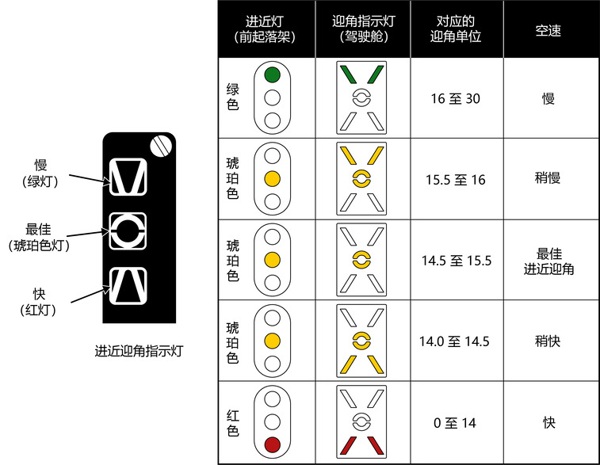
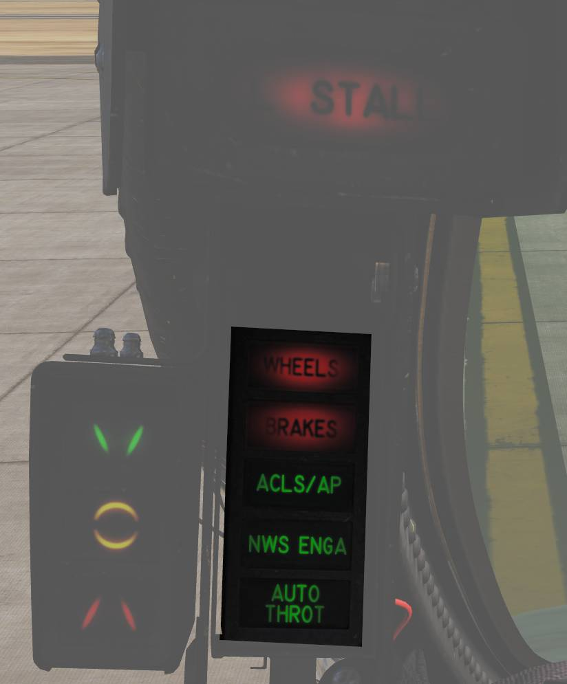

# 风挡左边框

## 进近迎角分度器

带状迎角指示器指示了飞机的迎角（AoA），指示器的显示范围在 0 至 30 个单位之间（对应迎角探头在 -10° 至 +40° 范围内转动）。

灯光分别为：

- 绿色 — 空速过低（迎角过大）。
- 琥珀色 — 正处于最佳进近迎角
- 红色 — 表示空速过快（迎角过低）。

如果拦阻钩旁路开关处于 CARRIER（着舰）位置，当起落架放下，但拦阻钩升起时，分度器灯光将会闪烁。

这些指示灯光会在前前轮支柱的进近灯上复显，以便在着舰时，让 LSO（着舰信号官）也能通过观察灯光来判断飞机的 AOA。

## HUD 注意灯

位于 HUD 左侧的指示灯数个注意和告警灯。

| 指示器     | 功能                                                                                                         |
| ---------- | ------------------------------------------------------------------------------------------------------------ |
| WHEELS     | 机轮告警灯。起落架未放下并锁定且襟翼放下的角度小于10°以及其中一个油门握把设定转速小于85%时，告警灯将会亮起。 |
| BRAKES     | 机轮刹车告警灯。告警灯亮起时表示防滑或刹车失效。同时在设置停放刹车时也将亮起。                               |
| ACLS/AP    | 自动助降系统/自动驾驶注意灯。注意灯亮起表示 ACLS 或自动驾驶已断开。                                          |
| NWS ENGA   | 前轮转向（NWS）启用注意灯。注意灯亮起表示前轮转向已启用。                                                    |
| AUTO THROT | 自动油门注意灯。注意灯亮起表示飞行员使用油门模式开关以外的方式断开 APC。                                     |
