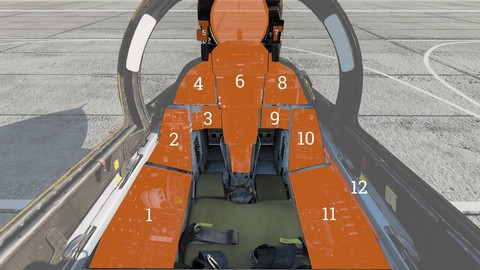

# 飞行员驾驶舱总览

## 布局

| 部分 | 名称                                       |
| :--: | ------------------------------------------ |
|  1.  | [左侧控制台](left_console.md)              |
|  2.  | [左侧垂直控制台](left_vertical_console.md) |
|  3.  | [左膝仪表板](left_knee_panel.md)           |
|  4.  | [左仪表板](left_instrument_panel.md)       |
|  5.  | [风挡左边框](left_windshield_frame.md)     |
|  6.  | [中央仪表板](center_panel.md)              |
|  7.  | [风挡右边框](right_windshield_frame.md)    |
|  8.  | [右仪表板](right_instrument_panel.md)      |
|  9.  | [右膝仪表板](right_knee_panel.md)          |
| 10. | [右垂直控制台](right_vertical_console.md)  |
|  11  | [右侧控制台](right_console.md)             |
| 12. | [座舱盖控制手柄](canopy_control_handle.md) |

<iframe width="560" height="315" src="https://www.youtube.com/embed/OO3IdQjAdDA?si=_mawunE5OBnmxVqE" title="Heatblur DCS: F-14 Tomcat - Episode 2: Pilot's Cockpit Walkaround" frameborder="0" allow="accelerometer; autoplay; clipboard-write; encrypted-media; gyroscope; picture-in-picture; web-share" referrerpolicy="strict-origin-when-cross-origin" allowfullscreen></iframe>
