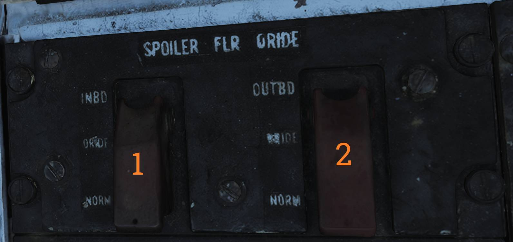
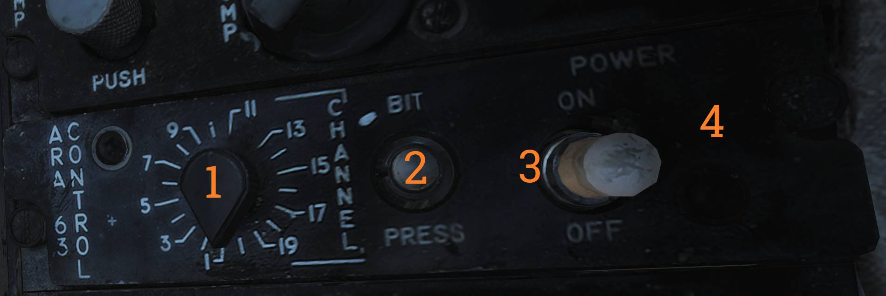
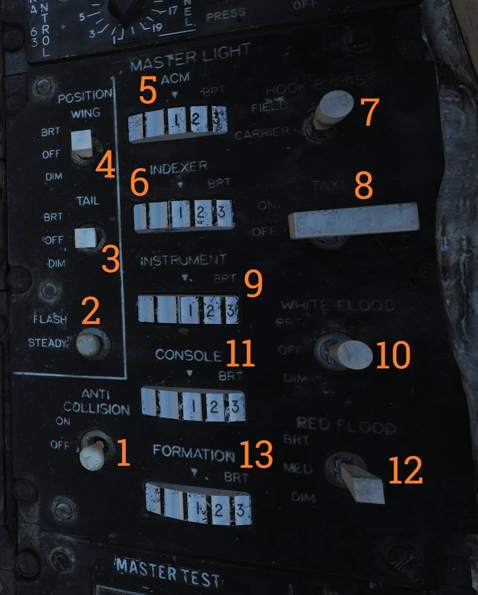
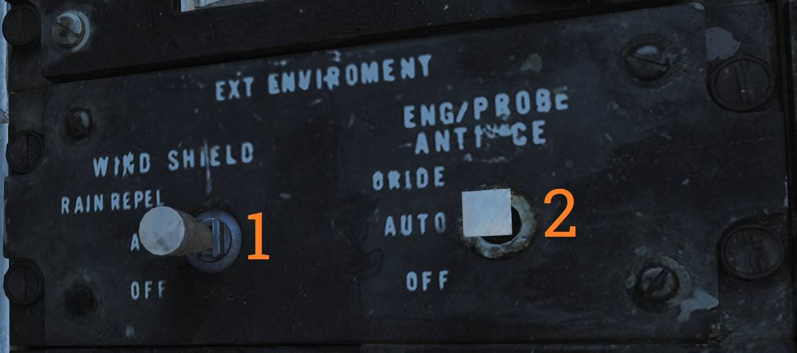
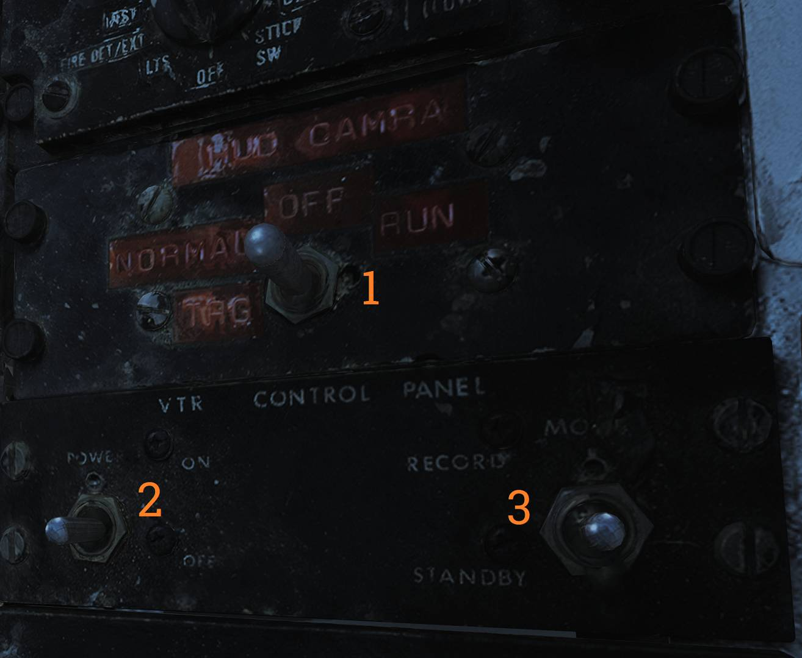

# Right Side Console

## Spoiler Failure Override

Contains controls to override failed spoiler sections, allowing the remaining spoilers to continue
operating after a MASTER RESET.

### Inboard and Outboard Spoiler Override Switch

Two-position switch (<num>1</num>) controlling the inboard spoiler override function with
two-position switch (<num>2</num>) controlling the outboard spoiler override function.

Both controls have two positions:

- ORIDE - Overrides spoiler symmetry protection, allowing a functional spoiler to continue to
  operate after a MASTER RESET if one fails.
- NORM - Normal (guarded position), in this mode, if a spoiler fails up the rest are commanded to
  drop and the SPOILERS light illuminates on the caution panel.

## Liquid Oxygen Quantity Indicator

Contains an indicator showing the remaining quantity of liquid oxygen available. Graduated in
1-liter increments. Also has an OFF flag that is shown in case of power failure to the indicator.
The indicator is tested through the INST mode on the MASTER TEST panel and should read 2 liters.

## Compass Control Panel

The compass control panel contains controls used to configure AHRS heading reference modes.

### Sync Indicator

Indicator (<num>1</num>) displaying synchronization between the AHRS directional gyro and the
magnetic azimuth detector. Used primarily in SLAVED mode.

### Hemisphere Selector Switch

The N-S switch (<num>2</num>) selects the hemisphere in which the aircraft is operating.

Correct selection is critical to ensure proper earth-rate correction in both DG and SLAVED modes.

### Latitude Selector Knob

The LAT knob (<num>3</num>) selects aircraft latitude from 0° to 90°.

This input allows the AHRS to apply correct earth-rate compensation in DG and SLAVED modes.

### Compass Mode Switch

The mode switch (<num>4</num>) selects the source of heading information for the AHRS.

- COMP - Compass, uses magnetic azimuth detector directly without stabilization from the directional
  gyro, used only for emergency operation and the displays automatically uses the manual magnetic
  variation.
- SLAVED - Normal mode, uses the magnetic azimuth detector stabilized by the directional gyro.
- DG - Directional gyro mode, uses only gyro and not the magnetic azimuth detector.

### Heading Knob/Button

The HDG knob and pushbutton (<num>5</num>) is used in DG and SLAVED modes.

In SLAVED mode it's used to sync the directional gyro with the magnetic azimuth detector and set
magnetic heading on the BDHI. Button should be held until the synchronization indicator needle is
over the null mark.

In DG mode the button is depressed and rotated to select desired heading on the BDHI.

The button can also be used to fast erect pitch and roll of the AHRS by depressing the button for up
to 3 minutes. A new fast erect attempt can be done if a 1 minute wait is first observed.

## ARA-63 Control Panel

Panel used to control the AN/ARA-63 Instrument Carrier Landing System (ICLS).

### Channel Selector

Rotary selector (<num>1</num>) used to select one of 20 available ICLS channels.

### BIT Button

The BIT pushbutton (<num>2</num>) initiates a self-test of the AN/ARA-63 system.

When activated, landing symbology is displayed on the HUD and VDI if configured for ILS operation.

### Power Switch

The POWER switch (<num>3</num>) controls electrical power to the AN/ARA-63.

The switch must be pulled outward to move to the OFF position.

### Power Indicator Light

Indicator light (<num>4</num>) illuminates when the AN/ARA-63 is powered.

## Caution - Advisory Indicator

Main pilot caution panel.

| Indicator        | Function                                                                                                                                                                                                                                                                       |
| ---------------- | ------------------------------------------------------------------------------------------------------------------------------------------------------------------------------------------------------------------------------------------------------------------------------ |
| PITCH STAB 1 & 2 | Caution lights indicating inoperative pitch channels.                                                                                                                                                                                                                          |
| ROLL STAB 1 & 2  | Caution lights indicating inoperative roll channels (roll SAS failure).                                                                                                                                                                                                        |
| YAW STAB OP      | Caution light indicating one inoperative yaw channel.                                                                                                                                                                                                                          |
| YAW STAB OUT     | Caution light indicating two inoperative yaw channels (yaw SAS failure).                                                                                                                                                                                                       |
| EMERG JETT       | Caution light indicating activation of EMERG STORES JETT button.                                                                                                                                                                                                               |
| LADDER           | Caution light indicating boarding ladder not correctly stowed.                                                                                                                                                                                                                 |
| ECS TURBINE      | Non-functional                                                                                                                                                                                                                                                                 |
| INLET ICE        | Caution light indicating accumulation of ice on the ice detector in the left engine inlet.                                                                                                                                                                                     |
| FLAP             | Caution light indicating failure in the flap system or airspeed greater than 225 knots indicated airspeed with flaps down.                                                                                                                                                     |
| HZ TAIL AUTH     | Caution light indicating failure of lateral tail authority actuator (or CADC failure).                                                                                                                                                                                         |
| RUDDER AUTH      | Caution light indicating failure of rudder authority actuators (or CADC failure).                                                                                                                                                                                              |
| SPOILERS         | Caution light indicating spoiler system failure causing several or all spoilers to be locked down.                                                                                                                                                                             |
| AUTO PILOT       | Caution light indicating failure in the auto pilot system.                                                                                                                                                                                                                     |
| L & R INLET      | Caution lights indicating AICS programmer and/or system failure.                                                                                                                                                                                                               |
| OIL PRESS        | Caution light indicating left or right engine oil pressure below 11 psi.                                                                                                                                                                                                       |
| BLEED DUCT       | Caution light indicating high-temperature air leak in the engine compartments.                                                                                                                                                                                                 |
| L & R RAMPS      | Caution lights indicating ramps not locked in position during critical flight conditions.                                                                                                                                                                                      |
| START VALVE      | Caution light indicating that the starter solenoid air valve is open after start. (F-14B only.)                                                                                                                                                                                |
| OXY LOW          | Caution light indicating low oxygen pressure or less than 2 liters of oxygen remaining. (F-14A only.)                                                                                                                                                                          |
| L & R ENG SEC    | Caution lights indicating that respective engine AFTC is in secondary mode. (F-14B only.)                                                                                                                                                                                      |
| L & R OVSP/VALVE | Caution lights indicating engine starter system malfunction or N1 rotor over-speed in respective engine. (F-14A only.)                                                                                                                                                         |
| L & R GEN        | Caution lights indicating respective engine generator is inoperative.                                                                                                                                                                                                          |
| CANOPY           | Caution light indicating that the canopy is not down and locked.                                                                                                                                                                                                               |
| BINGO            | Caution light indicating aircraft fuel quantity at or below set BINGO quantity.                                                                                                                                                                                                |
| L & R OIL HOT    | Caution lights indicating that respective engine oil is too hot.                                                                                                                                                                                                               |
| CADC             | Caution light indicating failure in the air data computer.                                                                                                                                                                                                                     |
| HYD PRESS        | Caution light indicating pressure in either engine hydraulic pump below 2,100 psi.                                                                                                                                                                                             |
| L & R FUEL PRESS | Caution lights indicating pressure below 9 psi in the respective engine fuel boost pump.                                                                                                                                                                                       |
| L & R FUEL LOW   | Caution lights indicating fuel quantity below 1,000 pounds in aft and left or forward and right fuel feed group respectively.                                                                                                                                                  |
| WING SWEEP       | Advisory light indicating failure of a single channel in the wing-sweep system.                                                                                                                                                                                                |
| RATS             | Advisory light indicating RATS enabled. (F-14B only.)                                                                                                                                                                                                                          |
| TRANS/RECT       | Advisory light indicating failure in one or both transformer-rectifiers.                                                                                                                                                                                                       |
| MACH TRIM        | Advisory light indicating failure in Mach trim actuator.                                                                                                                                                                                                                       |
| WSHLD HOT        | Advisory light indicating central windshield overheat.                                                                                                                                                                                                                         |
| LAUNCH BAR       | Advisory light indicating either: Weight on wheels - Aircraft kneeled, either throttle below MIL and launch bar not up and locked. Weight off wheels - Launch bar not up and locked, launch bar not within 15º of center (cocked nose-gear), or nose strut not fully extended. |
| INTEG TRIM       | Advisory light indicating failure in the trim system or computer failure.                                                                                                                                                                                                      |
| AHRS             | Advisory light indicating unreliable attitude or heading information from AHRS.                                                                                                                                                                                                |
| ENG FIRE EXT     | Advisory light indicating low pressure in the fire extinguishing container (90 psi below nominal 600 psi).                                                                                                                                                                     |
| AUX FIRE EXT     | Advisory light indicating low pressure in the auxiliary fire extinguishing container (90 psi below nominal 600 psi).                                                                                                                                                           |

## Master Generator Control Panel

Panel controlling electrical power generation and emergency generator logic.

### Master Generator Switches

The left and right MASTER GEN switches (<num>1</num>) control activation and connection of their
respective engine-driven generators.

The switch must be lifted to move from OFF/RESET.

- NORM - Activates and connects the generator to the main electrical buses.
- OFF/RESET - Disconnects the generator and resets protective circuits.
- TEST - Activates the generator without connecting it to the buses for testing purposes.

### Emergency Generator Switch

Guarded EMERG switch (<num>2</num>) controlling emergency generator connection to the essential
buses.

- NORM - Emergency generator automatically connects if both main generators fail.
- OFF/RESET - Disconnects the emergency generator and resets protection circuits.

## Master Light Control Panel

The master light control panel manages most interior and exterior aircraft lighting systems.

### Anti-Collision Light Switch

ON/OFF switch (<num>1</num>) controlling aircraft anti-collision lights.

### Position Light Mode Switch

Switch (<num>2</num>) selecting steady or flashing operation of wing and supplementary tail position
lights.

With weight on wheels, supplementary lights remain steady regardless of selection.

### Tail Position Light Switch

Switch (<num>3</num>) controlling tail position lights with DIM and BRT settings.

### Wing Position Light Switch

Switch (<num>4</num>) controlling wing position lights with DIM and BRT settings.

### ACM Lighting Thumbwheel

Thumbwheel (<num>5</num>) controlling ACM panel lighting intensity from 0 (off) to 14 (maximum).

### AoA Indexer Thumbwheel

Thumbwheel (<num>6</num>) adjusting angle-of-attack indexer light intensity from 0 to 14.

### Hook Bypass Switch

Switch (<num>7</num>) selecting FIELD or CARRIER AoA logic.

When set to CARRIER with wheels down, AoA lights flash if the arresting hook is not down.

### Taxi Light Switch

ON/OFF switch (<num>8</num>) controlling taxi lights.

### Instrument Lighting Thumbwheel

Thumbwheel (<num>9</num>) controlling instrument panel lighting intensity from 0 to 14.

### White Flood Light Switch

Switch (<num>10</num>) enabling white cockpit flood lighting.

DIM and BRT positions available. Switch is locked to OFF unless pulled outward.

### Console Lighting Thumbwheel

Thumbwheel (<num>11</num>) controlling console lighting and red flood lighting.

- 0 - All off
- 1–14 - Increasing console light intensity

### Red Flood Light Switch

Switch (<num>12</num>) controlling red instrument and console flood lighting.

- DIM - Dim red console flood
- MED - Medium red console flood
- BRT - Bright red instrument and console flood

### Formation Light Thumbwheel

Thumbwheel (<num>13</num>) controlling external formation light brightness from 0 to 14.

## Air Conditioning Control Panel

Panel controlling the environmental control system (ECS).

### Temperature Switch

Two-position switch (<num>1</num>) controlling the cabin and pressure suit temperature mode.

- AUTO - Temperature is automatically regulated using the TEMP thumbwheel regardless of airspeed and
  altitude.
- MAN - Temperature is manually controlled using the TEMP thumbwheel and varies with airspeed and
  altitude.

### Cabin Pressure Switch

Two-position switch (<num>2</num>) controlling cabin pressurization. The switch is locked in NORM
until lifted.

- NORM - Normal pressurization mode. Cabin pressure is maintained at approximately 8,000 feet up to
  an aircraft altitude of 23,000 feet, after which a constant 5 psi differential is maintained.
- DUMP - Opens the cockpit dump valve, depressurizing the cockpit.

### RAM AIR Switch

The RAM AIR switch (<num>3</num>) modulates cockpit air temperature when the ram air door is in use.

INCR opens the ram air door, decreasing temperature, while DECR closes the door, increasing
temperature. The switch is spring-loaded to center.

### Air Source Selectors

Five mutually exclusive air source selectors (<num>4</num>) used to select ECS air supply source.

- RAM - Closes all other air sources and opens the ram air door. Gun firing is inhibited.
- L & R ENG - Selects either engine as bleed air source.
- BOTH ENG - Selects both engines as bleed air sources. Normal position.
- OFF - Closes all air sources except the ram air door. Pressurization and air conditioning are
  unavailable. Gun firing is inhibited.

### Temperature Thumbwheel

The TEMP thumbwheel (<num>5</num>) selects cockpit and pressure suit air temperature. 0-14 is
selectable with COOL and WARM placarded at each end stop. With the TEMP switch (<num>1</num>) set to
AUTO, a setting of 7 corresponds approximately to 21°C (70°F) while set to manual, the thumbwheel
needs to be set for each variation in airspeed and altitude.

## Master Test Panel

Panel used to control onboard checkout (OBC), on board built-in tests (BIT), and emergency flight
hydraulic operation.

### Master Test Selector

The MASTER TEST selector (<num>1</num>) is used to select and initiate OBC and BIT functions. Pull
out to enable selection, push in at selected option to start test.

- OFF - Disables all test functions.
- LTS - Tests cockpit lights.
- FIRE DET/EXT - Tests fire detection and extinguishing systems.
- INST - Tests cockpit instruments.
- OBC - Initiates onboard checkout.
- EMERG GEN - Tests emergency generator.
- MACH LEV - Dynamic Mach lever test. (F-14A only.)
- WG SWP - Wing sweep test.
- FLT GR DN - Ground check of autothrottle interlocks.
- FLT GR UP - External tank pressurization test.
- D/L RAD - Data link converter test.
- STICK SW - Stick and spoiler symmetry switch test.

### GO / NO-GO Indicator Lights

The GO and NO-GO lights (<num>2</num>) used to indicate GO or NO-GO conditions of systems during
relevant tests.

### Emergency Flight Hydraulic Switch

The EMERG FLT HYD switch (<num>3</num>) controls emergency flight hydraulic operation. The switch is
guarded to the AUTO (LOW) position.

- HIGH - Activates the power module (high speed mode), bypassing flight and combined 2,100 psi
  switches.
- LOW - Activates the backup power module bypassing flight and combined 2,100 psi switches.
- AUTO (LOW) - Automatically activates LOW mode when both flight and combined system pressures are
  below 2,100 psi.

## External Environmental Control Panel

Panel controlling windshield heating and external anti-ice systems.

### Windshield Heat Switch

The WIND SHIELD switch (<num>1</num>) controls external windshield heating by blasting the exterior
with warm air.

- AIR - Enables windshield heating using warm air.
- OFF - Disables windshield heating.

### ENG/PROBE ANTI-ICE Switch

The ENG/PROBE ANTI-ICE switch (<num>2</num>) controls engine, probe, and AICS anti-ice systems.

- ORIDE/ON - Engages engine and probe anti-ice regardless of external conditions and enables the
  anti-ice setting in AICS.
- AUTO/OFF - Automatically engages engine and probe anti-ice as needed, turns off AICS anti-ice.
- OFF/OFF - Turns off both engine and probe anti-ice and AICS anti-ice.

## Hydraulic Transfer Pump Switch

Panel containing the control for the hydraulic transfer pump which equalizes pressure between the
combined and flight hydraulic systems in case of a failure in one of them.

The HYD TRANSFER PUMP switch has two positions, SHUTOFF and NORMAL (guarded position).

The NORMAL position (also the standard setting) will have the hydraulic transfer pump pressurize a
failed hydraulic system from the other, functioning system, when it drops below 2,100 psi.

The SHUTOFF position (which can be accessed by lifting the guard) is used to turn off the transfer
pump in case it can’t supply enough pressure to the failed system as that would risk disabling the
still operational system.

## HUD - Video Control Panel

Control panel for the CTVS system used to record HUD video.

> 💡 Not implemented in DCS.

### HUD Camera Switch

The HUD CAM(E)RA switch (<num>1</num>) selects when recording occurs.

- TRG - Trigger, records while the second (firing) detent on the stick trigger is depressed.
- NORMAL - Records while the first detend on the stick trigger is depressed.
- OFF - Disables power to the CTVS.
- RUN - Records continuously.

Switches (<num>2</num>) and (<num>3</num>) are for the Video Tape Recorder (VTR).

## Canopy Defog / Cabin Air Lever

The canopy air diffuser lever controls the flow of cabin air. The normal position, CABIN AIR,
directs 70% of the conditioned air through the cockpit air diffusers and 30% through the canopy air
diffusers.

The CANOPY DEFOG position directs all airflow through the canopy air diffusers for canopy defog.
