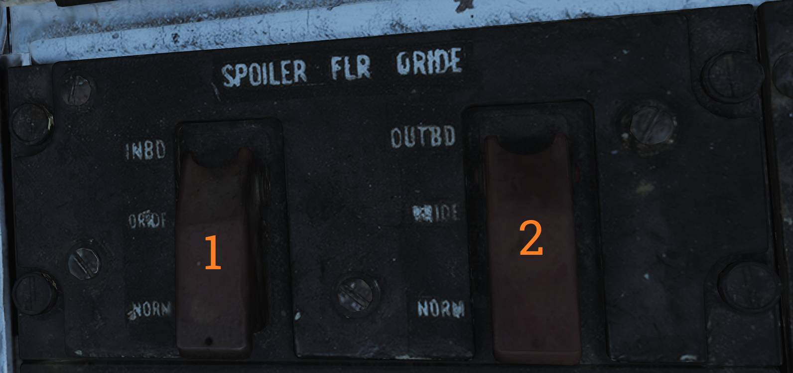
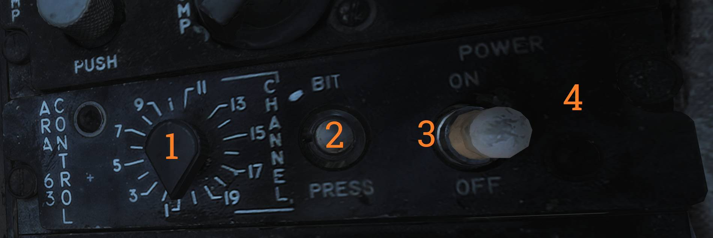
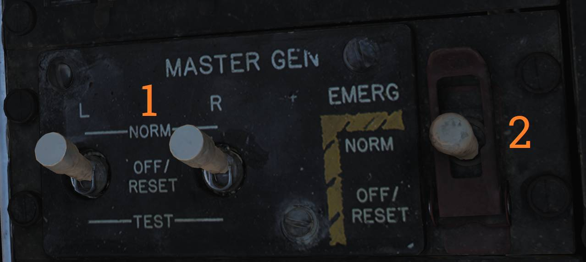
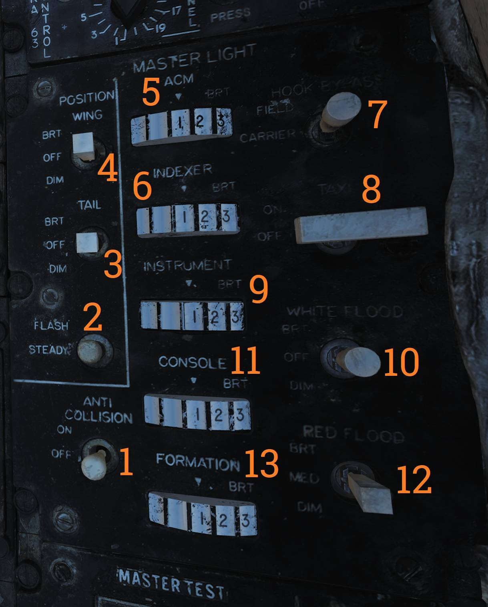
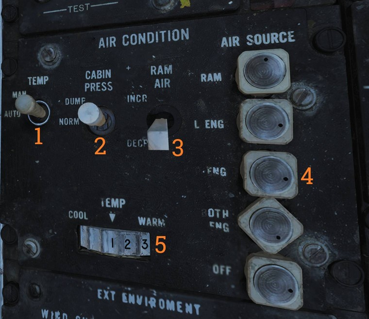

# 右侧控制台

## 扰流板故障超控

用于超控故障的扰流板部分，使其余扰流板在执行 MASTER
RESET（大气数据计算机复位）后继续正常工作。

### 内侧和外侧扰流板超控开关

两档开关 (<num>1</num>) 用于控制内侧扰流板的超控功能以及两档开关 (<num>2</num>) 用于控制外侧扰流板的超控功能。

这两个控制开关各有两个档位：

- ORIDE - 超控内侧扰流板对称保护，如果一侧扰流板故障，CADC 复位后，允许另一侧正常工作的内侧扰流板继续作动。
- NORM - 正常模式（保护开关锁定），该模式下，如果任意一侧机翼上的内扰流板故障无法升起，另一侧的内侧扰流板会收起，且注意灯面板中的 SPOILERS 指示灯亮起起。

## 液氧储量表

显示了剩余的液氧储备量。每个刻度代表 1 公升。电源故障时，表盘上显示 OFF 标识旗。飞行员可以通过主测试面板的 INST 档位来测试仪表，在测试时，仪表读数应显示为 2 公升。

## 罗盘控制面板

用于在使用 AHRS（姿态航向基准系统）时选择罗盘工作模式。

### SYNC IND

这个指示器 (<num>1</num>) 用于显示 AHRS 航向陀螺与磁方位探测器之间是否同步。用于 SLAVED（隶属）模式。

### N-S 选择开关

用于选择 DG（航向陀螺仪）和 SLAVED 模式下飞机所处的半球。

这个开关对于在 DG 和 SLVAED 模式下提供正确的地球自转修正来说至关重要。

### LAT 旋钮

纬度选择旋钮 (<num>3</num>)，用于选择从0°到90°的维度。

输入后以便在 DG 和 SLAVED 模式下对地球自转进行修正。

### 模式选择开关

(<num>4</num>) 用于选择 AHRS 航向信息来源。

- COMP - 罗盘，直接使用磁方位探测器，不通过航向陀螺稳定，仅用于紧急操作，且显示将自动使用手动输入的磁差。
- SLAVED - 正常模式，使用经过航向陀螺稳定的磁方位探测器。
- DG - 向陀螺仪模式，仅使用航向陀螺不使用磁方位探测器。

### HDG 旋钮/按钮

(<num>5</num>) 用于 DG 和 SLAVED 模式。

在 SLAVED 模式下，HDG 旋钮/按钮用于使航向陀螺与磁方位探测器同步，以及设置 BDHI 上的磁航向。按住按钮直到同步指示器指针归中至零位标记为止。

在 DG 模式下，按下并旋转旋钮来调定 BDHI 中的所需航向。

HDG 旋钮/按钮还可以通过至少按住3分钟来快速调平 AHRS 的俯仰和横滚。在等待1分钟后，可再次执行新的快速调平。

## ARA-63 控制面板

此面板用于控制 AN/ARA-63 ILS（ICLS）系统。

### CHANNEL 选择开关

波道选择开关 (<num>1</num>)，用来选择 20 个可用波道中的任意一个进行使用。

### BIT 按钮

(<num>2</num>) 按钮用于激活 BIT 测试回路。

如果在 PDCP 中选择了 LDG MODE 以及 AWL/PCD 转向，并且在 HUD AWL 或 VDI
AWL 开关中选择了 ILS 档位的话，那么着舰标识符将显示在 VDIG 中。

### POWER 开关

电源开关 (<num>3</num>)，ON/OFF 档位分别用于接通或断开 ARA-63 的电源。

提起开关才可将其拨至 OFF 档位。

### 状态指示灯

灯光 (<num>4</num>) 亮起表示 AN/ARA-63 通电。

## 注意 - 提示灯面板

飞行员驾驶舱的主要注意灯光面板。

| 指示器           | 功能                                                                                                                                                                                                         |
| ---------------- | ------------------------------------------------------------------------------------------------------------------------------------------------------------------------------------------------------------ |
| PITCH STAB 1 & 2 | “俯仰增稳 1” 和 “俯仰增稳 2” 注意灯，指示灯亮起表示俯仰通道不可用。                                                                                                                                          |
| ROLL STAB 1 & 2  | “横滚增稳 1” 和 “横滚增稳 2” 注意灯，指示灯亮起表示横滚通道不可用（横滚 SAS 故障）。                                                                                                                         |
| YAW STAB OP      | “偏航增稳工作” 注意灯，亮起表示单个通道不可用。                                                                                                                                                              |
| YAW STAB OUT     | “偏航增稳失效” 注意灯，指示灯亮起表示两个偏航通道不可用（横向增稳故障）。                                                                                                                                    |
| EMERG JETT       | “应急抛弃” 注意灯，指示灯亮起表示 EMERG STORES JETT（应急挂载抛弃）按钮按下。                                                                                                                                |
| LADDER           | “登机梯” 注意灯，指示灯亮起表示登机梯未正确折叠收起。                                                                                                                                                        |
| ECS TURBINE      | 无功能                                                                                                                                                                                                       |
| INLET ICE        | “进气道结冰” 注意灯，注意灯亮起表示左发进气道结冰信号器探测到结冰。                                                                                                                                          |
| FLAP             | “襟翼” 注意灯，指示灯亮起表示襟翼系统故障，或空速超过225节但襟翼仍未收上。                                                                                                                                   |
| HZ TAIL AUTH     | “水平安定面控制” 注意灯，指示灯亮起表示水平安定面控制作动器故障（或 CADC 故障）。                                                                                                                            |
| RUDDER AUTH      | “方向舵控制” 注意灯，指示灯亮起表示方向舵控制作动器故障（或 CADC 故障）。                                                                                                                                    |
| SPOILERS         | “扰流板” 注意灯，指示灯亮起表示扰流板失效导致一组扰流板被锁死。                                                                                                                                              |
| AUTO PILOT       | “自动驾驶” 注意灯，指示灯亮起表示自动驾驶系统中存在故障。                                                                                                                                                    |
| L & R INLET      | “左进气” 和 “右进气” 注意灯，指示灯亮起表示 AICS（进气控制系统）控制程序和/或系统故障。                                                                                                                      |
| OIL PRESS        | “滑油压力” 注意灯，指示指示灯亮起起表示左发或右发机滑油压力小于 11 psi。                                                                                                                                     |
| BLEED DUCT       | “引气导管” 注意灯，指示灯亮起表示发动机舱内高温空气泄露。                                                                                                                                                    |
| L & R RAMPS      | “左斜板” 和 “右斜板” 注意灯，指示灯亮起表示关键飞行阶段中，进气道斜板未处在收上或限位器锁定位置。                                                                                                            |
| START VALVE      | “起动机阀门” 注意灯，指示灯亮起表示发动机起动后，起动机电磁空气阀仍开启。（仅限 F-14B）                                                                                                                      |
| OXY LOW          | “氧气压力低”注意灯，灯光亮起表示剩余液氧储量少于 2 公升，或氧气压力过低。（仅限 F-14A）                                                                                                                      |
| L & R ENG SEC    | “左发次要模式” 和 “右发次要模式” 注意灯，指示灯亮起表示对应一侧的发动机 AFTC（增推扇叶温度控制装置）处于次要工作模式。（仅限 F-14B）                                                                         |
| L & R OVSP/VALVE | “左发超速/阀门” 和 “右发超速/阀门” 注意灯，指示灯亮起表示对应的发动机起动机系统故障或对应发动机的 N1 转子超速。（仅限 F-14A）                                                                                |
| L & R GEN        | “左发电机” 和 “右发电机” 注意灯，指示灯亮起表示对应一侧发动机的发电机不工作。                                                                                                                                |
| CANOPY           | “座舱盖” 注意灯，指示灯亮起表示座舱盖未关闭并锁定。                                                                                                                                                          |
| BINGO            | “返航油量” 注意灯，指示灯亮起表示飞机燃油量处于或低于设定的返航油量（BINGO）。                                                                                                                               |
| L & R OIL HOT    | “左发滑油过热” 和 “右发滑油过热” 注意灯，指示灯亮起表示对应一侧的发动机滑油温度过高。                                                                                                                        |
| CADC             | “中央大气数据计算机” 注意灯，指示灯亮起表示大气数据计算机硬件故障或某些计算不可靠。                                                                                                                          |
| HYD PRESS        | “液压压力” 注意灯，指示灯亮起表示至少一侧发动机液压泵的出口压力低于 2100 psi。                                                                                                                               |
| L & R FUEL PRESS | “左发油压” 和 “右发油压” 注意灯，指示灯亮起表示发动机中，燃油泵的出口油压低于 9 psi。                                                                                                                        |
| L & R FUEL LOW   | “左发燃油量低” 和 “右发燃油量低” 注意灯，指示灯亮起表示对应的供油油箱组的剩余油量低于 1000 磅。                                                                                                              |
| WING SWEEP       | “机翼后掠” 提示灯，指示灯亮起表示机翼后掠系统中单个通道故障。                                                                                                                                                |
| RATS             | “航降减推” 提示灯，指示灯亮起表示 RATS（航降减推系统）启用。（仅限 F-14B）                                                                                                                                   |
| TRANS/RECT       | “变压/整流” 提示灯，指示灯亮起表示一台变压-整流器正为整个需要交流电的负荷供电或两台变压-整流器故障。                                                                                                         |
| MACH TRIM        | “马赫数配平” 提示灯，指示灯亮起表示马赫数配平作动器故障。                                                                                                                                                    |
| WSHLD HOT        | “风挡超温” 提示灯，指示灯亮起表示中央风挡玻璃过热。                                                                                                                                                          |
| LAUNCH BAR       | “弹射杆” 提示灯，指示灯亮起时将表示：机轮负重时 - 前轮支柱收缩，油门位置未超过 MIL 或正常操作时弹射杆未收上并锁定时亮起。机轮不负重时 - 弹射杆未收上并锁定、前轮偏转超过15度或前起落架支柱未完全伸展时亮起。 |
| INTEG TRIM       | “综合配平” 提示灯，指示灯亮起输入指令信号和作动器位置之间不一致，计算机内部出现电力流失。                                                                                                                    |
| AHRS             | “姿态航向基准” 提示灯，指示灯亮起表示 AHRS 显示的姿态或航向信息不可靠。                                                                                                                                      |
| ENG FIRE EXT     | “发动机灭火” 提示灯，指示灯亮起表示灭火瓶内的压力低（大约比正常值 600 psi 低 90 psi）。                                                                                                                      |
| AUX FIRE EXT     | “备用灭火” 提示灯，指示灯亮起表示备用灭火瓶中的压力低（大约比正常值 600 psi 低 90 psi）。                                                                                                                    |

## 主发电机控制面板

控制发电和应急发电机逻辑的控制面板。

### MASTER GEN 开关

主发电机开关 (<num>1</num>)，分别用于接通和测试对应一侧发动机的发电机。

提起开关才能将其拨至 OFF/RESET 档位。

- NORM - 正常位置，启用发电机并将发电机连接至主母线。
- OFF/RESET - 断开发电机与主母线连接，复位触发的保护电路。
- TEST - 发电机被激励，但不与主母线连接，只用于测试。

### EMERG 开关

带有保护盖的应急发电机开关 (<num>2</num>)，开关用于控制应急发电机与应急电源母线间的连接（保护盖关闭时开关固定在 NORM 档位）。

- NORM - 正常模式，如果主发电机故障，应急发电机将自动与应急电源母线连接。
- OFF/RESET - 无论主发电机状态如何，切断将应急发电机与应急电源母线间的连接。复位保护电路。

## 主灯光控制板

用于控制机外和机内的大部分灯光。

### ANTI COLLISION 开关

防撞灯开关 (<num>1</num>)，用于开启或关闭防撞灯。

### POSITION 闪光器开关

航行灯闪光器开关(<num>2</num>) ，用于设置机翼或附加航行灯是稳定亮起还是闪烁。

前轮放下时，附加灯光将保持稳定亮起。

### TAIL POSITION 开关

尾部航行灯开关 (<num>3</num>)，用于控制机尾航行灯，可选择 BRT（亮）或 DIM（暗）。

### WING POSITION 开关

机翼航行灯开关(<num>4</num>)，用于控制机翼航行灯，可选择 BRT（亮）或 DIM（暗）。

### ACM 拨轮

(<num>5</num>) 用于控制 ACM 面板灯光亮度，0 等于关闭，1-14逐渐增加灯光亮度。

### INDEXER 拨轮

分度器亮度拨轮 (<num>6</num>) ，用于控制迎角分度器的亮度，亮度调整范围从0到14。

### HOOK BYPASS 开关

拦阻钩旁路开关，用于设置 AOA 指示灯（译注：包括分度器和进近灯）为 FIELD（机场）或 CARRIER（航母）模式.

如果选择了 CARRIER 模式且起落架放下，但拦阻钩未放下时，指示灯会闪烁。

### TAXI 开关

滑行灯开关(<num>8</num>)，控制滑行灯开关。

### INSTRUMENT 拨轮

仪表板灯光拨轮(<num>9</num>)，用于控制仪表板灯光亮度，0 等于关闭灯光，1-14 逐渐增加灯光亮度。

### WHITE FLOOD 开关

白色泛光灯开关(<num>10</num>)，用于控制飞行员驾驶舱中的白色泛光灯。

向上提起开关才可将其拨至 BRT（亮）或 DIM（暗）档位。

### CONSOLE 拨轮

控制台灯光拨轮，用于调整控制台灯光和红色泛光灯的拨轮。

- 0 - 关闭灯光
- 1–14 - 逐渐增加灯光亮度

### RED FLOOD 开关

红色泛光灯开关 (<num>12</num>)，用于控制仪表板和控制台的红色泛光灯。

- DIM - 仅开启低亮度控制台红色泛光灯
- MED - 仅开启红色控制台泛光灯
- BRT - 开启高亮度仪表板和控制台红色泛光灯

### FORMATION 拨轮

编队灯拨轮 (<num>13</num>)，用于控制机外编队灯亮起度。0 等于关闭编队灯，1-14 逐渐增加编队灯的亮度。

## 空调控制面板

用于操作环境控制系统（ECS）的面板。

### TEMP 开关

温控模式开关 (<num>1</num>)，用于选择驾驶舱和抗荷服加温模式。

- AUTO - 驾驶舱和抗荷服温度将被自动保持在 TEMP 拨轮选定的等级。
- MAN - 在 MAN 模式下使用 TEMP 拨轮手动调节驾驶舱热空气调节阀门来保持驾驶舱和抗荷服的温度。

### CABIN PRESS 开关

座舱增压开关 (<num>2</num>)，用于控制座舱增压。向上提起开关才能将其拨至其他档位。

- NORM - 正常模式，在 8000 英尺至 23000 英尺的高度范围内自动保持座舱压力，超过 23000 英尺后则始终保持座舱气压比外部气压高 5
  psi。
- DUMP - 开启座舱泄压阀来给座舱减压。

### RAM AIR 开关

冲压空气开关 (<num>3</num>)，在 AIR
SOURCE 按钮选择了 RAM 或 OFF 后，则可使用这个弹簧开关用于调整冲压空气进气门的进气量。

开关可以保持在 INCR（增加进气量）或 DECR（减小进气量）位置上，开关由弹簧归中。

### AIR SOURCE 开关

气源选择开关 (<num>4</num>)，五个互斥的气源选择开关。被选中的开关会旋转。

- RAM - 关闭其它气源，并开启冲压空气进气门，冲压空气与热引气混合后提供给所有系统。
- L & R ENG - 选择对应一侧的发动机作为引气源。
- BOTH ENG - 使用两台发动机作为引气的气源。这个档位是 AIR
  SOURCE 开关的正常位置。
- OFF - 关闭除了冲压进气门以外的所有其他气源。该模式下，冲压空气无法为驾驶舱增压或提供空气调节。OFF 模式下航炮无法击发。

### TEMP 拨轮

温控拨轮 (<num>5</num>)，用于调节驾驶舱和抗荷服温度。拨轮的调节范围是0-14，两侧有 COOL（冷）和 WARM（热）标识。自动模式下 (<num>1</num>)，7的位置大约对应 21°C 或 70°F。手动模式下，每当空速和高度变化，都需要调节拨轮以保持当前温度。

## 主测试面板

用于控制 OBC（机内检查）和各种机载系统 BIT（自检）以及应急飞行液压系统。

### MASTER TEST 选择开关

主测试选择开关(<num>1</num>)，用于选择和启动 OBC 和多个系统的 BIT。向上提起旋钮来选择测试项目，按下旋钮选择对应项目并开始测试。

- OFF - 禁用测试功能。 - LTS - 灯光测试，测试驾驶舱内指示灯。
- FIRE DET/EXT - 测试失火探测系统。
- INST - 仪表测试，测试各种驾驶舱仪表。
- OBC - 机内检查，选则该项目来启动 OBC 程序。
- EMERG GEN - 测试应急发电机。
- MACH LEV - 开始动态马赫杆检查。只适用于 F-14A。
- WG SWP - 测试机翼后掠系统。
- FLT GR DN - 开始自动油门互锁地面检查。
- FLT GR UP - 测试副油箱增压。
- D/L RAD - 测试数据链路转换器。
- STICK SW - 检查左、右扰流板对称性，将操纵杆左右横向移动 1 英尺来检查。

### GO/NO-GO 指示灯

指示灯 (<num>2</num>) 用于指示通过（GO）或未通过（NO-GO）相关系统的测试。

### EMERG FLT HYD 开关

应急飞行液压 (<num>3</num>) ，用于控制飞行液压系统的紧急模式。保护盖关闭时，开关固定在 AUTO（LOW）位置。

- HIGH - 启用动力模块（高速模式），绕过飞行液压和联合液压系统 2100
  psi 交换条件。
- LOW - 启用备用动力模块，绕过飞行液压和联合液压系统 2100 psi 交换条件。
- AUTO (LOW) - 飞行液压和联合液压系统中的压力低于 2100
  psi 时，LOW（低速）模式将被自动启用。

## 外部环境控制面板

面板用于设置风挡吹风和机外除冰。

### WSHLD 开关

风挡加温开关 (<num>1</num>) ，用于控制风挡加温，用高温空气向风挡外部送风进行加温。

- AIR - 启用系统。
- OFF - 关闭系统。

### ANTI-ICE 开关

除冰开关 (<num>2</num>)，控制发动机、皮托管和 AICS 除冰设置。

- ORIDE/ON - 无论机外气象条件如何，启用发动机除冰和皮托管除冰，并启用 AICS 除冰设定。
- AUTO/OFF - 系统自动接通发动机除冰、皮托管除冰，关闭 AICS 除冰。
- OFF/OFF - 关闭发动机除冰和皮托管除冰两者并关闭 AICS 除冰。

## 液压输送泵开关

面板用于控制液压输送泵，液压输送泵用来在一台发动机或发动机驱动泵不工作的情况下，保证主系统液压压力的持续性，液压输送泵为系统提供第二压力源。

HYD TRANSFER
PUMP 开关有两个档位，分别是 SHUTOFF（关闭）和 NORMAL（保护盖关闭，正常档位）。

如果开关置于 NORMAL 位置（同时是标准的设定），当一侧液压系统的液压压力低于 2100
psi 时，那么将通过液压输送泵从另一系统对低于 2100 psi 一侧的系统进行增压。

SHUTOFF 档位（通过抬起保护盖来波动到这个档位）用来在无法为另一侧系统提供足够压力，可能会导致正常工作的系统失效时，手动关闭液压输送泵。

## HUD-视频控制面板

面板用于控制 CTVS 系统。CTVS 的作用是录制 HUD 中的标识和图像。

> 💡 DCS 中未实装相关功能。

### HUD 摄像机开关

HUD CAM(E)RA 开关(<num>1</num>)在开始录制时进行选择。

- TRG - 扳机触发，当扳机第二段被按下（开火）时录制 HUD 画面。
- NORMAL - 按下扳机第一段时开始录制。
- OFF - 关闭 CTVS 电源。
- RUN - 持续录制 HUD 画面。

开关 (<num>2</num>) 和 (<num>3</num>) 用于录像机 (VTR)。

## 座舱盖除雾 / 座舱通风气流调节拉杆

舱盖空气散流器控制手柄控制驾驶舱中的通风气流。手柄置于正常位置——CABIN
AIR——空调系统引导70%的气流空过驾驶舱空气散流器，30%通过舱盖空气散流器。

手柄置于 CANOPY
DEFOG（舱盖除雾）位置时，空调系统将引导所有气流通过舱盖空气散流器来给舱盖除雾。
