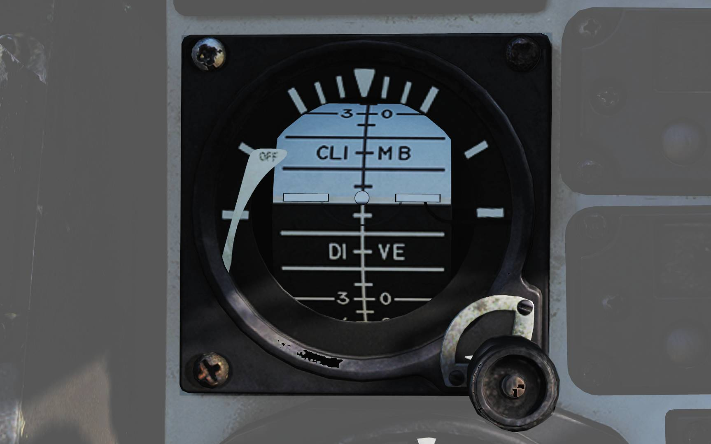

# Right Instrument Panel

## Wing-Sweep Indicator

Indicator detailing the status of the wing-sweep system.

| No. | Indicator                  | Function                                                                                                |
| --- | -------------------------- | ------------------------------------------------------------------------------------------------------- |
| 1   | Leftmost indicator pointer | Shows wing-sweep program position which is also the max forward angle at present airspeed and altitude. |
| 2   | Middle tape                | Shows commanded wing-sweep position.                                                                    |
| 3   | Rightmost tape             | Shows actual wing-sweep position.                                                                       |
| 4   | Indicator windows          | The five indicator windows show the current operating mode.                                             |

## Right Engine Fuel Shutoff Handle

Pull to shut off fuel to the right engine in case of emergency. Push in to
re-enable fuel flow to the engine. Should not be used to secure the engine.

Right engine fire extinguishing button is located behind the handle, accessible
when the handle is pulled out.

## Standby Attitude Indicator

Standalone standby attitude indicator.

| No. | Indicator/Control | Function                                                                                                                                                                                        |
| --- | ----------------- | ----------------------------------------------------------------------------------------------------------------------------------------------------------------------------------------------- |
| 1   | OFF flag          | Visible on the left side when caged or when un-powered.                                                                                                                                         |
| 2   | Knob              | Cages/un-cages the indicator and allows trim to correct pitch. In pulled-out position the indicator is caged. When pushed in, un-cages the indicator and allows pitch trim by turning the knob. |

## UHF/VHF Remote Indicators

Remote indicators displaying set frequency or channel of UHF 1 (AN/ARC-159) and
V/UHF 2 (AN/ARC-182).

| No. | Control/Indicator                                  | Function                                                                  |
| --- | -------------------------------------------------- | ------------------------------------------------------------------------- |
| 1   | UHF 1 remote channel/frequency indicator (pilot)   | Displays a readout of the frequency or channel set for the UHF 1 radio.   |
| 2   | V/UHF 2 remote channel/frequency indicator (pilot) | Displays a readout of the frequency or channel set for the V/UHF 2 radio. |

The knobs labelled DIM and BRT control display brightness.

The TEST button initiates a test for the respective indicator, no fault results
in a readout of 888.888.

## Bearing Distance Heading Indicator (BDHI)

Display indicating azimuth and bearing information.

| No. | Indicator             | Function                                                                                     |
| --- | --------------------- | -------------------------------------------------------------------------------------------- |
| 1   | No. 2 bearing pointer | Indicates magnetic course to tuned TACAN station.                                            |
| 2   | Compass rose          | Shows current aircraft magnetic heading.                                                     |
| 3   | No. 1 bearing pointer | Indicates bearing to tuned UHF/ADF station.                                                  |
| 4   | Distance counter      | Indicates slant range to tuned TACAN station in nautical miles. (Not visible in this image.) |

## ALR-67 Indicator

Indicator showing emitters detected by the ALR-67 RWR (radar warning receiver)
set.

| No. | Control/Indicator              | Function                                                                                                                  |
| --- | ------------------------------ | ------------------------------------------------------------------------------------------------------------------------- |
| 1   | System status circle, area I   | Upper left quadrant of <num>1</num>. Shows symbol indicating type of threats selected to be shown.                        |
| 2   | System status circle, area II  | Upper right quadrant of <num>1</num>. Indicates if limited mode is selected.                                              |
| 3   | System status circle, area III | Lower half of <num>1</num>. Displays failure codes and if offset display is selected.                                     |
| 4   | Non-lethal band                | Displays emitters not a direct threat to own aircraft, either because deemed out of range or lacking weaponry.            |
| 5   | Lethal band                    | Displays threats that are deemed within range and capable of engaging own aircraft but not currently doing so.            |
| 6   | Critical band                  | Displays direct threats to own aircraft. Systems capable of engaging own aircraft and showing current intent of doing so. |
| 7   | INT knob                       | Intensity/brightness knob. Controls the brightness of the display.                                                        |

### System Status Circle

The upper left quadrant (Area I) can show the following symbols:

- N - Normal
- I - AI, airborne interceptors prioritized.
- A - AAA, anti-air artillery prioritized.
- U - Unknown emitters prioritized.
- F - Friendly emitters shown in addition to other threats.

The upper right quadrant (Area II) can either be blank (limited mode not
selected) or show L if selected. Limited mode will only show the 6 highest
prioritized threats on the display.

The lower half shows system status codes:

- _Blank_ - No failure detected and offset not selected.
- B - BIT failure.
- T - Thermal overload.
- O - Offset display selected. Threats will be separated to allow readout of
  overlapping symbols. Bearing accuracy degraded for displaced threats.

## Canopy Jettison Handle

Used to jettison canopy manually.
