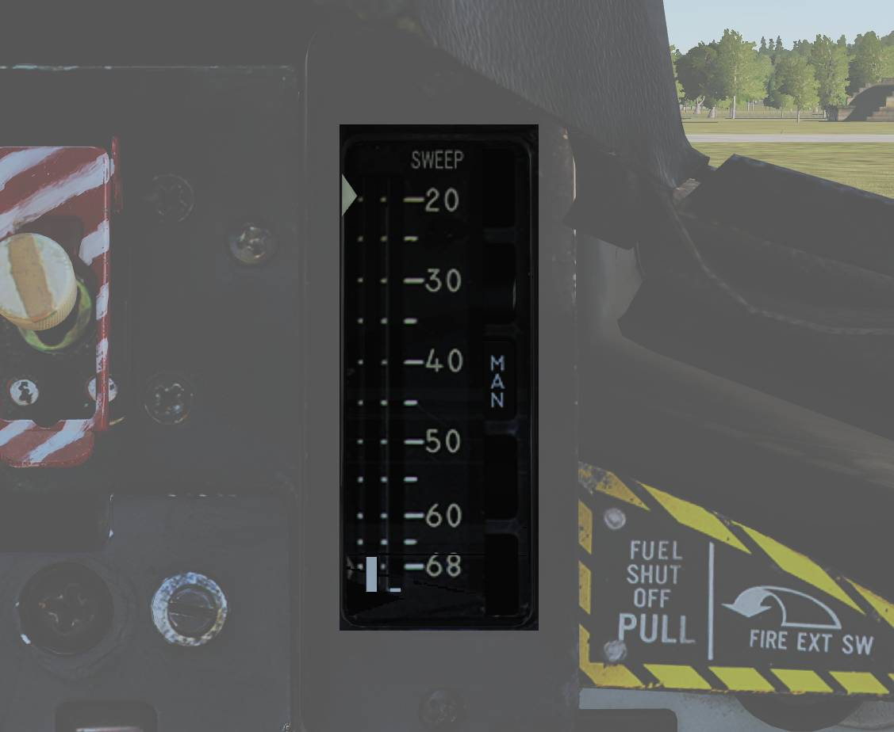
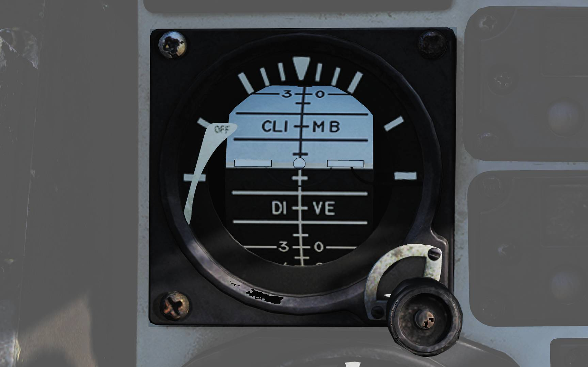
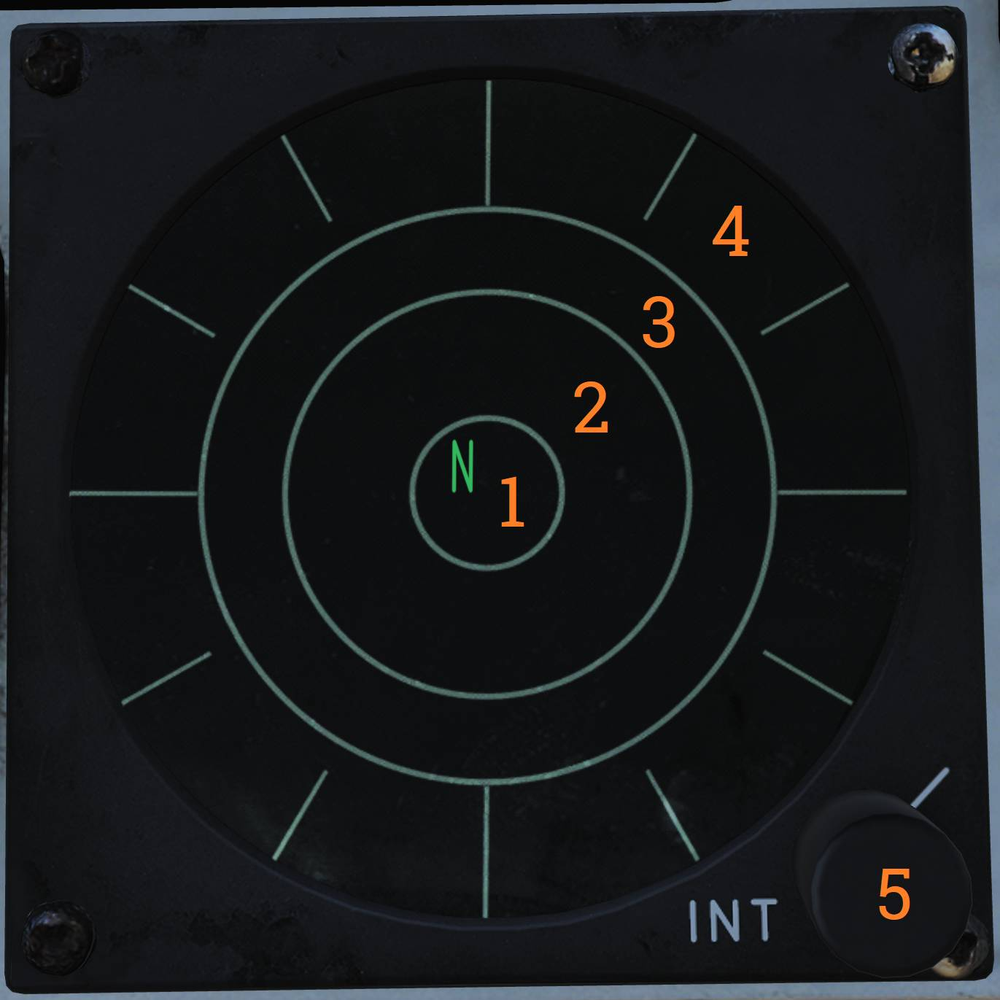

# 右仪表板

## 机翼后掠指示器

用于显示后掠翼系统的详细状态。

最左侧的指针指示了机翼后掠控制程序选定的后掠位置，同样为当前的空速和高度下的最小后掠角度。

中间的带状指示器显示了指令的后掠位置。

最右侧指示带显示了实际的机翼后掠位置。

右侧五个垂直排列的显示窗口显示了当前的机翼后掠工作模式。

## 右发断油手柄

紧急情况下，抽出手柄来切断右发动机供油。

将手柄推入正常位置来重新向发动机注入燃油。

但这个手柄不应用于正常关闭发动机。

右发灭火按钮在手柄后方，抽出手柄后方可使用灭火按钮。

## 备用姿态仪

独立工作的备用姿态仪。

表盘左侧显示的 OFF 标识旗表示备用姿态仪锁定或未通电。

位于表盘右下方的旋钮用于锁定/解锁姿态仪和调节俯仰梯度显示。旋钮抽出时，姿态仪锁定。旋钮按下解锁姿态仪时，转动旋钮可以调节俯仰梯度指示线。

## UHF/VHF 远程显示器

这个远程显示器用于显示 UHF 1（AN/ARC-159）和 V/UHF 2（AN/ARC-182）中调定的频率或波道。

### UHF 1 远程波道/频率显示器（飞行员）

(<num>1</num>) 显示 UHF 1 无线电台调定的频率或波道。

### V/UHF 2 远程波道/频率显示器（飞行员）

(<num>2</num>) 显示 V/UHF 2 无线电台调定的频率或波道。

DIM 和 BRT 旋钮以及 TEST 按钮的操作方式在这两个显示器上是一样的。

DIM 和 BRT 旋钮用于控制显示器亮度。

TEST 按钮开始显示器自检，如果通过自检，显示器中会显示 888.888。

## 方位距离航向指示器（BDHI）

用于显示方位和航向信息。

### 二号方位指针

(<num>1</num>) 用来指示选定 TACAN 台的磁方位。

### 罗盘指针

(<num>2</num>) 显示当前飞机的磁航向。

### 一号方位指针

(<num>3</num>) 指向选定 UHF/ADF 电台的方位。

### 距离计数器

(<num>4</num>) 以海里为单位显示选定 TACAN 台的斜距。（图中不可见）

## ALR-67 显示器

用于显示 ALR-67 RWR（雷达告警接收机）套件探测到的辐射源。

### 威胁区

- 非致命威胁区 (<num>2</num>) - 显示辐射源没有直接威胁到本机，显示在这个区域内表示系统认为本机在辐射源的射程外或辐射源未装备武器。
- 致命威胁区 (<num>3</num>) - 显示 RWR 认为本机进入威胁的攻击射程内并且装备武器，但还未攻击本机。
- 严重威胁区 (<num>4</num>) - 显示对本机构成直接威胁的辐射源。辐射源有能力攻击本机，且攻击意图明显。

### 系统状态圈

系统状态圈 (<num>1</num>) 分为三个区域。

**区域 I (左上象限)** 示的符号代表威胁目标的显示类型：

- N - 正常优先级。
- I - AI，优先显示机载截击雷达威胁。
- A - AAA，优先显示高射炮威胁。
- U - 优先显示不明辐射源。
- F - 显示其他雷达威胁的同时也显示友方辐射源。

**区域 II (右上象限)** 指示 ARL-67 是否处于限制模式。

- (空白) - 未选择限制模式。
- L - 选用限制模式，只显示威胁最高的6个雷达威胁。

**区域 III (下半部分)** 显示系统状态和偏置信息：

- (空白) - 正常工作。
- B - BIT（自检）未通过。
- T - 热过载。
- O - 选择了偏置显示模式。重叠的威胁目标符号会偏置显示，以增强可读性。选择偏置显示模式时，显示器指示目标方位信息的精度会下降。

### INT（亮度）控制旋钮

亮度控制旋钮 (<num>5</num>)。用于控制显示器的亮度。

## 座舱盖抛离手柄

用于手动抛离座舱盖。
