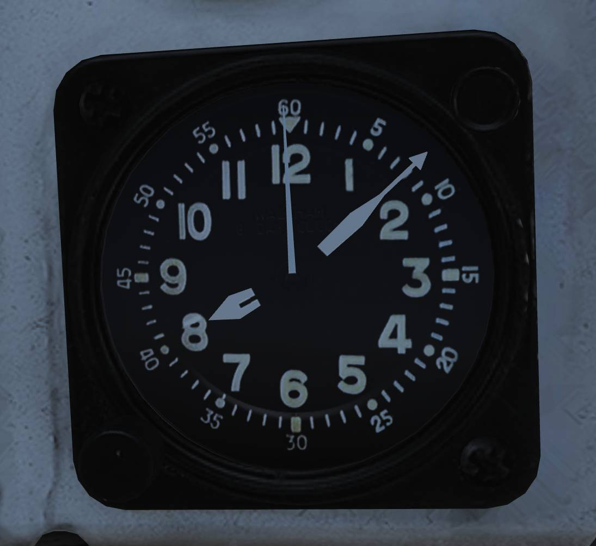

# Right Knee Panel

## Fuel Quantity Indicator

The fuel quantity indicator displays fuel quantity information for all aircraft tanks.

### BINGO Readout

The BINGO readout (<num>1</num>) displays the currently set BINGO fuel quantity.

### Total Fuel Counter

The TOTAL counter (<num>2</num>) displays total fuel quantity contained in all aircraft tanks.

### Left and Right Tank Counters

The L and R counters (<num>3</num>) display fuel quantity for the currently selected left or right
tanks.

The displayed tank group (feed, wing, or external) is selected using the QTY SEL switch on the fuel
management panel.

### Fuselage and Feed Fuel Tapes

The FUS and FEED fuel tapes (<num>4</num>) display fuselage fuel quantities.

- Left tape — Indicates left feed and aft fuselage tanks.
- Right tape — Indicates right feed and forward fuselage tanks.

### BINGO Set Knob

The SET knob (<num>5</num>) is used to set the desired BINGO fuel quantity.

Rotate the knob to select the required value.

## Accelerometer

Instrument showing current aircraft g-load (acceleration along the aircraft vertical axis). It’s
graded in g from -5g to +10g. One pointer will show current g-load while the other two will indicate
max reached negative and positive g-load. These can be reset by pushing the PUSH TO SET button on
the lower left corner of the instrument.

## Clock

Mechanical wind-up clock.

The knob on the lower left corner is used to wind up the clock by turning it clockwise and pulled
out and turned to set the hour and minute hands.

The control on the upper right corner is used to start, stop, and reset a 1-hour elapsed time
counter.
