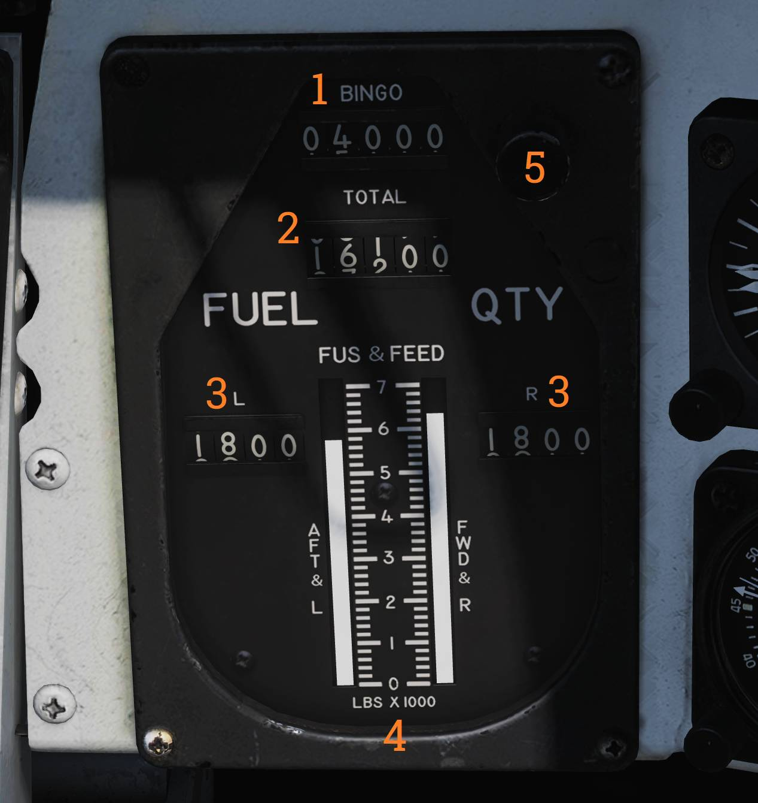
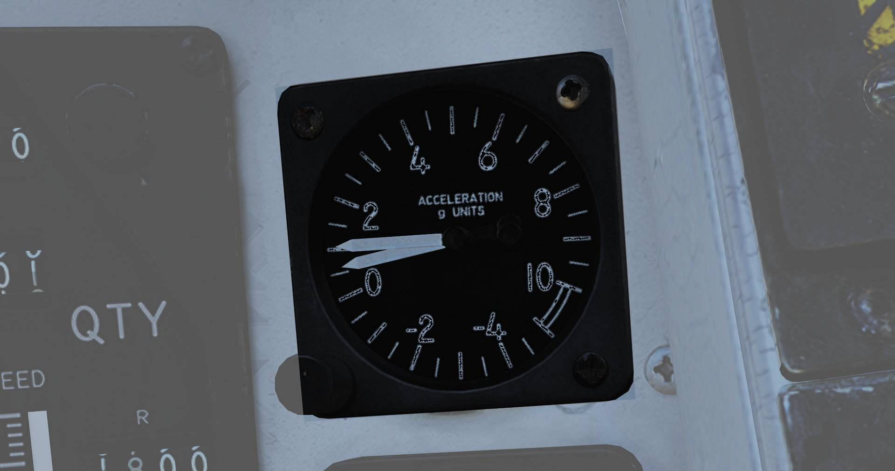
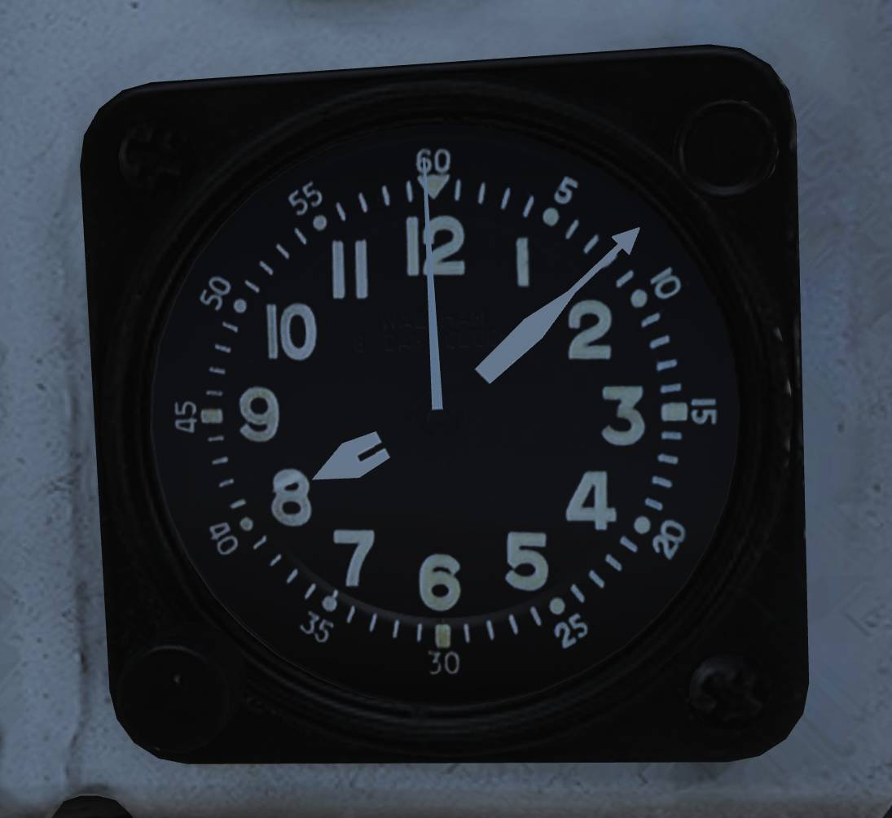

# 右膝仪表板

## 燃油量指示器

用于显示飞机不同油箱中的燃油量。

### BINGO 油量显示

(<num>1</num>) 显示当前调定的 BINGO 油量（返航油量）。

### TOTAL 油量显示

燃油总量读数(<num>2</num>)对应了飞机所有油箱中的燃油总量。

### L & R 油量显示

L & R 油量显示 (<num>3</num>) 显示当前选定左/右油箱的燃油量。

QTY SEL 开关选定的当前对应（L 或 R）油箱（供油油箱组、机翼油箱或副油箱）的燃油油量。

### FUS & FEED（机身油箱与供油油箱组）指示带

(<num>4</num>)显示对应油箱中的燃油量。

- 左侧指示带 — 显示左供油油箱组和后机身油箱中的燃油量。
- 右侧指示带 — 显示右供油油箱组和前机身油箱中的燃油量。

### SET 旋钮

(<num>5</num>)用于设置返航油量（BINGO）。

转动旋钮来调定所需油量。

## 加速度表

仪表显示当前飞机过载值（沿飞机垂直轴的加速度）的仪表。仪表的显示范围为 -5G 至 +10G。其中一个指针将显示当前过载值，而另外两个指针指示飞行中受到的最大正/负过载值。按下仪表左下角的复位按钮可以复位指针位置。

## 时钟

机械发条时钟。

左下角的旋钮用于上紧时钟发条，顺时针转动旋钮，然后抽出旋钮来设置时针和分针。

右上角的按钮用于开始、停止和复位时长为1小时的计时器。
