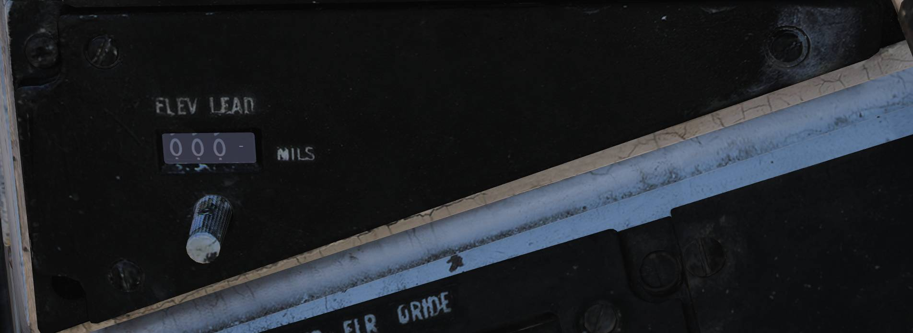

# Right Vertical Console

## Arresting Hook Panel

Panel controlling arresting hook operation.

### Hook Handle

The HOOK handle (<num>1</num>) selects arresting hook position.

- UP - Electrically commands hydraulic retraction of the hook and locks it in the up-lock.
- DOWN - Electrically releases hydraulic pressure, allowing the hook to extend by dashpot pressure
  and gravity.
- EMERG DOWN - When the handle is pulled and rotated counter-clockwise, the hook is mechanically
  released for emergency extension.

### Hook Transition Light

The hook transition light (<num>2</num>) illuminates when hook position does not correspond to
handle position.

The light will not extinguish until the hook is fully extended and may remain illuminated during
high-speed extension due to hook blowback.

### Rounds Remaining Counter

The rounds remaining counter (<num>3</num>) displays remaining M61A1 gun ammunition.

The counter normally counts down from 676 rounds and may be manually reset to a desired value using
the adjustment knob on the right side.

## Displays Control Panel

> 💡 Image shows an F-14A with AN/ALR-45 having a third option on the HSD MODE and an ECM ORIDE
> which are not functional but are present in some aircraft with the AN/ALR-67.

Control panel for front cockpit display configuration.

### Steering Command Selectors

The STEERING CMD selectors (<num>1</num>) select the source of steering command information.

The selectors are mutually exclusive and rotate to indicate the active selection.

- TACAN - TACAN provides steering information.
- DEST - Steering commands based on the RIO-selected waypoint.
- AWL/PCD - Selects glideslope guidance (ILS or ACLS) for landing or PCD steering for air-to-ground
  delivery.
- VEC - Data link vector steering commands.
- MAN - Manual course and heading steering.

### Mode Selectors

The MODE selectors (<num>2</num>) determine overall display mode.

Selectors are mutually exclusive and rotate to indicate the selected mode.

- T.O. - Takeoff mode.
- CRUISE - Cruise mode.
- A/A - Air-to-air mode.
- A/G - Air-to-ground mode.
- LDG - Landing mode.

### HUD Declutter Switch

The HUD DECLUTTER switch (<num>3</num>) selects declutter level for HUD symbology.

### HUD AWL Switch

The HUD AWL switch (<num>4</num>) selects the source of all-weather landing information displayed on
the HUD.

- ILS - ILS is used as the AWL source.
- ACL - ACLS is used as the AWL source.

### VDI Mode Switch

The VDI MODE switch (<num>5</num>) selects the display content shown on the VDI.

- TV - Displays video from TCS or LANTIRN.
- NORM - Displays the standard VDI presentation.

### VDI AWL Switch

The VDI AWL switch (<num>6</num>) selects the AWL source displayed on the VDI.

- ILS - ILS-based AWL information.
- ACL - ACLS-based AWL information.

### HSD Mode Switch

The HSD MODE switch (<num>7</num>) selects the display content shown on the HSD.

- NAV - Navigation display showing steering information based on selected steering command source.
- TID - Repeats the RIO Tactical Information Display. If the RIO TID is set to TV, the display will
  be blank.
- ECM - Displays ECM information from AN/ALR-45 and AN/ALR-50 (F-14A with AN/ALR-45/50 only).

### Display Power Switches

The POWER switches (<num>8</num>) control electrical power to the VDI, HUD, and HSD/ECMD.

### Pitch Ladder Brightness Knob

The PITCH LAD BRT knob (<num>9</num>) controls brightness of the HUD pitch ladder.

### HSD ECM Override Switch

The HSD ECM ORIDE switch (<num>10</num>) determines whether ECM information is allowed to override
the current HSD display when a threat is detected.

- ORIDE - Allows ECM override.
- OFF - Prevents ECM override.

Only functional in aircraft equipped with the AN/ALR-45/50.

## Elevation Lead Panel

The elevation lead panel (<num>11</num>) sets gun elevation lead in mils for manual air-to-air and
air-to-ground gun modes.

Adjustment range is from −263 to +87 mils.
