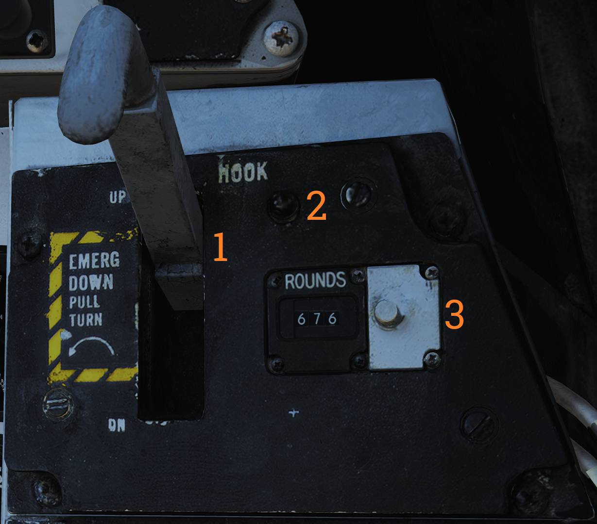
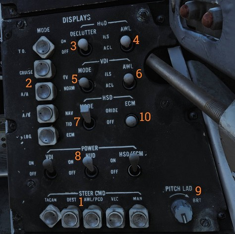

# 右垂直控制台

## 拦阻钩控制面板

用于控制拦阻钩。

### HOOK 手柄

拦阻钩控制手柄 (<num>1</num>)，用于选择拦阻钩的位置。

- UP - 电动向液压收上作动器增压，收上拦阻钩并锁定。
- DOWN - 电动使上锁作动器泄压并允许拦阻钩在阻尼压力和重力的作用下放下。
- EMERG DOWN - 应急放钩，抽出并逆时针转动手柄会让拦阻钩机械脱扣，从而使拦阻钩放下。

### 拦阻钩过渡指示灯

灯光 (<num>2</num>) 亮起表示拦阻钩实际位置与拦阻钩手柄对应位置不符。

高速飞行中放下拦阻钩时，由于空气向后吹动拦阻钩，使其无法放下，因此指示灯直到拦阻钩完全放下才会熄灭。

### 航炮弹药计数器

(<num>3</num>) 显示 M-61A1 航炮的剩余弹药数量。

从 676 开始倒数，但可按需使用右侧的旋钮调整至所需数值。

## 显示控制面板

> 💡 图中展示的为装备了 AN/ALR-45 的 F-14A， HSD MODE 拥有第三个选项，以及 ECM ORIDE，ECM
> ORIDE 在装备了 AN/ALR-67 的飞机中是不存在的。

飞行员驾驶舱中，显示器的控制面板。

### STEER CMD 选择开关

转向指令选择开关(<num>1</num>)，用于选择当前的转向指令源。

所有选择开关互斥（只能选中一个），开关将会旋转表示被选中。

- TACAN - 使用 TACAN 作为转向指令源。
- DEST - 选择 RIO 设置的航路点作为转向指令源。
- AWL/PCD - 全天候助降/精确航线方向，按下开关选择使用下滑道引导（ILS/ACLS）进行着舰，或选择 PCD 作为空对地攻击方向用于转向指令源。
- VEC - 数据链路引导，选择数据链路偏差转向作为转向指令源。
- MAN - 手动，使用手动选择的航线和航向作为转向指令源。

### 模式选择开关

模式选择开关(<num>2</num>)用于选择显示模式。

所有选择开关互斥（只能选中一个），开关将会旋转表示被选中。

- T.O. - 选择起飞模式。
- CRUISE - 选择巡航模式。
- A/A - 选择空对空模式。
- A/G - 选择空对地模式。
- LDG - 选择降落模式。

### HUD DECLUTTER 开关

HUD 防拥开关(<num>3</num>)，选择 HUD 标识防拥模式。

### HUD AWL 开关

(<num>4</num>)选择在 HUD 上显示何种 AWL（全天候降落）信息。

- ILS - 选择 ILS 作为 AWL 信息源。
- ACL - 选择 ACLS 作为 AWL 信息源。

### VDI MODE 开关

(<num>5</num>)用于选择 VDI 中显示的内容。

- TV - 在 VDI 上显示 TCS 或 LANTIRN 吊舱的视频。
- NORM - 使用正常 VDI 显示。

### VDI AWL 开关

(<num>6</num>)选择 VDI 上显示何种 AWL 信息。

- ILS - 选择 ILS 作为 AWL 信息源。
- ACL - 选择 ACL 作为 AWL 信息源。

### HSD MODE 开关

(<num>7</num>) 用来选择 HSD 中显示的内容。

- NAV - 导航显示，HSD 将根据选定的转向指令源显示转向信息。
- TID - 重复显示 RIO 的 TID 中的信息。如果 RIO 将 TID 设置显示 TV，那么 HSD 将会为空白画面。
- ECM - 显示 AN/ALR-45 和 AN/ALR-50 的 ECM 信息。（仅限装备了 AN/ALR-45 的 F-14A）

### POWER 开关

电源控制开关(<num>8</num>)，用于控制 VDI、HUD 和 HSD / ECMD 的电源。

### PITCH LAD BRT 旋钮

俯仰梯度亮度旋钮 (<num>9</num>)，用于控制 HUD 中俯仰梯度线的亮度。

### HSD ECM 超控开关

这个开关用来设置在探测到威胁时，是否允许 ECM 超控 HSD 当前的显示。

- ORIDE - 允许 ECM 超控。
- OFF - 将禁用 ECM 超控。

仅在装备了 AN/ALR-45 的 F-14A 中有效。

## 准星偏移量设置面板

面板 (<num>11</num>)用于设置手动 A/A 和 A/G 航炮模式下，准星的抬高/下压量。

最小和最大值分别是 -263 和 +87 毫弧度。
