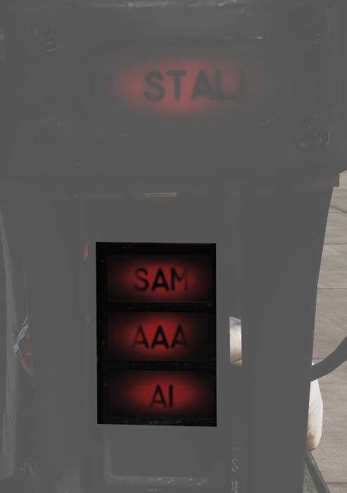

# 风挡右边框

## ECM（电子对抗）告警灯光

这些告警灯与 ALR-67 相连，用于指示不同类型的威胁。

### ALR-67

| 指示器 | 功能                                                                                   |
| ------ | -------------------------------------------------------------------------------------- |
| SAM    | 面空导弹，灯光稳定亮起表示探测到面空导弹跟踪雷达锁定，灯光闪烁表示探测到面空导弹发射。 |
| AAA    | 高射炮，灯光稳定亮起表示探测到高射炮跟踪雷达锁定，灯光闪烁表示探测到防空炮开火。       |
| AI     | 机载截击雷达，灯光稳定亮起表示探测到机载雷达锁定。                                     |

### ALR-45

| 指示器 | 功能                                                                        |
| ------ | --------------------------------------------------------------------------- |
| SA TRK | 灯光稳定亮起表示探测到面空导弹跟踪雷达锁定。                                |
| SAM    | 主 SAM 系统警告指示：MA（导弹告警）时指示灯常亮，ML（导弹发射）时指示灯闪烁 |
| AI/AAA | 灯光稳定亮起表示探测到无法明确识别的 AI/AAA 雷达照射。                      |
| AI     | 灯光稳定亮起表示探测到机载雷达照射。                                        |

## 备用罗盘

常规备用罗盘。
