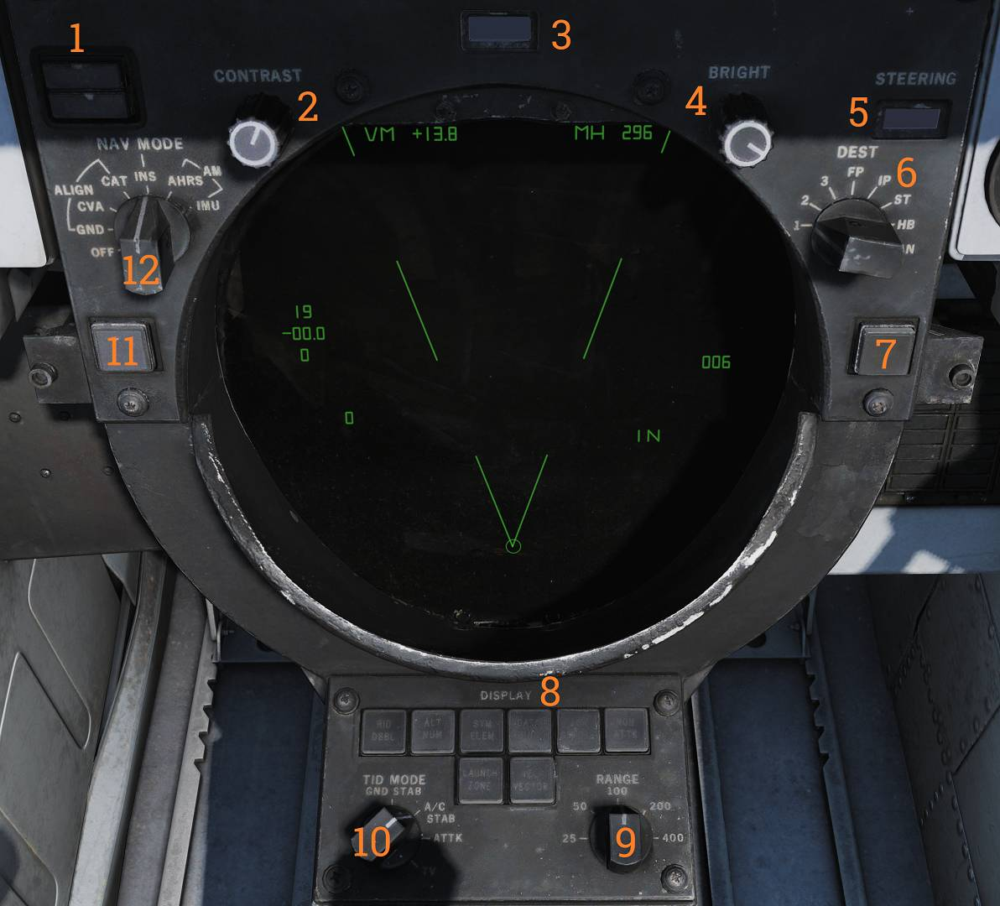

# 中央控制台

## 战术信息显示器（TID）

战术信息显示器及导航系统相关控制开关/按钮。

### INS 状态指示器

指示灯 (<num>1</num>) 用来指示 INS 对准的状态。

- STBY — 指示 INS 电源已接通但未完成对准。
- READY — 指示 INS 对准精度已符合 AIM-54 最低发射标准。

选择 INS 模式时，STBY 和 READY 灯应熄灭。如果指示灯未熄灭，那么表示 INS 系统故障。

### CONTRAST 旋钮

对比度控制旋钮 (<num>2</num>)，用于调节 TCS 视频的对比度。

### DATA READOUT 指示器

数据读数滚筒指示器 (<num>3</num>)，用来指示显示在 TID 读数中的数据的来源。

如果显示器内的滚筒上没有数据源对应的名称，那么滚筒将显示空白。

### BRIGHT 旋钮

亮度控制旋钮 (<num>4</num>)，用于调节 TID 亮度。

### STEERING 指示滚筒

转向指示滚筒 (<num>5</num>)，显示当前导航系统向飞行员显示的转向信息。

### DEST 选择旋钮

目标选择旋钮 (<num>6</num>)，用来选择在 STEER CMD 为 DEST 模式时所使用的目标点。

### CLSN 按钮

带有指示灯的按钮 (<num>7</num>)，用于选择恒量角度拦截转向至跟踪的目标或 TWS 质心。

### DISPLAY 按钮

用于控制 TID 中显示何种类型的标识。

选择对应的按钮时，按钮指示灯亮起。

可用显示选项包括：

- RID DISABLE — 未实装。
- ALT NUM — 显示或隐藏跟踪符号左侧的高度数值。 
- SYM ELEM — 显示或隐藏跟踪目标的所有补充标识。未选中时，TID 将只显示一个表示跟踪目标的圆点。
- DATA LINK — 显示或隐藏所有数据链路跟踪目标。
- JAM STROBE — 显示或隐藏干扰源射线。
- NON-ATTK — 显示或隐藏不可攻击的跟踪目标。
- VEL VECTOR — 显示或隐藏跟踪的速度矢量。
- LAUNCH ZONE — 显示或隐藏跟踪的导弹发射区间。如果启用，那么将替换速度矢量显示。在到达目标的发射最大距离 60 秒前，WCS 会自动激活导弹发射区间显示。

### RANGE 选择旋钮

距离选择旋钮 (<num>9</num>)，用于选择当前 TID 的标度。

选择的标度对应显示的直径距离。

### TID MODE 选择旋钮

TID 模式选择旋钮 (<num>10</num>)，用于控制 TID 的显示模式。

### TRACK HOLD 按钮

跟踪保持按钮 (<num>11</num>)，用于使雷达最后一次观察到目标后，将跟踪被丢弃前的时间延长至两分钟。

选择后，跟踪保留时间增加至两分钟。正常时间是 14 秒。

### NAV MODE 选择开关

导航模式选择旋钮 (<num>12</num>)，用于控制导航参考系统，也用于 INS 对准。

## 手控装置（HCU）

雷达和 TCS 主控制杆。

### IR/TV 开关

(<num>1</num>) 用于控制 TCS 电源。

- OFF/STBY — 通电但，不完整工作。
- ON — 启用完整 TCS 功能。

### IR/TV 超温指示灯

指示灯 (<num>2</num>) 亮起表示 TCS 超温状态。

### LIGHT TEST 按钮

灯光测试按钮 (<num>3</num>)，用于测试所有 AWG-9 指示灯。

### PWR RESET 指示灯

电源复位指示灯 (<num>4</num>)，灯光亮起表示一个或多个不工作的二次电源。

### PWR RESET 按钮

电源复位按钮 (<num>5</num>)，用于复位不工作的二次电源。

但如果导致电源不工作的状况仍未解决，受影响的二级电源依旧无法正常工作。

### WCS 指示灯

WCS 指示灯 (<num>6</num>) 亮起表示：

- 选择了 STBY/XMT 档位，但雷达未准备就绪。 - 选择了 XMT 档位，但雷达未进行发射。

### WCS 控制开关

(<num>7</num>) 用于控制 WCS 电源（计算机和雷达）。

- STBY — WCS 通电，并在静默状态下进行雷达预热。
- XMT — 如果雷达已经准备就绪，启用雷达发射。

AWG-9 显示器预热需要 30 秒，而雷达预热需要 3 分钟。

### MRL 按钮

MRL 按钮 (<num>8</num>) 用来选择手动快速锁定模式。

超控所有除 PLM（飞行员锁定模式）和 VSL（垂直扫描锁定）外的雷达工作模式。

### OFFSET 按钮

偏置按钮 (<num>9</num>) ，用来偏置 TID 至显示器中选中的位置。

### ELEV 拨轮

(<num>10</num>) 用于微调 STT 锁定模式下的雷达天线仰角。

### HCU 扳机

(<num>11</num>) 为二段式扳机，用来根据选定模式指令不同 WCS 功能。

- 第一段 — HALF ACTION（按下一半）。
- 第二段 — FULL ACTION（完全按下）。

例如，扳机用来进行目标截获和符号选中。

### HCU 功能按钮

带有指示灯的按钮 (<num>12</num>)，用于选择 HCU 控制杆的功能。

开关之间互斥（只能选中一个开关）。

可用功能为：

- IR/TV — 选择控制 TCS 的方位、仰角和跟踪。选择后，DDD 面板中，仰角指示器右侧的指针将显示 TCS 仰角。
- RDR — 选择 RDR 来控制雷达天线进行 STT 锁定，如果雷达已经处在 STT 模式下，那么用来返回搜索状态。选择后，DDD 面板中，仰角指示器右侧的指针将显示当前指令的雷达天线仰角。
- DDD CURSOR — 选择控制 DDD 光标，用于在脉冲雷达模式下标记地理位置。
- TID CURSOR — 选择控制 TID 光标，用来选中（选中）TID 中的符号。
