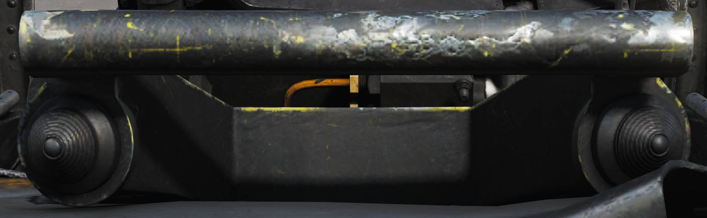

# Center Panel

## Chaff/Flare Dispense Switches

Two switch hats on the center RIO hand hold used to initiate release of
countermeasures. The switches are mirrored in regards to functionality.

- **Up**: Initiates a single chaff release.
- **Down**: Initiates set chaff release program.
- **Inboard**: Initiates set jammer release program.
- **Outboard**: Initiates set flare release program.

## Detail Data Display Panel

Main radar control panel.

| No. | Control/Indicator            | Function                                                                                                                                                                                                                                     |
| --- | ---------------------------- | -------------------------------------------------------------------------------------------------------------------------------------------------------------------------------------------------------------------------------------------- |
| 1   | TGTS switch                  | Switch selecting target size for missile launch zones, WCS track calculations as well as missile ATC calculation.                                                                                                                            |
| 2   | MLC switch                   | Switch selecting MLC mode of operation.                                                                                                                                                                                                      |
| 3   | AGC switch                   | Switch controlling AGC speed. Currently non-functional in DCS.                                                                                                                                                                               |
| 4   | PARAMP switch                | Switch controlling the parametric amplification. Currently non-functional in DCS.                                                                                                                                                            |
| 5   | PULSE VIDEO knob             | Knob controlling video strength of pulse video on the DDD. No effect on pulse doppler video.                                                                                                                                                 |
| 6   | Radar track indicator lights | Indicator lights indicating radar tracking in the STT modes.                                                                                                                                                                                 |
| 7   | RANGE display                | Rotary drum indicator displaying currently selected radar range. Can also be blank if no range scale is used on the DDD.                                                                                                                     |
| 8   | RANGE buttons                | Buttons used to select radar range.                                                                                                                                                                                                          |
| 9   | BRIGHT knob                  | Knob used to control the brightness of the DDD by means of a polarized filter in front of the DDD.                                                                                                                                           |
| 10  | IR AUDIO THRLD knob          | Knob used to control IR AUDIO threshold, non-functional with TCS.                                                                                                                                                                            |
| 11  | IR AUDIO VOL knob            | Knob used to control IR AUDIO volume, non-functional with TCS.                                                                                                                                                                               |
| 12  | IR GAIN knob                 | Knob used to control IR GAIN, non-functional with TCS.                                                                                                                                                                                       |
| 13  | XMTR CHAN wheel              | 12-position wheel used to control AWG-9 operating frequency. Currently non-functional in DCS.                                                                                                                                                |
| 14  | MSL CHAN wheel               | 6-position wheel used to control missile channel used by AIM-7 or AIM-54. Currently non-functional in DCS.                                                                                                                                   |
| 15  | DISPLAY buttons              | Buttons used to control what to display on the DDD. IR button non-functional with TCS.                                                                                                                                                       |
| 16  | WCS MODE buttons             | Buttons used to select the current AWG-9 operating mode.                                                                                                                                                                                     |
| 17  | WCS MODE display             | Rotary drum indicator displaying current WCS mode.                                                                                                                                                                                           |
| 18  | Vc switch                    | Switch used to select different closing velocity scales on the DDD in PD modes.                                                                                                                                                              |
| 19  | ERASE knob                   | Knob used to control the intensity of the ERASE beam on the DDD, controlling how quick the image on the DDD fades.                                                                                                                           |
| 20  | PULSE GAIN knob              | Knob used to control the gain of the AWG-9 in pulse mode, normally left in detent unless needed because of clutter or jamming.                                                                                                               |
| 21  | ASPECT switch                | Switch used to control the rate region covered by the doppler filters in pulse doppler modes and if to use edge or centroid tracking in pulse mode. These settings correspond to expected target aspect.                                     |
| 22  | EL indicator                 | Meter with indicator needles indicating sensor elevation. Left indicator shows current actual radar antenna elevation. The right indicates commanded radar elevation while RDR is selected on HCU and TCS elevation while IR/TV is selected. |
| 23  | CCM MODES buttons            | Buttons used to set AWG-9 functionality countering jamming targets. Currently non-functional in DCS.                                                                                                                                         |
| 24  | JAM/JET knob                 | Control knob used to set the threshold at which a radar return is considered a jamming target. Currently non-functional in DCS.                                                                                                              |
| 25  | ACM THRLD knob               | Control knob used to control radar sensitivity level at close ranges. Usually set automatically with the knob in the detent position.                                                                                                        |
| 26  | PD THRLD knobs               | Control knobs used to set pulse doppler video threshold in the CLEAR (upper half of DDD) region and in the CLUTTER (lower half of the DDD) region.                                                                                           |
| 27  | DDD radar display            | Main AWG-9 radar display.                                                                                                                                                                                                                    |

### Radar Track Indicator Lights

Indicator lights indicating radar tracking in the STT modes.

- ANT TRK - Indicates the radar is tracking the target's angle.
- RDROT - Indicates the target is within the range or rate gate and being
  tracked.
- JAT - Indicates the radar is tracking a jamming source's angle.
- IROT - Indication of TCS angle tracking, called IROT as this was originally
  used for the IRST in the early-A Variant of the Tomcat.
