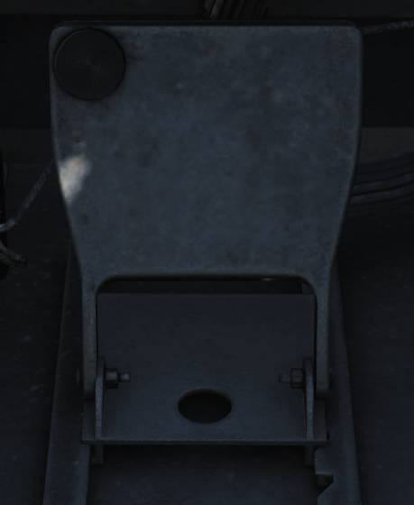

# Footwells

## ICS Foot Button

RIO left footrest containing ICS PTT for COLD MIC intercommunication.

## Mic Foot Button

RIO right footrest containing PTT for transmission on UHF 1, V/UHF 2, or both
depending on ICS setting.
