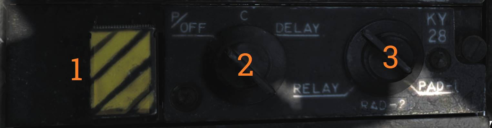
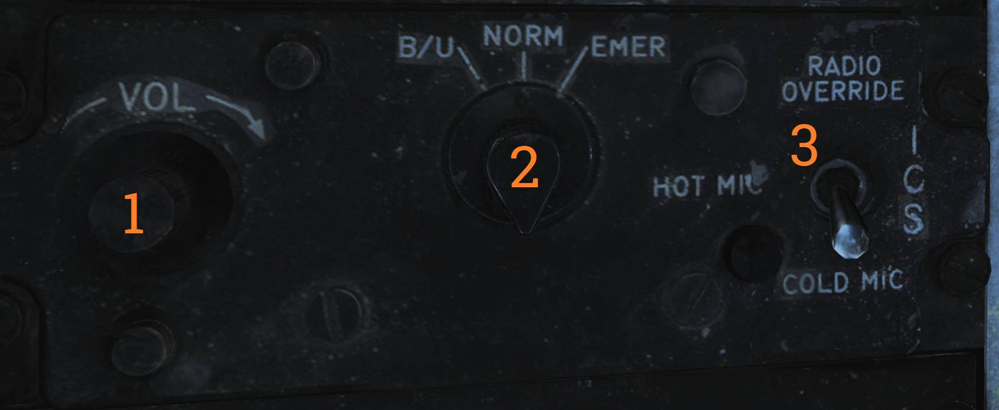
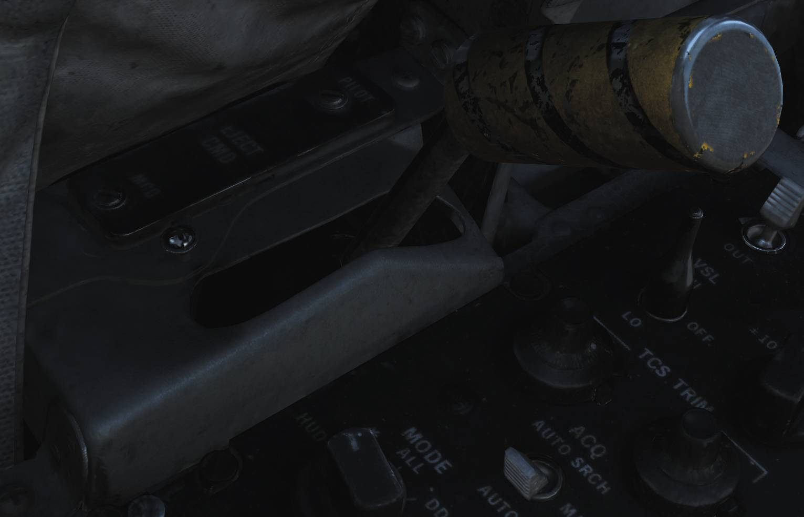
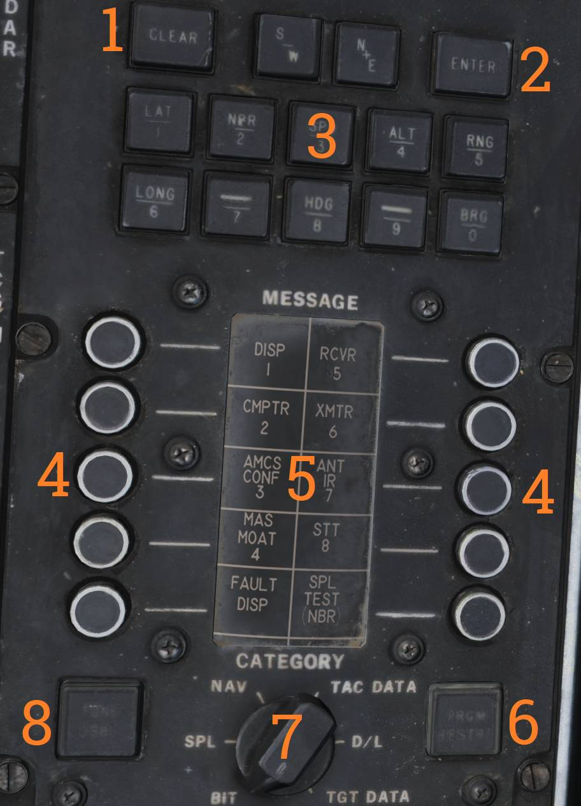

# Left Side Console

## G-Valve Button

The G-valve button is pressed to test inflation of the g-suit.

## Oxygen-Vent Airflow Control Panel

Panel controlling ventilation airflow and oxygen supply to the RIO.

### Vent Airflow Dial

The VENT AIRFLOW dial controls airflow through the pressure suit or seat cushions when no pressure
suit is worn.

### Oxygen Switch

The OXYGEN switch controls oxygen flow to the RIO oxygen mask.

- ON - Oxygen supplied to mask.
- OFF - Oxygen flow shut off.

## Data Stowage Compartment

The data stowage compartment provides storage space for equipment, documents, and mission briefing
materials.

## TACAN Control Panel

TACAN control panel allowing the RIO to operate TACAN when assigned command.

### Channel Selector

The dual rotary selector (<num>1</num>) selects the TACAN channel.

- Outer dial - selects the first two digits.
- Inner dial - selects the final digit.

### GO / NO-GO Indicator Lights

The GO and NO-GO lights (<num>2</num>) display TACAN BIT results.

### BIT Button

The BIT button (<num>3</num>) initiates TACAN built-in test.

### Mode Switches

The MODE switches (<num>4</num>) select TACAN operating mode and X or Y channel.

INVERSE mode is not functional.

### TACAN Volume Knob

The VOL knob (<num>5</num>) controls TACAN audio volume to the RIO headset.

### TACAN Mode Selector

The MODE knob (<num>6</num>) selects TACAN operating mode.

Available modes are:

- OFF - TACAN off.
- REC - Receive only.
- T/R - Transmit and receive with range readout.
- A/A - Air-to-air TACAN.
- BCN - Beacon mode (not functional).

## Communication / TACAN Command Panel

Panel controlling radio selection, antenna routing, and TACAN command authority.

### Transmitter Select Switch

The XMTR SEL switch (<num>1</num>) selects which radio is keyed by the RIO PTT.

- UHF 1 - ARC-159.
- BOTH - Both radios.
- V/UHF 2 - ARC-182.

### V/UHF 2 Antenna Switch

The V/UHF 2 ANT switch (<num>2</num>) selects antenna used by the ARC-182.

- UPR - Upper antenna.
- LWR - Lower antenna.

### TACAN Command Switch

The TACAN CMD switch (<num>3</num>) selects which crewmember controls TACAN and indicates current
authority.

### UHF 1 Volume Knob

The UHF 1 VOL knob (<num>4</num>) controls UHF-1 audio volume to the RIO headset.

### KY Mode Switch

The KY MODE switch (<num>5</num>) is only functional with KY-58 encryption.

The simulated aircraft uses KY-28; this switch is non-functional.

## V/UHF 2 (AN/ARC-182) Radio

Secondary VHF/UHF radio providing voice communications.

### V/UHF 2 Volume Knob

The VOL knob (<num>1</num>) controls V/UHF-2 audio volume.

### Squelch Switch

The SQL switch (<num>2</num>) enables or disables squelch.

### Frequency Select Switches

The frequency select switches (<num>3</num>) set the desired operating frequency.

### Frequency / Channel Display

The FREQ/(CHAN) display (<num>4</num>) shows selected frequency or preset channel.

### UHF Selector Switch

The UHF switch (<num>5</num>) selects modulation mode within the 225.000–399.000 MHz band.

### Brightness Knob

The BRT knob (<num>6</num>) controls display brightness.

### Mode Selector Knob

The MODE knob (<num>7</num>) selects ARC-182 operating mode.

### Frequency Mode Knob

The outer frequency mode dial (<num>8</num>) selects frequency tuning mode.

### Channel Select Knob

The inner CHAN SEL knob (<num>9</num>) selects preset channel.

> 💡 HAVE QUICK anti-jam functionality is not implemented in DCS.

## KY-28 Control Panel

Encryption control panel for secure voice communications.

### Zeroize Switch

The ZEROIZE switch (<num>1</num>) clears all encryption keys when actuated.

### Power-Mode Switch

The power-mode switch (<num>2</num>) selects KY-28 operating mode.

### Radio Select Switch

The radio select switch (<num>3</num>) selects which radio is encrypted.

## Radar Beacon Control Panel

Panel controlling the AN/APN-154 radar beacon.

### Beacon Mode Selector

The MODE selector (<num>1</num>) selects beacon operating mode.

- SINGLE - Responds to single-pulse interrogation.
- DOUBLE - Responds to double-pulse code.
- ACLS - Enables ACLS augmentation for carrier landings.

### ACLS Test Button

The ACLS TEST button (<num>2</num>) includes a green indicator light.

- Illuminates during successful test.
- Flashes when SPN-42 radar sweep is detected.
- Steady illumination indicates radar lock-on for ACLS.

### Power Switch

The PWR switch (<num>3</num>) controls beacon electrical power.

- PWR - Beacon fully active.
- STBY - Warm-up mode; ACLS replies enabled if MODE is ACLS.
- OFF - Beacon off.

## Liquid Cooling Control Panel

LIQ COOLING switch controlling the liquid cooling system for the AWG-9 and AIM-54. The AWG-9 circuit
can be enabled independently of the AIM-54. This switch needs to be enabled for the respective
system before AWG-9 operation or AIM-54 missile preparation.

## ICS Control Panel

Intercommunication system control panel.

### ICS Volume Knob

The VOL knob (<num>1</num>) controls ICS audio volume from the pilot.

### Amplifier Selection Knob

The amplifier selection knob (<num>2</num>) selects which audio amplifier is used.

- B/U - Backup amplifier.
- NORM - Normal amplifier.
- EMER - Emergency amplifier using pilot’s amplifier and volume settings. Disables RIO-only audio
  sources.

### ICS Function Switch

The ICS switch (<num>3</num>) selects ICS operating mode.

- RADIO OVERRIDE - ICS audio overrides radio audio.
- HOT MIC - Enables continuous intercom without PTT.
- COLD MIC - Intercom only when PTT is pressed.

## Eject Command Lever

The EJECT CMD lever determines ejection logic when the RIO ejects.

- PILOT (lever forward) - Only the RIO ejects.
- MCO (lever aft) - Both crewmembers eject.

Pilot-initiated ejection always ejects both crew members.

## Sensor Control Panel

Control panel for radar scan geometry, TCS operation, and AVTR recording.

### Stabilization Switch

The STAB switch (<num>1</num>) controls ground stabilization of the radar.

### Azimuth Center Knob

The AZ CTR knob (<num>2</num>) sets the center of the radar azimuth scan.

### Elevation Center Knob

The EL CTR knob (<num>3</num>) sets the center of the radar elevation scan.

### VSL Switch

The VSL switch (<num>4</num>) is spring-loaded to the OFF position and selects vertical scan mode.

- VSL HI
- VSL LO

### Azimuth Scan Knob

The AZ SCAN knob (<num>5</num>) selects azimuth scan width.

### Elevation Bars Knob

The EL BARS knob (<num>6</num>) selects number of elevation scan bars.

### TCS Trim Knobs

The TCS TRIM knobs (<num>7</num>) adjust azimuth and elevation alignment of TCS video.

### Slave Switch

The SLAVE switch (<num>8</num>) selects which sensor is slaved to the other.

### Acquisition Switch

The ACQ switch (<num>9</num>) selects TCS acquisition mode.

- AUTO SRCH
- MAN
- AUTO

### Field of View Switch

The FOV switch (<num>10</num>) selects TCS field of view.

- WIDE
- NAR

### AVTR Mode Knob

The MODE knob (<num>11</num>) selects what the airborne video tape recorder records.

### Minutes Remaining Display

The MIN REMAIN display (<num>12</num>) shows remaining recording time.

### Record Switch

The RECORD switch (<num>13</num>) controls AVTR operation.

- OFF
- STBY
- ON

### AVTR Indicator Lights

The indicator lights (<num>14</num>) show AVTR status.

- STBY
- EOT (end of tape)
- REC

## Computer Address Panel (CAP)

The Computer Address Panel is used to enter data into the Weapon Control System.

### Clear Button

The CLEAR button (<num>1</num>) clears the current TID buffer without entering data.

### Enter Button

The ENTER button (<num>2</num>) inserts buffered data into the WCS.

### Prefix and Numerical Buttons

The numerical and prefix buttons (<num>3</num>) are used for data entry.

### Message Selection Buttons

The MESSAGE buttons (<num>4</num>) select functions indicated on the MESSAGE drum.

### Message Indicator Drum

The MESSAGE drum (<num>5</num>) displays available WCS message functions.

### Program Restart Button

The PRGM RESTRT button (<num>6</num>) restarts the active WCS program.

### Category Selector Knob

The CATEGORY knob (<num>7</num>) selects the active MESSAGE category.

### Tune Disable

The TUNE DSBL function (<num>8</num>) is non-functional.

> 💡 All CAP buttons include indicator lights that illuminate based on selected function.
