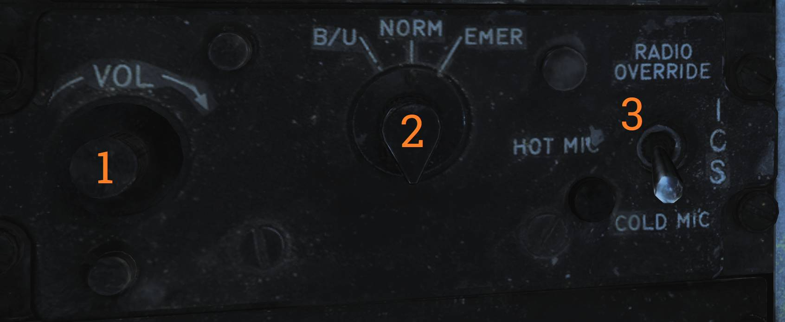
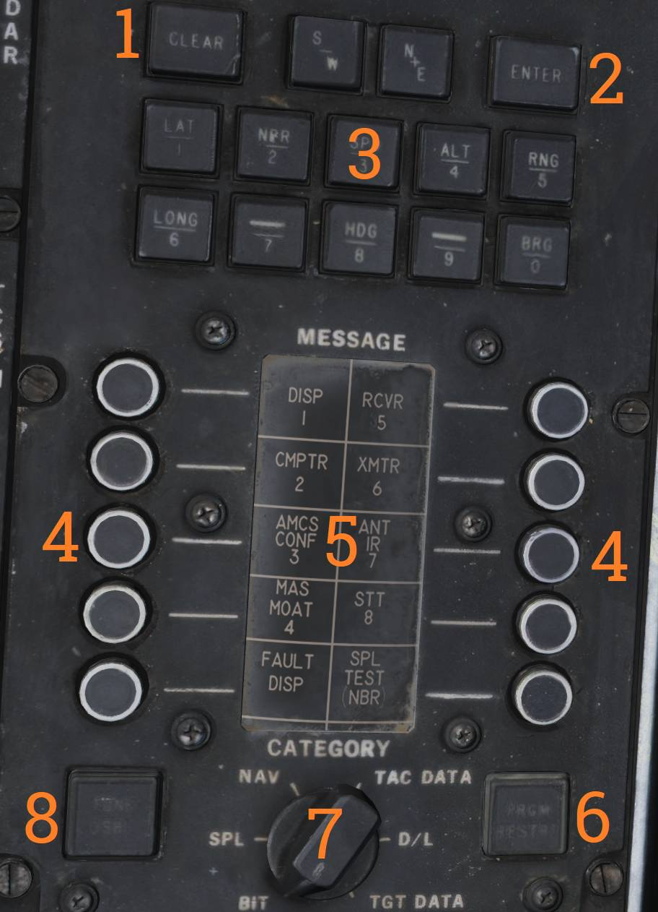

# 左侧控制台

## 飞行服抗荷充气检测按钮

按下按钮来测试抗荷服充气。

## 供氧-通风控制面板

用于控制抗荷服或坐垫的通风气流以及通向 RIO 面罩的氧气。

### VENT AIRFLOW 拨轮

通风气流调节拨轮，用于控制抗荷服气流进出，未连接抗荷服时则控制坐垫气流。

### OXYGEN 开关

供氧开关，用于控制流向面罩的氧气。

- ON - 面罩供氧。
- OFF - 供氧关断。

## 数据储存室

数据储存室是一个小隔间，用来存放设备或任务简报材料等等。

## TACAN 控制面板

如果 RIO 拥有 TACAN 设备控制权，则可以通过该控制面板对 TACAN 进行控制。

### 双层旋转开关

双层旋转开关 (<num>1</num>) 选择塔康波道。

- 外侧拨盘 - 选择前两位数字。
- 内侧拨盘 - 选择最后一位数字。

### GO 和 NO-GO 指示灯

通过/未通过指示灯，指示 TACAN 是否通过自检。

### BIT 按钮

自检按钮 (<num>3</num>)，按下按钮开始 TACAN 自检。

### MODE 开关

模式开关 (<num>4</num>)，用于切换 TACAN 的工作模式，可以选择 X 或 Y 波段。

INVERSE 模式无功能。

### VOL 旋钮

音量控制旋钮 (<num>5</num>)，用于控制 RIO 头戴中的 TACAN 音频音量。

### 模式选择旋钮

(<num>6</num>) 用于选择 TACAN 功能模式。

以下模式可用：

- OFF — 关闭 TACAN。
- REC — 仅接收信号。
- T/R — 传输并接收信号，该模式下可进行距离读数。
- A/A — 空对空 TACAN 模式。
- BCN — 信标 TACAN 模式（无功能）。

## 通信/TACAN 指令面板

面板用来对 ICS 电台的设定和拥有 TACAN 控制权的机组成员进行控制。

### XMTR SEL 开关

选择踩下传声器脚踏开关时进行通信的无线电台。

- UHF 1 - ARC-159。
- BOTH - 选择两个电台同时进行通信。
- V/UHF 2 - ARC-182。

### V/UHF 2 ANT（天线）控制开关

(<num>2</num>) 选择 V/UHF 2 使用的天线。

- UPR - 选择上部天线。
- LWR - 选择下部天线。

### TACAN CMD 按钮开关

带有指示灯的按钮开关 (<num>3</num>)，用于指定控制 TACAN 的机组成员（飞行员 / RIO）。指示灯显示当前的设定。

### UHF 1 VOL（音量）控制旋钮

(<num>4</num>) 用于控制 RIO 头戴中 UHF 1 音频音量。

### KY MODE 开关

KY 模式选择开关 (<num>5</num>) ，只在安装了 KY-58 时有效。

由于 DCS F-14 安装的是 KY-28，因此 KY MODE 开关在 DCS 中无功能。

## V/UHF 2（AN/ARC-182）无线电台

V/UHF 2 无线电台。电台及其控制开关/按钮。

### VOL 旋钮

(<num>1</num>) 控制 RIO 头戴中 V/UHF 2 音频音量。

### SQL 开关

静噪控制开关 (<num>2</num>)，有 ON / OFF 两个档位，分别用于启用或关闭静噪。

### 频率选择开关

频率选择开关 (<num>3</num>)，拨动开关来调制频率。

### FREQ./(CHAN) 显示窗

频率 /（波道）显示窗 (<num>4</num>)，用于显示当前选中的频率或波道。

### UHF 开关

UHF 调制选择开关 (<num>5</num>)，用于选择使用的调制模式，工作波段从 225.000 至 399.00 MHz。

### BRT 旋钮

亮度旋钮 (<num>6</num>)，用于调节显示屏的亮度。

### MODE 旋钮

模式选择旋钮 (<num>7</num>)，用于选择 V/UHF 2 电台的工作模式。

### 频率模式选择旋钮

双层旋钮开关 (<num>8</num>) 的外侧旋钮拨轮，用于选择频率模式。

### CHAN SEL 旋钮

双层旋钮开关 (<num>9</num>) 的内侧旋钮拨轮，用于选择预设波道。

> 💡 “Have Quick”抗干扰功能在 DCS 中未实装。

## KY-28 控制面板

用于保密话音通信的加密控制面板。

### ZEROIZE 开关

开关/保护盖(<num>1</num>)用于擦除（zeroize） KY-28 编码。

### 电源模式开关

(<num>2</num>) 用于选择 KY-28 工作模式。

### 无线电台选择开关

(<num>3</num>) 用于选择与 KY-28 一起使用的无线电台。

## 雷达信标控制面板

面板用于对 AN/APN-154 雷达信标进行控制。

### MODE 选择开关

模式选择开关(<num>1</num>)，用于控制雷达信标工作模式。

- SINGLE - 将限制信标对任何接收到的单脉冲群码进行响应。
- DOUBLE - 将信标响应设置为五个中的其中一个双脉冲问询。
- ACLS - 启用增益器操作。

### ACLS TEST 按钮

ACLS 测试按钮 (<num>2</num>)，按钮中的绿色指示灯用于指示信标工作状态或用于测试。

- MODE 选择开关拨动至 ACLS 模式时，按下按钮，如果指示灯亮起则表示通过测试。
- 指示灯闪烁表示探测到 AN/SPN-42 雷达扫过本机。
- 当 AN/SPN-42 雷达锁定本机进行 ALCS 引导时指示灯将常亮。

### PWR 开关

电源开关 (<num>3</num>)，用于控制信标电源。

- PWR - 启用信标，并根据 MODE 选择开关启用所有响应。
- STBY - 用于预热系统，如果模式选择开关置于 ACLS 档位，同时也会启用信标 ACLS 响应。
- OFF - 雷达信标关闭。

## 液冷控制面板

LIQ COOLING 开关用于控制 AWG-9 和 AIM-54 的液冷系统。AWG-9 冷却控制电路可以独立于 AIM-54 电路启用。使用 AWG-9 前，或进行 AIM-54 导弹发射准备前，需开启拨动这个开关至对应需要进行冷却的系统档位。

## 机内通话系统控制面板

机内通话系统（ICS）的控制面板。

### ICS 音量旋钮

(<num>1</num>) 音量控制旋钮用来控制 RIO 头戴中 ICS 的音频音量。

### 放大器选择旋钮

(<num>2</num>) 用于选择将音频信号输出到头戴的放大器。

- B/U — 备用放大器。
- NORM — 正常放大器。
- EMER — 应急放大器，这个档位会使用飞行员的放大器和其的音量设定。禁用仅限 RIO 的音源。

### ICS 功能开关

(<num>3</num>) 用于选择 ICS 的功能。

- RADIO OVERRIDE — 无线电台超控，使 ICS 音频超控无线电台音频。
- HOT MIC — 无需按下 PTT（Push-To-Talk，按键通话）开关即可进行对讲。
- COLD MIC — 需按下 PTT 开关才能对讲。

## 弹射指令控制杆

弹射指令（EJECT CMD）控制杆用于设置弹射系统在 RIO 进行弹射时的行为。

- PILOT 模式（手柄向前） - 只有 RIO 自己会弹射。
- MCO （手柄向后） - RIO 和飞行员都会弹射。

由飞行员发起的弹射始终会同时弹射两名机组成员。

## 传感器控制面板

面板用于控制 AWG-9 雷达的扫描设置、TCS（电视摄像套件）和机载录像机。

### STAB 开关

选择开关 (<num>1</num>) 用于控制雷达相对地面稳定。

### AZ CTR 旋钮

方位控制旋钮 (<num>2</num>)，用来控制雷达扫描方位角的中心点。

### EL CTR 旋钮

仰角控制旋钮 (<num>3</num>)，用来控制雷达扫描仰角的中心点。

### VSL 控制开关

开关 (<num>4</num>) 用于选择 VSL（垂直扫描锁定）模式的 HI（高）或 LO（低），松开开关后，开关弹回中立位置。

- VSL HI
- VSL LO

### AZ SCAN 旋钮

方位扫描旋钮 (<num>5</num>)，用来控制方位角扫描的范围。

### EL BARS 旋钮

仰角扫描线旋钮 (<num>6</num>)，控制雷达仰角扫描线的数量。

### TCS TRIM 旋钮

TCS 微调旋钮 (<num>7</num>)，用于校正 TCS 视频的方位和仰角。

### SLAVE 开关

传感器隶属控制开关 (<num>8</num>)，用于选择隶属于另一个传感器的传感器。

### ACQ 开关

目标捕获选择开关 (<num>9</num>) ，开关用来选择 TCS 的捕获模式。

- AUTO SRCH
- MAN
- AUTO

### FOV 开关

视场控制开关 (<num>10</num>)，用于选择 TCS 的视场。

- WIDE（宽）
- NAR（窄）

### AVTR MODE 旋钮

(<num>11</num>) 用于选择 AVTR（机载录像机）录制哪些视频。

### MIN REMAIN 显示窗

录像剩余时间显示窗 (<num>12</num>)，计数器显示了 AVTR 录像的剩余录制时间。

### RECORD 开关

录像控制开关 (<num>13</num>)，用于控制 AVTR。

- OFF
- STBY
- ON

### 录像指示灯

(<num>14</num>) 用于指示 AVTR 的工作状态。

- STBY
- EOT（录像带结束）
- REC

## 计算机位址面板（CAP）

CAP（计算机位址面板）用于输入数据至 WCS（武器控制系统）中。MESSAGE（消息）滚筒指示器和对应的按钮开关与新式飞机装备的 MFD（多功能显示器）类似。

### CLEAR 按钮

清除按钮 (<num>1</num>)，用于清除当前 TID 缓冲寄存器中的数据，不向 WCS 输入数据。

### ENTER 按钮

输入按钮 (<num>2</num>)，向 WCS 输入当前 TID 缓冲寄存器中的数据。

### 前缀和数字按钮

(<num>3</num>) 带有前缀选择功能的数字按钮。

### MESSAGE 按钮开关

(<num>4</num>) 用于选择 MESSAGE 滚筒指示器上的功能。

### MESSAGE 滚筒指示器

(<num>5</num>) 指示器内部的滚筒用于指示当前可用的 MESSAGE 功能。

### PRGM RESTRT 按钮

程序重启按钮 (<num>6</num>)，用于重启 WCS 中运行的程序。

### CATEGORY 选择旋钮

(<num>7</num>) 用于选择 MESSAGE 滚筒指示器中，当前使用的类别。

### Tune Disable

(<num>8</num>) 无功能。

> 💡 所有按钮都带有指示灯，这些灯光指示用来根据模式指示进行的操作。
