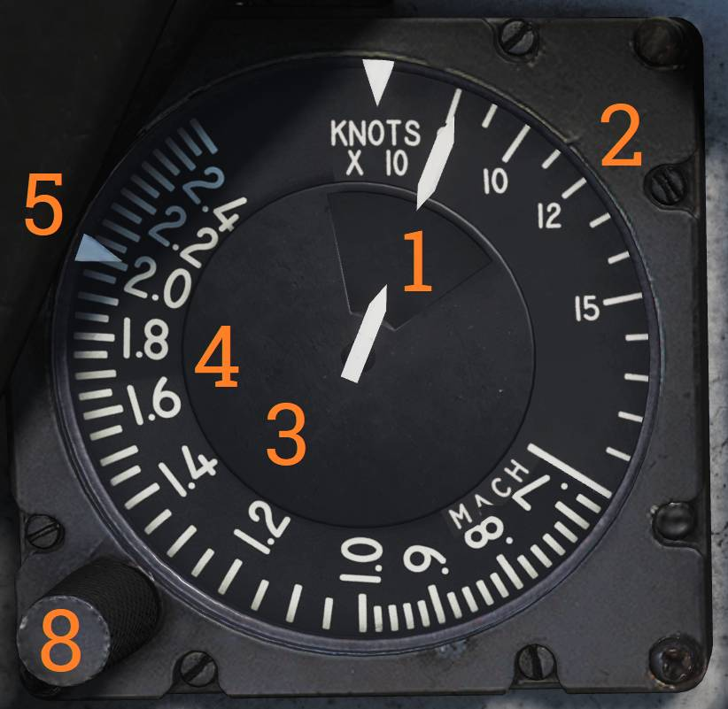

# Left Instrument Panel

## Servopneumatic Altimeter

The servopneumatic altimeter provides altitude indication using both electrical and pressure-based
systems.

### Altimeter Readout

The altimeter readout (<num>1</num>) displays altitude using three digital drums for 10,000, 1,000,
and 100 feet, and a pointer on a circular scale indicating hundreds of feet.

A pointer on the circular scale provides continuous indication in hundreds of feet.

### Baroset Knob

The baroset knob (<num>2</num>) sets local barometric pressure in inches of mercury (in.Hg).

This setting only affects the local altimeter display. Other CADC-driven digital indicators use a
fixed 29.92 in.Hg reference.

### Local Barometric Pressure Window

The local barometric pressure window (<num>3</num>), also known as the Kollsman window, displays the
selected pressure setting.

### Mode Switch

The mode switch (<num>4</num>) selects altimeter operating mode and is spring-loaded from RESET.

- RESET - When CADC power and altitude data are available, holding RESET for approximately three
  seconds enables normal servoed operation.
- STBY - Selects backup pressure mode.

If CADC data or electrical power is absent for more than three seconds, the system automatically
reverts to standby mode.

### STBY Flag

The STBY flag is a red standby indication that appears when the altimeter is operating in backup
(standby) mode (not visible in this image).

> 💡 At high speeds and below 10,000 feet, pressure effects can produce significant readout errors:
> up to 1,200 feet when transonic and up to 4,000 feet when supersonic.

## Airspeed Mach Indicator

The airspeed Mach indicator displays indicated airspeed and Mach number.

### Airspeed Dial

The airspeed dial (<num>1</num>) integrates multiple scales to display both indicated airspeed and
Mach number.

### Outer Airspeed Scale

The outer indicated airspeed scale (<num>2</num>) displays airspeed values up to 200 knots.

### Inner Airspeed Scale

The inner airspeed scale (<num>3</num>) displays airspeed from 200 to 850 knots.

This scale remains covered by the dial until applicable.

### Mach Number Scale

The Mach number scale (<num>4</num>) moves relative to airspeed to indicate current Mach number.

### Indicated Airspeed Index Pointer

The indicated airspeed index pointer (<num>5</num>) can be set to mark a desired airspeed.

### Mach Number Index Pointer

The Mach number index pointer (<num>6</num>) marks a selected Mach number.

(Not visible in the referenced image.)

### Safe Mach Number Index Pointer

The safe Mach number index pointer (<num>7</num>) displays the maximum safe Mach number calculated
by the CADC.

(Not visible in the referenced image.)

### Index Selector Knob

The index knob (<num>8</num>) is a push-pull control.

One position adjusts the airspeed index pointer, and the other adjusts the Mach index pointer.

## Standby Attitude Indicator

The standby attitude indicator provides independent attitude reference.

### OFF Flag

The OFF flag (<num>1</num>) appears when the instrument is unpowered or caged.

### Cage and Trim Knob

The cage and trim knob (<num>2</num>) controls indicator caging and pitch trim.

- Pulled out - Indicator is caged.
- Pushed in - Indicator is uncaged and pitch trim may be adjusted by rotating the knob.

## UHF Remote Indicator

The UHF remote indicator provides a cockpit readout of ARC-159 radio tuning.

The remote display shows the selected frequency or preset channel for UHF 1.

The TEST button initiates an indicator self-test. A successful test results in a display of 888.888.

The DIM knob controls indicator display brightness.
