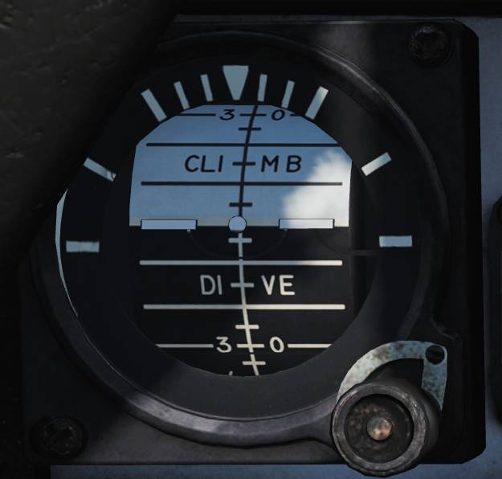

# 左仪表板

## 气动伺服高度表

伺服气动高度表通过电系统和压力系统双重方式显示高度。

### 高度表读数

在三个滚筒上显示高度数字 (<num>1</num>)，三个数字分别对应10 000、1 000 和 100 英尺。

同时，表盘指针指向的环形排列的刻度表示百英尺高度。

### 气压调节旋钮

(<num>2</num>) 设置以英寸汞柱（in.Hg）为单位的本地气压。

只用于气压计本身的读数，所有其他（由 CADC 控制的）数字指示器都使用 29.92 英寸汞柱作为气压数值。

### 当地气压

(<num>3</num>)指示调定的局部气压值，这个显示框也被称为“Kollsman Window”。

### 模式选择开关

模式选择开关(<num>4</num>)为三档位开关，当松开开关时，开关从 RESET 位置弹回正常位置。

- RESET - 如果接通电源，且 CADC 可提供高度数据，那么将开关在 RESET 档位保持3秒后，高度表会进入正常（伺服）工作模式。
- STBY - 选择备用气压模式。

开关拨至 STBY 位置，或电源断开，或缺少 CADC 高度数据，那么3秒后，系统会切换至备用（气压）模式。

### STBY 警示旗

如果系统在备用模式下工作，那么表盘中会显示红色的标有 STBY 字样的警示旗。

> 💡 在 10000 英尺以下高速飞行时，由于气压变化较大，飞机跨声速飞行时，气压计读数误差最多可达到 1200 英尺，而超声速飞行时，误差可能高达 4000 英尺 。

## 空速马赫表

用来显示指示空速和马赫数。

### 空速表拨盘

(<num>1</num>) 用三种刻度显示指示空速，其中两种刻度对应指示空速，一个随马赫数变化移动。

### 指示空速刻度（外圈）

(<num>2</num>) 用于显示指示空速，最高200节。

### 指示空速刻度（内圈）

(<num>3</num>) 用于显示指示空速，刻度对应从200节到850节空速。

内圈的指示空速刻度被空速表拨盘未镂空的部分盖住，直到需要显示对应的空速时。

### 马赫数刻度

马赫数的读数 (<num>4</num>)。显示正确的以马赫数为单位的指示空速。

### 指示空速数值游标

可以将游标(<num>5</num>)调定到所需的指示空速上。

### 马赫数数值游标

可以将游标(<num>6</num>)调定到所需的马赫数上。

在上图中不可见。

### 最大安全马赫数游标

游标(<num>7</num>)显示 CADC 计算出的安全马赫数。

在上图中不可见。

### 游标设置旋钮

这个旋钮 (<num>8</num>) 有抽出和按下两个档位。

两个档位分别用于设置指示空速游标和马赫数游标。

## 备用姿态仪

独立工作的备用姿态仪。

### OFF 警示旗

表盘左侧显示的 OFF 标识旗 (<num>1</num>) 表示备用姿态仪锁定或未通电。

### 锁定/调节旋钮

位于表盘右下方的旋钮(<num>2</num>)用于锁定/解锁姿态仪和调节俯仰梯度显示。

- 抽出 - 姿态仪锁定。 - 旋钮按下 - 解锁姿态仪，转动旋钮可以调节俯仰梯度指示线。

## UHF 远程显示器

ARC-159 电台调谐使用 UHF 远程显示器来作为驾驶舱读数设备。

这个远程显示器用于显示 UHF 1（AN/ARC-159）中调定的频率或波道。

TEST 按钮来开始显示器自检，如果通过自检，显示器中会显示 888.888。

使用 DIM 旋钮来控制显示器亮度。
