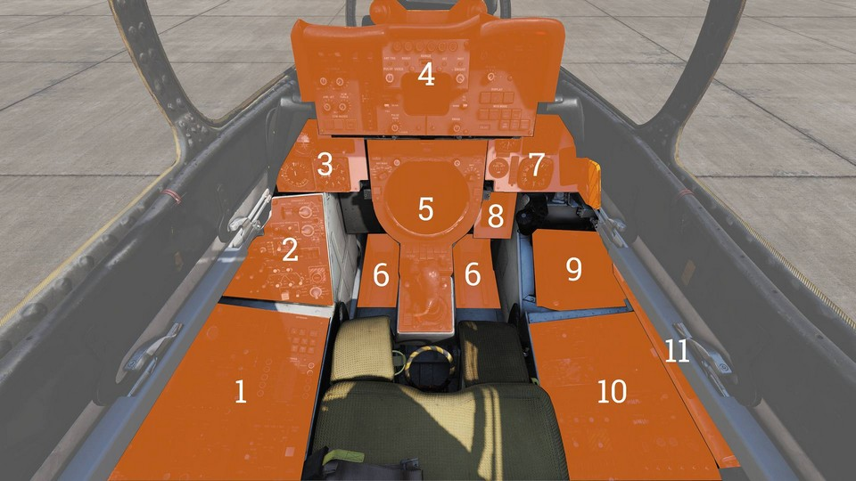

# RIO Cockpit Overview

## Layout

| Section | Name                                                         |
| :-----: | ------------------------------------------------------------ |
|   1.    | [Left Side Console](../rio/left_console.md)                  |
|   2.    | [Left Vertical Console](../rio/left_vertical_console.md)     |
|   3.    | [Left Instrument Panel](../rio/left_instrument_panel.md)     |
|   4.    | [Center Panel](../rio/center_panel.md)                       |
|   5.    | [Center Console](../rio/center_console.md)                   |
|   6.    | [Footwells](../rio/footwells.md)                             |
|   7.    | [Right Instrument Panel](../rio/right_instrument_console.md) |
|   8.    | [Right Knee Panel](../rio/right_knee_panel.md)               |
|   9.    | [Right Vertical Console](../rio/right_vertical_console.md)   |
|   10.   | [Right Side Console](../rio/right_console.md)                |
|   11.   | [Canopy Control Handle](../rio/canopy_control_handle.md)     |

<iframe width="560" height="315" src="https://www.youtube.com/embed/kgpGO7fj4oU?si=aijx0zXpMBAjdH7X"
title="DCS: F-14 Tomcat - Episode 4: The RIO's Office" frameborder="0"
allow="accelerometer; autoplay; clipboard-write; encrypted-media; gyroscope; picture-in-picture; web-share"
referrerpolicy="strict-origin-when-cross-origin" allowfullscreen></iframe>
