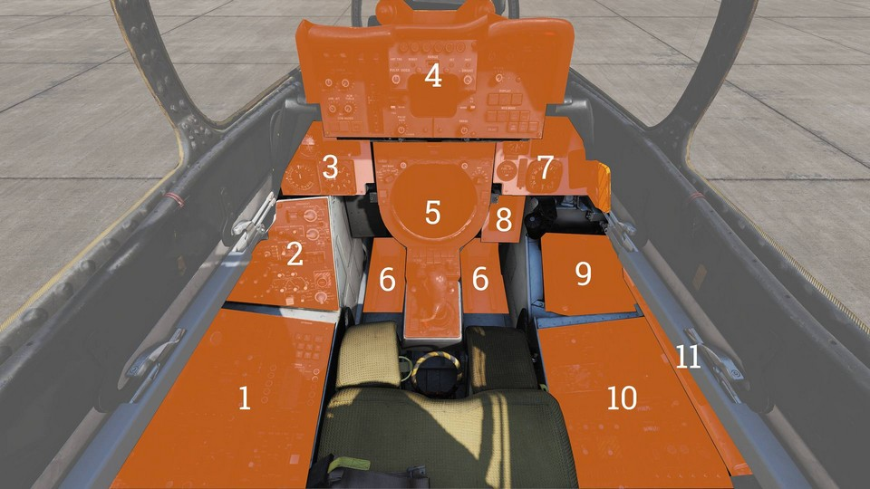

# RIO 驾驶舱总览

## 布局

| 部分 | 名称                                              |
| :--: | ------------------------------------------------- |
|  1.  | [左侧控制台](../rio/left_console.md)              |
|  2.  | [左侧垂直控制台](../rio/left_vertical_console.md) |
|  3.  | [左仪表板](../rio/left_instrument_panel.md)       |
|  4.  | [中央仪表板](../rio/center_panel.md)              |
|  5.  | [中央控制台](../rio/center_console.md)            |
|  6.  | [左右脚部空间](../rio/footwells.md)               |
|  7.  | [右仪表板](../rio/right_instrument_panel.md)      |
|  8.  | [右膝仪表板](../rio/right_knee_panel.md)          |
|  9.  | [右垂直控制台](../rio/right_vertical_console.md)  |
| 10. | [右侧控制台](../rio/right_console.md)             |
| 11. | [座舱盖控制手柄](../rio/canopy_control_handle.md) |

<iframe width="560" height="315" src="https://www.youtube.com/embed/kgpGO7fj4oU?si=aijx0zXpMBAjdH7X"
title="DCS: F-14 Tomcat - Episode 4: The RIO's Office" frameborder="0"
allow="accelerometer; autoplay; clipboard-write; encrypted-media; gyroscope; picture-in-picture; web-share"
referrerpolicy="strict-origin-when-cross-origin" allowfullscreen></iframe>
