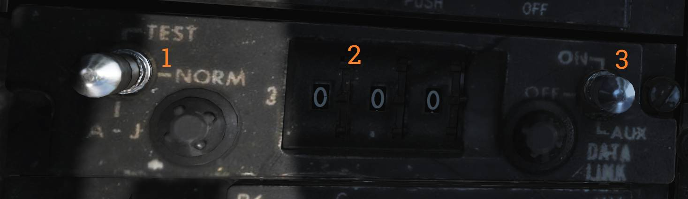
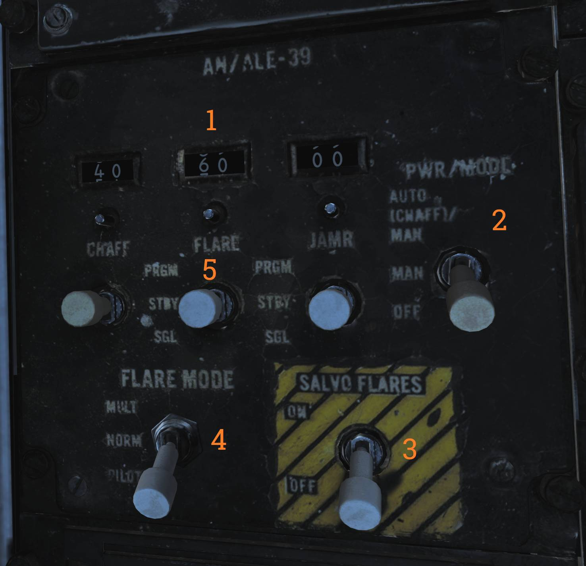
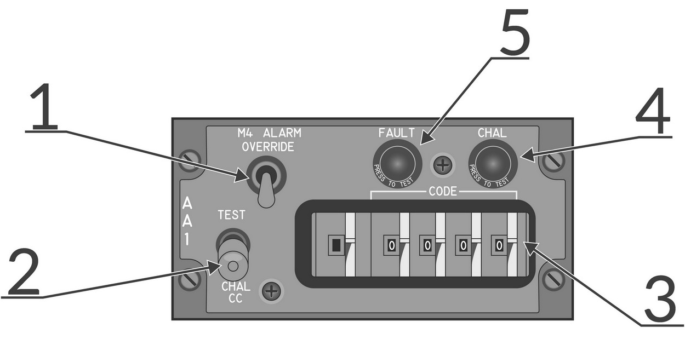
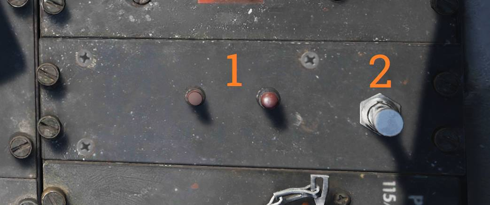
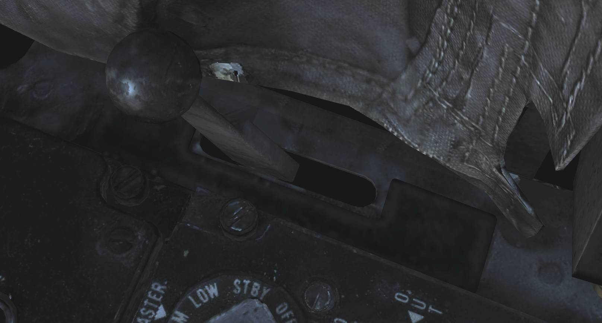

# Right Side Console

## Radar Warning Receiver Panel

Control panel for the ALR-67 radar warning receiver.

### Power Switch

The PWR switch (<num>1</num>) controls electrical power to the ALR-67.

### Display Type Selector

The DISPLAY TYPE selector (<num>2</num>) selects which threat types are prioritized and displayed.

### Mode Switch

The MODE switch (<num>3</num>) is spring-loaded to the center (OFF) position.

It can be held to the following momentary positions:

- OFST - Enables offset display while held.
- LMT - Enables limited display while held.

### Test Switch

The TEST switch (<num>4</num>) is spring-loaded to center.

- BIT - Momentary selection initiates ALR-67 BIT.
- SPL - While BIT page 1 is displayed, holding SPL displays the special BIT status page while held
  and for three seconds after release.

### Volume Knob

The VOL knob (<num>5</num>) controls ALR-67 audio volume to the RIO headset.

## Digital Data Indicator (DDI)

Digital data indicator used to display commands received via the data link.

| Indicator  | Function                                                                                                                                           |
| ---------- | -------------------------------------------------------------------------------------------------------------------------------------------------- |
| AFT VEC    | Aircraft is being vectored to approach target from the rear hemisphere.                                                                            |
| COL VEC    | Aircraft is being vectored on a collision course to target.                                                                                        |
| NO MSG     | No message at this time, indicates presence of data link communication while not receiving a command.                                              |
| TO WAY PT  | Proceed to the point being indicated by target information.                                                                                        |
| HANDOVER   | TDS is handing own aircraft over to another control center.                                                                                        |
| ORBIT      | Assume orbit at present position maintaining maximum endurance.                                                                                    |
| CHALNGE    | Intercept and visually identify the target.                                                                                                        |
| ARM 1      | Intercept and destroy the indicated hostile target using AIM-54.                                                                                   |
| ARM 2      | Intercept and destroy the indicated hostile target using AIM-7.                                                                                    |
| ARM 3      | Intercept and destroy the indicated hostile target using AIM-9.                                                                                    |
| NOT CMD    | Ignore currently received heading, speed, and altitude. Also means valid command BIT not yet available.                                            |
| FRE LAN    | Free to attack the most suitable target.                                                                                                           |
| DIS’GAGE   | Cease fire.                                                                                                                                        |
| ABORT      | Abort action.                                                                                                                                      |
| BEAC ON    | Enable APN-154 tracking beacon.                                                                                                                    |
| BEAC DUB   | Set APN-154 to double-pulse mode.                                                                                                                  |
| DROP       | Command to release a weapon in data link A/G attack, manually or automatically if in data link attack mode.                                        |
| BEAC OFF   | Turn off APN-154 tracking beacon.                                                                                                                  |
| RET BASE   | Return to the indicated home base.                                                                                                                 |
| WAVE OFF   | Wave off, automatic AFCS disengagement.                                                                                                            |
| LAND CHECK | CATCC has a data link channel available for AFCS, complete landing checklist.                                                                      |
| ACL BEAC   | Directed by carrier to enable APN-154 beacon.                                                                                                      |
| ACL RDY    | ACL has locked onto aircraft APN-154 beacon and is transmitting zero pitch and bank signals. Glideslope information is now available to the pilot. |
| A/P CPLR   | ACL is ready to take control of the aircraft for the ACL approach, autopilot should be engaged.                                                    |
| 10 SEC     | Indicates 10 seconds to the next action or waypoint. In ACL indicates that the ship's motion is taken into account for ACL.                        |
| ADJ A/C    | Indication from the control station of another aircraft near own aircraft.                                                                         |
| VOICE      | Indicates ACL not available, switch to voice procedures.                                                                                           |
| TILT       | Indicates no data link message received in the last 10 seconds. In ACL indicates no messages in the last 2 seconds, will disengage AFCS.           |
| CMD CHG    | Indicates imminent or recently changed command instructions.                                                                                       |
| ALT CHG    | Indicates imminent or recently changed altitude command.                                                                                           |
| MON ALT    | Message indicating altitude command not being followed with enough precision.                                                                      |
| MANUAL     | Indicates autopilot should not be engaged.                                                                                                         |
| SPD CHG    | Indicates imminent or recently changed speed command.                                                                                              |
| MON SPD    | Message indicating speed command not being followed with enough precision.                                                                         |
| CMD CTRL   | Indicates aircraft under data link control for landing.                                                                                            |
| CHG CHN    | Command to change data link channel.                                                                                                               |
| HDG CHN    | Indicates imminent or recently changed heading command.                                                                                            |
| CANC RPY   | TDS has canceled reply messages.                                                                                                                   |
| FWD VEC    | Aircraft is being vectored to approach the target from the front hemisphere.                                                                       |

> 💡 The majority of the DDI lights depend on data link reply messages not currently modelled in
> DCS.

## DECM Control Panel

Control panel for the AN/ALQ-126 DECM jammer.

### Standby Light

The STANDBY light (<num>1</num>) is an orange warm-up indication when the system is placed in STBY.

The light extinguishes after warm-up. Illumination during test or operation indicates a fault.

### DECM Selector

The DECM selector (<num>2</num>) controls AN/ALQ-126 power and operating mode.

Selectable modes are:

- OFF - Removes power from the AN/ALQ-126.
- STBY - Standby warm-up mode.
- TEST/HOLD 3 SEC - Hold for three seconds to arm the system test.
- TEST/ACT - Initiates AN/ALQ-126 BIT after the TEST/HOLD 3 SEC step.
- REC - Receive and analyze threat signals. Missile launch detection may force the system into
  repeat.
- RPT - Repeat mode, transmits programmed responses to detected threats.

### Audio Knob

The AUDIO knob (<num>3</num>) sets jammer audio volume to the RIO headset.

## Data Link Control Panel

Control panel for data link operation.

### Transmission Mode Switch

The transmission mode switch (<num>1</num>) selects data link transmission mode.

- TEST - Initiates system test.
- NORM - Normal operational mode.
- A/J - Anti-jam transmission mode.

### Frequency Select Wheels

The frequency select thumbwheels (<num>2</num>) set the data link frequency.

### Data Link Power Switch

The data link power switch (<num>3</num>) applies power to the data link and is also used to select
AUX (auxiliary) mode.

## Data Link Reply and Antenna Control Panel

Panel controlling data link alignment, reply, and antenna selection.

### Antenna Switch

The ANTENNA switch (<num>1</num>) selects the antenna used for UHF 1 and the data link.

### Reply Switch

The REPLY switch (<num>2</num>) controls data link reply transmission.

- NORM - Reply transmission enabled.
- CANC - Reply transmission disabled (cancelled).

### Mode Switch

The MODE switch (<num>3</num>) is spring-loaded to TAC and held by solenoid.

- CAINS/WAYPT - Enables data link alignment and waypoint update.
- TAC - Enables manual frequency selection and stops alignment/waypoint update.

### Address Thumbwheel

The ADDRESS thumbwheel (<num>4</num>) sets the aircraft data link address.

This sets the two least-significant digits; remaining digits are set by ground crew.

## AN/ALE-39 Control Panel

Controls countermeasure dispensing and operating modes for the AN/ALE-39.

### Inventory Counters

The inventory counters (<num>1</num>) indicate remaining countermeasure quantities.

Counters are manually set by pushing in and rotating the knob beneath each counter.

### Power and Mode Switch

The PWR/MODE switch (<num>2</num>) applies power and selects AN/ALE-39 operating mode.

- AUTO(CHAFF)/MAN - Enables manual dispensing and automatic chaff dispensing via ECM threat
  detection.
- MAN - Manual dispensing only.
- OFF - System off.

### Salvo Flares Switch

The SALVO FLARES switch (<num>3</num>) enables rapid firing of all flares.

The switch must be lifted to move to ON.

### Flare Mode Switch

The FLARE MODE switch (<num>4</num>) selects flare dispensing logic and also controls what the
pilot’s DLC button dispenses while airborne.

- MULT - Each flare command dispenses one flare from each launcher subsection loaded with flares.
- NORM - Each flare command dispenses one flare total.
- PILOT - Pilot DLC button dispenses flares. Other positions cause the pilot DLC button to dispense
  chaff.

### Countermeasure Release Switches

The countermeasure release switches (<num>5</num>) are spring-loaded to center and command
countermeasure release.

- PRGM - Program release. Switch must be lifted to enter PRGM; momentary actuation initiates
  programmed release.
- STBY - No release.
- SGL - Single release.

## AA1 Control Panel

AN/APX-76 interrogator control panel.

> 💡 Due to DCS limitations in regards to IFF the AA1 control panel is currently non-functional.

### M4 Alarm Override Switch

The M4 ALARM OVERRIDE switch (<num>1</num>) disables the Mode 4 tone alarm in the RIO headset.

### Test / Challenge CC Switch

The TEST-CHAL CC switch (<num>2</num>) is spring-loaded to center and controls IFF test and
challenge functions.

- TEST - Momentary actuation interrogates own transponder. With matching codes, two solid lines
  appear on the DDD at 3 and 4 miles.
- CHAL CC - Momentary actuation starts a 10-second interrogation cycle. Only returns with correct
  mode and code are displayed on the DDD.

### Code Selector Thumbwheels

The CODE selector thumbwheels (<num>3</num>) set interrogation mode and code.

The first wheel sets mode, and the last four wheels set code.

### Challenge Light

The CHAL light (<num>4</num>) illuminates during active interrogation.

### Fault Light

The FAULT light (<num>5</num>) indicates an AN/APX-76 fault.

## AN/ALE-39 Programmer

Programming panel used to enter countermeasure programs and inventory into the AN/ALE-39.

### Jammer Program Thumbwheels

The JAMR thumbwheels (<num>1</num>) set jammer program parameters.

- QTY - Quantity of jammers released per program.
- INTV - Interval in seconds between jammer releases.

### Chaff Program Thumbwheels

The CHAFF thumbwheels (<num>2</num>) set chaff program parameters.

- B-QTY - Burst quantity per salvo; may be set to C (continuous) or R (random).
- B-INTV - Burst interval; may be set to R (random).
- S-QTY - Number of salvos in the program.
- S-INTV - Interval between salvos.

### Flare Program Thumbwheels

The FLARE thumbwheels (<num>3</num>) set flare program parameters.

- QTY - Quantity of flares released per program.
- INTV - Interval between flare releases.

### Load Control Thumbwheels

The LOAD control thumbwheels (<num>4</num>) input what is loaded in each launcher subsection.

- L10 - Left 10 subsection load.
- L20 - Left 20 subsection load.
- R10 - Right 10 subsection load.
- R20 - Right 20 subsection load.

### Reset Switch

The RESET switch (<num>5</num>) loads programmed settings into the AN/ALE-39 and resets sequencer
switches to their start positions.

## Interior Light Control Panel

Panel controlling RIO cockpit lighting.

### Instrument Lighting Thumbwheel

The INSTRUMENT thumbwheel (<num>1</num>) controls instrument panel lighting intensity.

- 0 - Off
- 1–14 - Increasing brightness

### White Flood Switch

The WHITE FLOOD switch (<num>2</num>) enables white flood lighting.

DIM and BRT settings are available. The switch is locked to OFF unless pulled out.

### Console Lighting Thumbwheel

The CONSOLE thumbwheel (<num>3</num>) controls console lighting and red flood lighting.

- 0 - Console and red flood off
- 1–14 - Increasing console brightness

### Red Flood Switch

The RED FLOOD switch (<num>4</num>) controls red instrument and console flood lighting.

- DIM - Dim red console flood
- MED - Medium red console flood
- BRT - Bright red instrument flood and console lights

## Data / ADF Switch

The DATA/ADF switch (<num>1</num>) controls display of navigation data and ADF symbology on the HSD
and ECMD.

- BOTH - Displays ADF bug and navigation data block.
- DATA - Displays navigation data block only.
- OFF - Disables both.

## IFF Transponder Control Panel

Control panel for the AN/APX-72 IFF transponder.

### Mode 4 Switch

The MODE 4 switch (<num>1</num>) enables Mode 4 operation.

### Mode 4 Audio/Light Switch

The MODE 4 AUDIO/LIGHT switch (<num>2</num>) enables Mode 4 audio monitoring and/or reply light
monitoring.

- AUDIO - Enables Mode 4 audio monitoring and reply light monitoring.
- OUT - Disables audio and light monitoring.
- LIGHT - Enables reply light monitoring only.

### Mode 4 Code Selector

The MODE 4 CODE selector (<num>3</num>) selects which cipher code is used.

- ZERO - Erases both ciphers.
- B - Selects B cipher.
- A - Selects A cipher.
- HOLD - Non-functional.

### Mode 4 Reply Light

The MODE 4 REPLY light (<num>4</num>) illuminates when a Mode 4 reply is generated and transmitted.

The light can be pressed to test.

### Test Light

The TEST light (<num>5</num>) illuminates to indicate a successful test when a mode test is
performed.

The light can be pressed to test illumination.

### Master Selector

The MASTER selector (<num>6</num>) selects AN/APX-72 operating state.

- OFF - No power.
- STBY - Standby for immediate operation when another mode is selected.
- LOW - Low sensitivity replies; responds only to strong nearby interrogators.
- NORM - Normal reply operation.
- EMER - Emergency replies to Mode 1, 2, and 3/A and normal reply to Mode C, regardless of mode
  switch settings.

### Mode Switches

The MODE switches (<num>7</num>) control individual IFF mode operation.

- TEST - Tests the respective mode; correct operation indicated by TEST light.
- ON - Enables the mode.
- OUT - Disables the mode.

### Rad Test / Out / Mon Switch

The RAD TEST-OUT-MON switch (<num>8</num>) controls ground test and monitoring of non-Mode 4
replies.

- RAD TEST - Not used by aircrew.
- OUT - Disables test and monitoring.
- MON - Monitors Mode 1, 2, 3, and C by illuminating the TEST light when replies are generated and
  transmitted.

### Ident / Out / Mic Switch

The IDENT-OUT-MIC switch (<num>9</num>) controls Mode 1–3 IDENT functionality.

- IDENT - Momentary; enables IDENT replies for 15–30 seconds after release.
- OUT - IDENT disabled.
- MIC - Transfers IDENT control to crewmember UHF PTT; IDENT replies occur when PTT is keyed.

### Code Thumbwheels

The code thumbwheels (<num>10</num>) set Mode 1 and Mode 3 codes.

Six thumbwheels are provided.

## IFF Antenna Control / Test Panel

Panel containing IFF antenna selection, BIT controls, and ground cooling control.

### IFF Antenna Switch

The IFF ANT switch (<num>1</num>) selects which antenna the IFF transponder uses.

- AUTO - Automatic selection.
- LWR - Forces lower antenna selection.

### Indicator Light / DDI BIT Switch

The IND LT/DDI BIT switch (<num>2</num>) initiates DDI BIT and tests RIO indicator lights.

### Ground Cooling Switch

The GND CLG switch (<num>3</num>) enables external air cooling while on the ground.

- OBC/CABIN - External air into cabin and electronics cooling with reduced OBC performance.
- OFF - External air not used.
- AWG-9/AIM-54 - External air used to cool AWG-9/AIM-54 more effectively; disables external cabin
  air.

## Mid Compression Bypass Test Panel (F-14A only)

Panel used to verify Mid Compression Bypass (MCB) circuit functionality.

### Left and Right Test Lights

The left and right test lights (<num>1</num>) illuminate during an MCB test to indicate successful
test results for the respective engine circuits.

### MCB Test Switch

The MCB test switch (<num>2</num>) initiates the MCB circuit test.

## Electrical Power System Test Panel

Ground crew test panel for aircraft electrical systems.

> 💡 Non-functional in DCS.

## Canopy Defog / Cabin Air Lever

The canopy air diffuser lever (<num>1</num>) controls distribution of conditioned cabin air.

- CABIN AIR - Normal position. Directs approximately 70% of airflow through cockpit air diffusers
  and 30% through canopy diffusers.
- CANOPY DEFOG - Directs all airflow through canopy diffusers for canopy defog.
