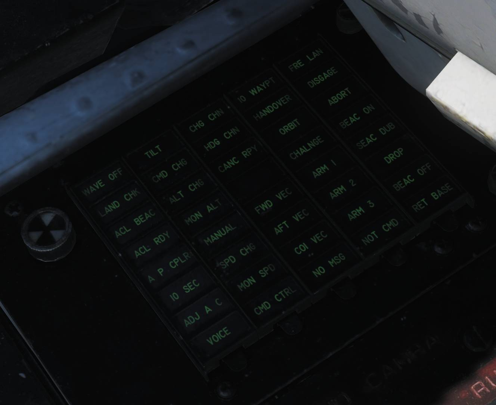
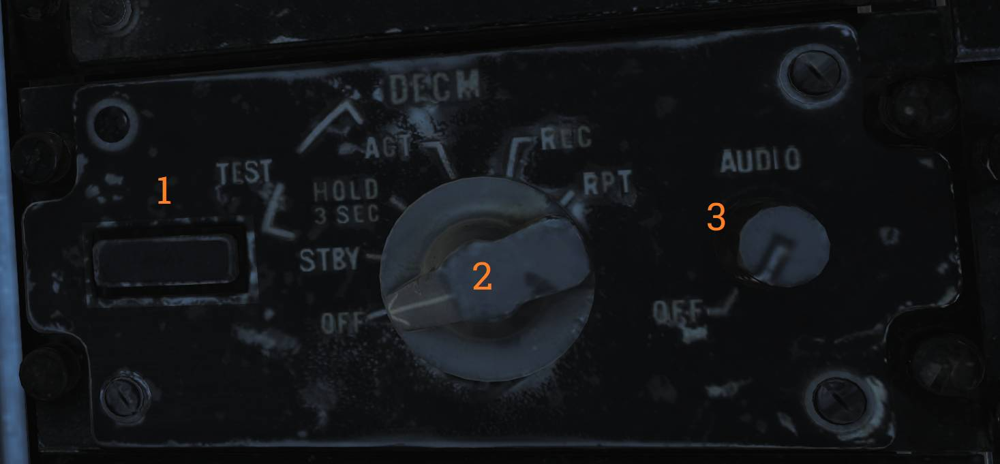
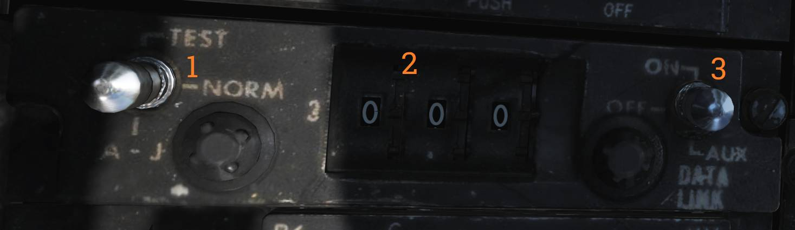
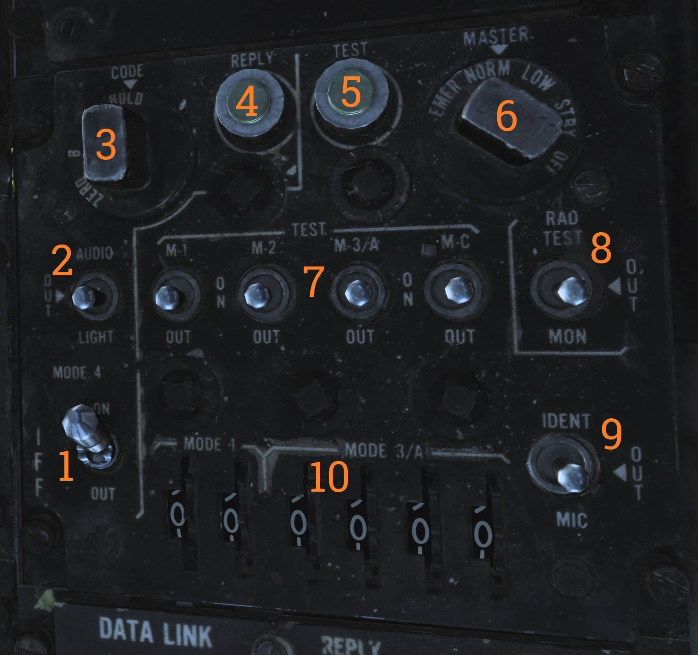
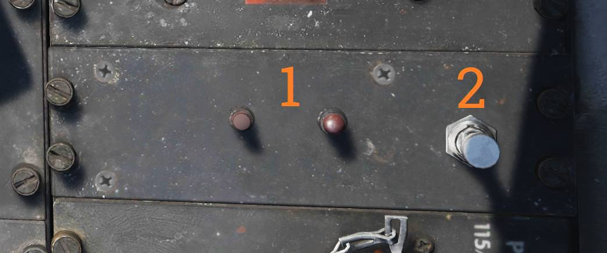

# 右侧控制台

## 雷达告警接收机面板

ALR-67 雷达告警接收机的控制面板。

### PWR 开关

(<num>1</num>) 用于控制 ALR-67 的电源。

### 显示类型选择开关

(<num>2</num>) 用于控制何种类型的威胁优先进行显示。

### MODE 选择开关

三档位弹簧开关 (<num>3</num>)，释放开关后，开关弹回中立（OFF）位置。

可保持在以下自复位档位：

- OFST - 保持在档位是启用偏置。 - LMT - 保持在档位时启用限制模式。

### TEST 开关

三档位弹簧开关(<num>4</num>)，释放开关后，开关弹回中间位置。

- BIT - 短暂地将开关拨至 BIT 档位会开始 ALR-67 BIT。
- SPL - 显示特殊 BIT 状态页，松开开关后，特殊 BIT 状态页会显示三秒然后消失。

### VOL 旋钮

(<num>5</num>) 用于调节 RIO 头戴中 ALR-67 的音频音量。

## 数字数据显示面板（DDI）

数字数据显示面板用于显示通过数据链路接收到的指令。

| 指示器                                                           | 功能                                                                                              |
| ---------------------------------------------------------------- | ------------------------------------------------------------------------------------------------- |
| AFT VEC                                                          | 飞机正接受数据链路引导，从目标后方（后半球）接近目标。                                            |
| COL VEC                                                          | 飞机正接受数据链路引导，以恒定角度拦截转向飞向目标。                                              |
| NO MSG                                                           | 此刻无消息，表示数据链路通信正常                                                                  |
| 但未接收到指令。                                                 |                                                                                                   |
| TO WAY PT                                                        | 行进至由目标信息所指示的点。                                                                      |
| HANDOVER                                                         | TDS（战术数据系统）正将飞机转交给另一控制中心。                                                   |
| ORBIT                                                            | 在当前位置盘旋，保持最长续航时间。                                                                |
| CHALNGE                                                          | 拦截并目视识别目标。                                                                              |
| ARM 1                                                            | 拦截目标并使用 AIM-54 摧毁指定敌方目标。                                                          |
| ARM 2                                                            | 拦截目标并使用 AIM-7 摧毁指定敌方目标。                                                           |
| ARM 3                                                            | 拦截目标并使用 AIM-9 摧毁指定敌方目标。                                                           |
| NOT CMD                                                          | 无视当前接收到的航向、速度和高度信息。                                                            |
| 这也表示有效指令 BIT 暂不可用。                                  |                                                                                                   |
| FRE LAN                                                          | 自由攻击最合适的目标。                                                                            |
| DIS'GAGE                                                         | 停火。                                                                                            |
| ABORT                                                            | 终止行动。                                                                                        |
| BEAC ON                                                          | 启用 APN-154 跟踪信标。                                                                           |
| BEAC DUB                                                         | 将 APN-154 信标设置为双脉冲模式。                                                                 |
| DROP                                                             | 指令在数据链路 A/G 攻击中投放武器，                                                               |
| 如果选用数据链攻击模式，则使用自动投放，否则采用手动投放。       |                                                                                                   |
| BEAC OFF                                                         | 关闭 APN-154 跟踪信标。                                                                           |
| RET BASE                                                         | 返回指定的基地。                                                                                  |
| WAVE OFF                                                         | 复飞，同时 AFCS（自动飞行控制系统，也就是自动驾驶）将自动断开。                                   |
| LAND CHECK                                                       | CATCC（母舰空中交通管制中心）有可用的 AFCS 数据链路通道，机组应完成着舰检查单。                   |
| ACL BEAC                                                         | CATCC 请求本机开启 AN/APN-154 信标。                                                              |
| ACL RDY                                                          | ACL 已锁定本机的 APN-154 信标，且正在传输零俯仰和坡度信号。                                       |
| 飞行员现在可以看见下滑道信息。                                   |                                                                                                   |
| A/P CPLR                                                         | ACL 已就绪，准备好控制飞机进行 ACL 进近，机组应接通自动驾驶。                                     |
| 10 SEC                                                           | 表示还有10秒抵达着舰航线的下一特殊点。                                                            |
| ACL 着舰过程中，母舰的运动也被添加至下滑道信息和数据链路指令中。 |                                                                                                   |
| ADJ A/C                                                          | 表示本机起降航线中或起降航线附近有其他飞机。                                                      |
| VOICE                                                            | 指示 ACL 不可用，切换至标准的基于音频通讯的进近流程。                                             |
| TILT                                                             | 表示在过去的10秒内未收到任何数据链路信息。在 ACL 中，如果超过2秒未收到数据链路信息，AFCS 会断开。 |
| CMD CHG                                                          | 表示即将收到或最近更变的数据链路指令。                                                            |
| ALT CHG                                                          | 表示即将收到或最近更变的数据链路高度指令。                                                        |
| MON ALT                                                          | 表示本机未能以足够精度遵循高度指令。                                                              |
| MANUAL                                                           | 表示本机应解除自动驾驶。                                                                          |
| SPD CHG                                                          | 表示即将收到或最近更变的数据链路速度指令。                                                        |
| MON SPD                                                          | 表示本机未能以足够精度遵循速度指令。                                                              |
| CMD CTRL                                                         | 表示飞机正由数据链路控制进行助降。                                                                |
| CHG CHN                                                          | 切换数据链路波道指令。                                                                            |
| HDG CHN                                                          | 表示即将收到或最近更变的数据链路航向指令。                                                        |
| CANC RPY                                                         | TDS（战术数据系统）取消发送应答信息。                                                             |
| FWD VEC                                                          | 飞机正接受数据链路引导，从目标前方（前半球）接近目标。                                            |

> 💡 目前在 DCS 中未模拟绝大多数依赖于数据链路应答消息的 DDI 灯光。

## 防御性电子对抗（DECM）控制面板

这个面板用于控制 DECM（防御性电子对抗）干扰机（AN/ALQ-126）。

### STANDBY 指示灯

橙色指示灯 (<num>1</num>)，当模式选择旋钮拨动至 STBY 档位时，用来指示系统正在预热。

预热完成后指示灯将会熄灭。如果在测试或工作中亮起表示系统发生故障。

### DECM 模式选择旋钮

DECM 电源/模式选择开关 (<num>2</num>)。用于控制 DECM 系统的电源和 DECM 的功能。

可选模式有：

- OFF - 关闭 AN/ALQ-126 的电源。
- STBY - 待机状态，向系统通电以进行预热。
- TEST/HOLD 3 SEC - 将选择开关拨该位置并保持3秒以准备系统测试。
- TEST/ACT - 将开关保持在 TEST/HOLD 3 SEC 档位3秒后，选择 TEST/ACT 档位来开始 AN/ALQ-126 自检。
- REC - 接收模式，使 AN/ALQ-126 接收并分析威胁信号。探测到的导弹发射威胁可能强制命令系统进入重复模式。
- RPT - 重复模式，使 AN/ALQ-126 向接收到的雷达威胁发送干扰信号。

### AUDIO 旋钮

音量控制旋钮 (<num>3</num>)，用于调节 RIO 头戴中来自 AN/ALQ-126 的音频音量。

## 数据链路控制面板

面板用于控制数据链路。

### 传输模式开关

(<num>1</num>) 用于设置数据链路的传输模式。

- TEST - 开始系统测试。
- NORM - 正常工作模式。
- A/J - 反干扰工作模式。

### 频率选择拨轮

(<num>2</num>) 拨轮用于设置数据链路频率。

### 数据链路电源开关

控制数据链路电源 (<num>3</num>)，也用于设置数据链路辅助（AUX）模式。

## 数据链路应答和天线控制面板

用于控制数据链路对准、应答和天线的面板。

### ANTENNA 开关

(<num>1</num>) 用于选择 UHF 1 和数据链路使用的天线。

### REPLY 开关

(<num>2</num>) 用于控制数据链路应答。

- NORM - 启用传输数据链路应答。
- CANC - CANC（取消）禁用数据链路应答。

### MODE 选择开关

(<num>3</num>) 螺线管保持在 CAINS/WAYPT 档位，失电时弹回 TAC 档位。

- CAINS/WAYPT - 启用数据链路对准和航路点更新。
- TAC - 启用手动选择数据链路频率，停止数据链路对准。

### ADDRESS 拨轮

(<num>4</num>) 设置本机使用的数据链路位址。

拨轮设置最低的两位数字，其它的数字将由地勤进行设置。

## AN/ALE-39 控制面板

控制 AN/ALE-39 对抗措施布撒和操作模式。

### 剩余数量计数器

机械计数器(<num>1</num>)——用于显示飞机装载的对抗措施的剩余数量。

按下并旋转计数器下方对应的旋钮来手动设置计数器。

### PWR/MODE 开关

电源/模式开关(<num>2</num>)，接通 AN/ALE-39 电源以及选择 AN/ALE-39 的工作模式。

- AUTO(CHAFF)/MAN - 允许手动弹射对抗措施，同时允许 ECM 系统根据探测到的威胁自动弹射箔条。
- MAN - 允许手动弹射对抗措施。 - OFF - 关闭 AN/ALE-39。

### SALVO FLARES 开关

红外干扰弹齐射开关(<num>3</num>)，启用 L/R 两个部分平行快速弹射所有红外干扰弹。

开关必须提起来拨动至 ON 档位。

### FLARE MODE 开关

红外干扰弹发射模式开关(<num>4</num>)——用于选择弹射红外干扰弹的工作模式。也用于当襟翼收上时，控制当飞行员驾驶杆的 DLC 按钮弹射哪种对抗措施。

- MULT - 齐射模式，每个弹射脉冲将从编程面板中设置为 F 的部分弹射一发红外干扰弹。这个选项对手动弹射模式和程序弹射模式都有效。
- NORM - 正常模式，每个红外干扰弹弹射指令都会使 AN/ALE-39 弹射总计一枚红外干扰弹。这个选项对手动发射模式和程序发射模式都有效。
- PILOT - 飞行员控制模式，允许飞行员通过驾驶杆上的 DLC 按钮手动弹射红外干扰弹，如果选择除 PILOT 以外的档位，按下 DLC 按钮会弹射箔条。

### 对抗措施弹射开关

对抗措施弹射开关(<num>5</num>)为弹簧归中，开关用于控制对应对抗措施的弹射动作。

- PRGM - 程序，将开关向上提起才能将其拨至该档位，短暂拨动至 PRGM 档位会按照预先设定的程序弹射对抗措施。
- STBY - 待机，不弹射对抗措施。
- SGL - 单发，短暂拨动至 SGL 将指令弹射单发对抗措施。

## AAI 控制面板

AN/APX-76 问询器控制面板。

> 💡 由于 DCS 对于 IFF 模拟的限制，目前 AAI 控制面板无功能。

### M4 ALARM OVERRIDE 开关

MODE 4 报警超控开关(<num>1</num>)，用于禁用 RIO 头戴中的 MODE 4 报警音。

### TEST-CHAL CC 开关

测试-询问控制开关 (<num>2</num>)，这个弹簧开关用于控制 IFF 询问和测试，松开开关时，开关弹回中间位置。

- TEST - 将开关短暂拨动至该档位会使 AN/APX-76 问询本机的 IFF 应答机，以此来对 AN/APX-76 进行测试。如果编码设置相同，DDD 显示器中对应3海里和4海里的位置会出现两条实线。
- CHAL
  CC - 将开关短暂拨动至该档位会使 AN/APX-76 进行一个长10秒的询问周期，仅正确的模式和编码应答会显示在 DDD 中。

### CODE 选择拨轮

编码设置拨轮(<num>3</num>)，用于设置询问模式和询问编码。

第一个拨轮用于设置模式，后四个拨轮用于设置编码。

### CHAL 指示灯

询问状态灯 (<num>4</num>) ，灯光亮起表示 AN/APX-76 正在进行询问。

### FAULT 指示灯

故障指示灯 (<num>5</num>)，灯光亮起表示 AN/APX-76 中出现故障。

## AN/ALE-39 编程面板

用于编辑和设置 AN/ALE-39 的对抗措施弹射程序。

### JAMR 拨轮（灰色）

(<num>1</num>)用于设置有源干扰弹弹射程序。

- QTY - 数量拨轮，用于设置有源干扰弹弹射程序中，弹射的数量。
- INTV - 间隔拨轮，用于设置有源干扰弹弹射程序中，弹射的间隔，单位是秒。

### CHAFF 拨轮（蓝色）

(<num>2</num>)用于设置箔条发射程序。

- B-QTY - 数量拨轮，用于设置每次弹射程序中，连投箔条的数量，也可以设置为 C（连续）和 R（随机）。
- B-INTV - 间隔拨轮，用于设置干扰弹弹射程序中，连投的时间间隔，也可以设置为 R（随机）。
- S-QTY - 数量拨轮，用来控制一次弹射程序中，连投的齐射轮数。
- S-INTV - 间隔拨轮，用于设置一次弹射程序中，齐射轮数之间的时间间隔。

### FLARE 拨轮（黄色）

(<num>3</num>)用于设置红外干扰弹弹射程序。

- QTY - 数量拨轮，用于设置弹射程序中，弹射红外干扰弹的数量。
- INTV - 间隔拨轮，用于设置弹射程序中，弹射红外干扰弹的时间间隔。

### LOAD 控制拨轮

(<num>4</num>) 用于向 AN/ALE-39 中输入每个发射器子部分中装填的对抗措施类型（C - 箔条，F - 红外干扰弹，J - 有源干扰弹）。

- L10 - 设置左发射器 10 部分中填充的对抗措施类型。
- L20 - 设置左发射器 20 部分中填充的对抗措施类型。
- R10 - 设置右发射器 10 部分中填充的对抗措施类型。
- R20 - 设置右发射器 20 部分中填充的对抗措施类型。

### 复位开关

复位开关(<num>5</num>)，用于向 AN/ALE-39 中载入预设定的程序，并复位所有电子序列器开关至初始位置。

## 机内照明控制面板

用于控制 RIO 驾驶舱内的灯光。

### INSTRUMENT 拨轮

仪表板灯光拨轮，用于控制仪表板灯光亮度。

- 0 - 关闭
- 1–14 - 增加亮度。

### WHITE FLOOD 开关

(<num>2</num>) 用于控制 RIO 驾驶舱中的白色泛光灯。

开关锁定在 MED 档位，向上提起开关才可将其拨至 BRT（亮）或 DIM（暗）。

### CONSOLE 拨轮

控制台灯光拨轮(<num>3</num>)，用于调整控制台灯光和红色泛光灯的拨轮。

- 0 - 关闭控制台灯光和红泛光灯
- 1–14 - 逐渐增加控制台灯光的亮度

### RED FLOOD 开关

红色泛光灯开关 (<num>4</num>)，用于控制仪表板和控制台的红色泛光灯。

- DIM - 开启高亮度仪表板和控制台红色泛光灯
- MED - 仅开启红色控制台泛光灯。
- BRT - 仅开启低亮度控制台红色泛光灯

## 数据/ADF 开关

(<num>1</num>) 用于控制 HSD 和 ECMD 中的显示的数据和 ADF 信息。

- BOTH - HSD 和 ECMD 中将显示 ADF 游标和导航数据块。
- DATA - 只显示导航数据块。
- OFF - 全部禁用。

## 敌我识别（IFF）应答机控制面板

用于控制 AN/APX-72 应答机。

### MODE 4 开关

(<num>1</num>) 用于启用 MODE 4 工作模式。

### MODE 4 AUDIO/LIGHT 开关

MODE 4 音频/灯开关(<num>2</num>)，用于启用 MODE 4 音频和灯光监视。

- AUDIO - 音频，启用 MODE 4 询问的音频监视和 MODE 4 应答的 REPLY（应答）灯光监视。
- OUT - 关闭，禁用 MODE 4 的音频和灯光监控。
- LIGHT - 灯光，启用 MODE 4 应答的灯光监控。

### MODE 4 CODE 选择开关

MODE 4 编码选择旋钮 (<num>3</num>)，用于选择 MODE 4 使用的，密钥编码类型。

- ZERO - 擦除系统中的 A 和 B 密钥。
- B - 选择并使用 B 密钥。
- A - 选择并使用 A 密钥。
- HOLD - 无功能。

### MODE 4 REPLY 灯

MODE 4 应答指示灯 (<num>4</num>)，灯光亮起表示系统正生成并传输 MODE 4 应答。

按下指示灯可以测试灯光。

### TEST 指示灯

测试灯 (<num>5</num>)，选择控制面板上的对应的测试开关进行测试并且测试结果为正常工作时，测试灯会亮起。

按下指示灯可以测试正常亮起。

### MASTER 选择旋钮

主模式选择旋钮(<num>6</num>)，用于控制 AN/APX-72 的工作模式。

- OFF - 关闭，切断 AN/APX-72 的电源。
- STBY - 待机模式，使系统进入待机状态，选择开关的其他档位时，系统可立即开始工作。
- LOW - 低灵敏度应答模式，只应答位于附近的强询问信号。
- NORM - 正常模式，应答所有接收到的询问。
- EMER - 激活紧急应答模式，无视模式开关当前位置，应答 MODE 1、MODE 2 和 MODE
  3/A 问询，同时正常应答 MODE C 询问。

### MODE 开关

(<num>7</num>)用于选择不同的 IFF 模式。

- TEST - 测试对应的模式，TEST 指示灯亮起表示正常工作。
- ON - 启用选定的 IFF 模式。
- OUT - 关闭选定的 IFF 模式。

### RAD TEST-OUT-MON 开关

开关(<num>8</num>)用于控制地面测试和监控非 MODE 4 应答。

- RAD TEST - 机组人员不使用该档位。
- OUT - 禁用地面测试和监控。
- MON - 监控 MODE 1、MODE 2、MODE 3 和 MODE C 应答，系统生成并发送应答时，测试灯会亮起。

### IDENT-OUT-MIC 开关

(<num>9</num>) 用于控制 MODE 1、MODE 2 和 MODE 3 的 IDENT（识别）功能。

- IDENT - 将开关拨至该档位并松开开关来启用系统 IDENT 应答，应答持续15至30秒。
- OUT - 关闭 IDENT 功能。 - MIC - 将 IDENT 控制转交给机组 UHF
  PTT（按键通话）开关，PTT 开关与 IDENT 档位作用相同，每次按下 PTT 都会启用 IDENT 应答。

### CODE 拨轮

(<num>10</num>) 用于选择 MODE 1 和 MODE 3 使用的编码。

共有六个拨轮可用。

## 敌我识别（IFF）天线控制 / 测试面板

用于控制 IFF 天线、BIT 和地面冷却。

### IFF ANT 开关

敌我识别天线控制开关 (<num>1</num>)，用于选择应答机使用哪一根 IFF 天线。

- AUTO - 自动选择。
- LWR - 强制选择下部天线。

### IND LT/DDI BIT 开关

指示灯/DDI自检开关 (<num>2</num>)，用于手动测试 DDI 自检和测试 RIO 驾驶舱内的指示灯。

### GND CLG 开关

地面冷却控制开关 (<num>3</num>)，允许地面通过外部气源为飞机系统提供冷却。

- OBC/CABIN - 允许在地面使用外部气源为座舱通风并冷却电子设备以及 AWG-9/AIM-54，但 OBC 性能下降。
- OFF - 禁用外部引气通风和冷却。
- AWG-9/AIM-54 - 使用外部引气为 AWG-9 和 AIM-54 的冷却液降温，性能更好但会切断座舱通风。

## 中间级放气检测面板（仅限 F-14A）

面板中包含了用于核实中间级放气（MCB）电路正常工作的控制开关/按钮和指示器。

### 左右检测指示灯

启动 MCB 检测后 (<num>1</num>)，指示灯光亮起表示对应发动机的 MCB 电路通过检测。

### MCB 检测开关

拨动开关 (<num>2</num>) 来启动 MCB 电路检测，用于核实 MCB 电路正常工作的测试开关。

## 电力系统测试面板

地勤人员使用此面板测试飞机电力系统。

> 💡 DCS 中无功能。

## 座舱盖除雾 / 座舱通风气流调节拉杆

舱盖空气散流器控制手柄(<num>1</num>)控制驾驶舱中的通风气流。

- CABIN AIR - 空调系统引导70%的气流空过驾驶舱空气散流器，30%通过舱盖空气散流器。
- CANOPY DEFOG - 空调系统将引导所有气流通过舱盖空气散流器来给舱盖除雾。
