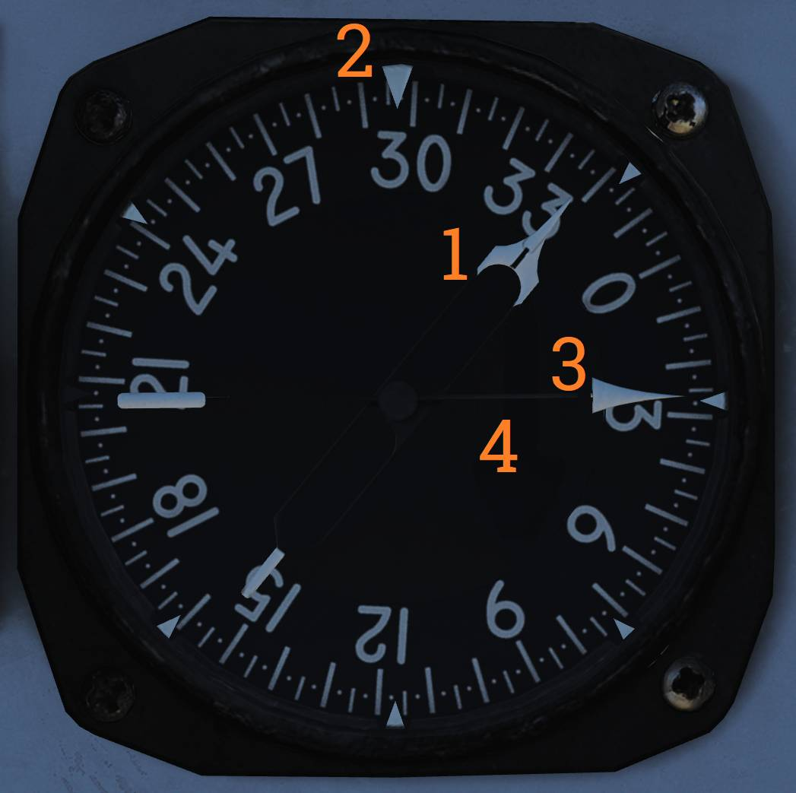

# Right Instrument Panel

## 时钟

机械发条时钟。

左下角的旋钮(<num>1</num>)用于上紧时钟发条。

- 顺时针转动旋钮。 - 抽出旋钮来设置时针和分针。

右上角的按钮 (<num>2</num>) 用于开始、停止和复位时长为1小时的计时器。

## ALR-67 显示器

用于显示 ALR-67 RWR（雷达告警接收机）套件探测到的辐射源。

### 威胁区

- 非致命威胁区 (<num>2</num>) - 显示辐射源没有直接威胁到本机，显示在这个区域内表示系统认为本机在辐射源的射程外或辐射源未装备武器。
- 致命威胁区 (<num>3</num>) - 显示 RWR 认为本机进入威胁的攻击射程内并且装备武器，但还未攻击本机。
- 严重威胁区 (<num>4</num>) - 显示对本机构成直接威胁的辐射源。辐射源有能力攻击本机，且攻击意图明显。

### 系统状态圈

系统状态圈 (<num>1</num>) 分为三个区域。

**区域 I (左上象限)** 示的符号代表威胁目标的显示类型：

- N - 正常优先级。
- I - AI，优先显示机载截击雷达威胁。
- A - AAA，优先显示高射炮威胁。
- U - 优先显示不明辐射源。
- F - 显示其他雷达威胁的同时也显示友方辐射源。

**区域 II (右上象限)** 指示 ARL-67 是否处于限制模式。

- (空白) - 未选择限制模式。
- L - 选用限制模式，只显示威胁最高的6个雷达威胁。

**区域 III (下半部分)** 显示系统状态和偏置信息：

- (空白) - 正常工作。
- B - BIT（自检）未通过。
- T - 热过载。
- O - 选择了偏置显示模式。重叠的威胁目标符号会偏置显示，以增强可读性。选择偏置显示模式时，显示器指示目标方位信息的精度会下降。

### INT（亮度）控制旋钮

亮度控制旋钮 (<num>5</num>)。用于控制显示器的亮度。

## 燃油总量表

燃油总量读数 (<num>1</num>) 显示飞机所有油箱中的剩余燃油总量。

## 威胁提示灯和主注意灯

主注意灯以及各种 ECM 和 IFF 相关提示 / 告警灯。

MASTER CAUTION 指示灯以及按钮表示 RIO 注意/提示灯面板上灯光状态发生变化。

按下来复位并熄灭主注意灯，直到下一个注意事件被触发。

### ALR-67 注意灯

| 指示器 | 功能                                                                                       |
| ------ | ------------------------------------------------------------------------------------------ |
| IFF    | 敌我识别提示灯，灯光亮起表示接收到 MODE 4 询问，但 IFF 系统未应答。                        |
| RCV    | 接收提示灯，灯光亮起表示 ALQ-126 接收到一个威胁识别信号。                                  |
| XMIT   | 干扰发射提示灯，灯光亮起表示 ALQ-126 正在发射干扰信号。                                    |
| SAM    | 面空导弹告警灯，灯光稳定亮起表示探测到 SAM 跟踪雷达锁定，闪烁时表示侦测到导弹发射。        |
| AAA    | 高射炮告警灯，灯光稳定亮起表示侦测到 AAA 跟踪雷达锁定。闪烁时表示探测到 AAA 正在进行攻击。 |
| CW     | 连续波告警灯，灯光亮起表示探测到被连续波辐射源照射。                                       |
| AI     | 机载截击雷达告警灯，灯光稳定亮起表示侦测到机载截击雷达锁定。                               |

### ALR-45 注意灯

| 指示器 | 功能                                                                        |
| ------ | --------------------------------------------------------------------------- |
| SA TRK | 灯光稳定亮起表示探测到 SAM 跟踪雷达。                                       |
| SA2    | SA-2 告警 - 稳定亮起表示 MA（导弹告警），闪烁表示 ML（导弹发射）。          |
| SA3/NI | SA-3 / SA-N-1 告警 - 稳定亮起表示 MA（导弹告警），闪烁表示 ML（导弹发射）。 |
| SA4    | SA-4 告警 - 稳定亮起表示 MA（导弹告警），闪烁表示 ML（导弹发射）。          |
| AI/AAA | 灯光稳定亮起表示探测到机载截击雷达和/或无法明确识别的 AI/AAA 雷达照射。     |
| REC    | ALQ-100 将接收到的信号识别为威胁时，指示灯稳定亮起。                        |
| IFF    | 敌我识别提示灯，灯光亮起表示接收到 MODE 4 询问，但 IFF 系统未应答。         |
| SA6    | SA-6 告警灯 - 稳定亮起表示 MA（导弹告警），闪烁表示 ML（导弹发射）。        |
| AI     | 灯光稳定亮起表示探测到机载截击雷达锁定。                                    |
| REP    | 灯光亮起表示 ALQ-100 正在发射干扰信号。                                     |

## 方位距离航向指示器（BDHI）

用于显示方位和航向信息。

### 二号方位指针

(<num>1</num>) 用来指示选定 TACAN 台的磁方位。

### 罗盘指针

(<num>2</num>) 显示当前飞机的磁航向。

### 一号方位指针

(<num>3</num>) 指向选定 UHF/ADF 电台的方位。

### 距离计数器

(<num>4</num>) 以海里为单位显示选定 TACAN 台的斜距。

（图中不可见）

## 座舱盖抛离手柄

手柄 (<num>1</num>) 用于手动抛离座舱盖。
