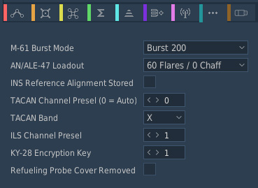
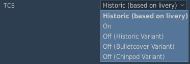

# Mission Editor

The F-14 has many aircraft-specific settings and waypoints that are configured
in the **Mission Editor**.

## Additional Aircraft Properties

Aircraft specific options are set up under the Additional Properties for
Aircraft page available when setting up an aircraft group containing F-14s.

### M-61 Burst Mode

This dropdown allows for changes in the M61's max burst length. The "Manual"
option fires until empty.

### AN/ALE-39 (AN/ALE-47 for F-14B Upgrade) Loadout

This dropdown allows for changes in the AN/ALE-39 (AN/ALE-47 for F-14B Upgrade)
countermeasure loadout.

### INS Reference Alignment Stored

This sets whether INS reference is pre-aligned at spawn. This allows for a
stored alignment to be completed upon aircraft cold start.

### TACAN Channel Preset and Band

This allows the initial TACAN channel and band to be preset.

### ILS Channel Preset

This allows the initial ILS channel preset to be set.

### KY-28 Encryption Key

This allows the initial KY-28 encryption key to be preset.

### Refueling Probe Cover Removed

This option removes the refueling probe cover while loaded in the mission. This
option overrides the livery refueling probe cover option.

### TCS (F-14A Early and F-14A Late Only)

This dropdown selection, for the F-14A Early and F-14A Late, allows mission
editors to select the TCS or select no TCS with ability to select between
historic (based on livery) or override.

| Option                     | Description                                                                                                    |
| -------------------------- | -------------------------------------------------------------------------------------------------------------- |
| Historic (based on livery) | Uses the livery's set option                                                                                   |
| On                         | Enables the TCS and equips chinpod with TCS regardless of livery option                                        |
| Off (Historic Variant)     | Disables TCS and equips chinpod based on livery (if TCS was originally on livery, the bulletcover is equipped) |
| Off (Bulletcover Variant)  | Disables TCS and equips bulletcover chinpod regardless of livery option                                        |
| Off (Chinpod Variant)      | Disables TCS and equips the chinpod without TCS housing regardless of livery option                            |

## Waypoints Types (F-14A/B Only)

As the F-14A/B's navigational system only has three numbered waypoints, most
other waypoints are set using Navigation Target Points.

- **Waypoints 1–3**: Set directly in the mission editor.
- **Home Base**: Set to the landing waypoint.
- **All others**: Set by naming _Navigation Target Points_ as below:

| Waypoint                | Name                      |
| ----------------------- | ------------------------- |
| Fix Point               | `FP`                      |
| Initial Point           | `IP`                      |
| Surface Target          | `ST`                      |
| Defended Point          | `DP`                      |
| Hostile Area            | `HA`                      |
| Datalink Waypoint 1–3   | `DLWP1`, `DLWP2`, `DLWP3` |
| Datalink Surface Target | `DLST`                    |
| Datalink Fixed Point    | `DLFP`                    |

## DTC (F-14B Upgrade Only)

The F-14B Upgrade has its Mission Data Loader integrated into DCS' Mission
Editor using the DTC menu. Refer to the
[Mission Data Loader section](../f14bu/systems/mdl/mission_data_loader.md) on
more in-depth how to use MDL with the DTC menu.

### Navigation

Refer to the
[Flight Plan subsection](../f14bu/systems/mdl/mission_data_loader.md#flight-plan)
of the MDL section for more information.

### JDAM

See the
[Pre-Planned JDAM Employment section](../f14bu/weapons/air_to_ground/gps_guided_weapons/ggw_employment.md#pre-planned-jdam-employment)
for further information on programming the JDAMs using the DTC menu.

### CMDS

See the
[Programmer section](../f14bu/systems/defensive_systems/countermeasures/ale_47.md#programmer)
for further information on programming the ALE-47 using the DTC menu.

### TIS (Tactical Imaging Set)

Refer to the
[Fast Tactical Imaging System](../f14bu/systems/nav_com/com/fast_tactical_imaging_set.md)
page for further information on how to use the Tactical Imaging Set.

#### Ownship Callsign

Callsign for ownship can be changed here. By default, "Use mission callsign", is
checked which means the DCS unit name (pilot) set in the mission editor is used.

#### Send-To Callsigns

The option to disable or enable the ability to auto-add wingmen to send list is
provided. Additionally, callsigns can be manually added to the send list.
