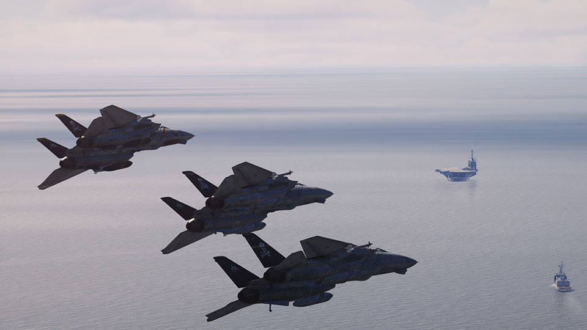

# DCS

This chapter contains systems, settings and interfaces specific to the
simulation of the Tomcat inside DCS. Refer to the F-14B Upgrade's
[DCS section](../f14bu/dcs/overview.md) for information that exclusively to the
F-14B Upgrade.

| Section | Name                                                 |
| :-----: | ---------------------------------------------------- |
|   1.    | [Special Options](../dcs/special_options.md)         |
|   2.    | [Mission Editor](../dcs/mission_editor.md)           |
|   3.    | [Grease Pencil](../dcs/grease_pencil.md)             |
|   4.    | [Virtual Browser](../dcs/virtual_browser.md)         |
|   5.    | [Instant Camera](../dcs/polaroid_camera.md)          |
|   6.    | [Jester Set Commands](../dcs/jester_set_commands.md) |
|   7.    | [Bombing Tool](../dcs/bombing_tool.md)               |
|   8.    | [Kneeboard](../dcs/kneeboard.md)                     |
|   9.    | [Embedded Manual](../dcs/ingame_manual.md)           |
|   10.   | [Character](../dcs/character.md)                     |
