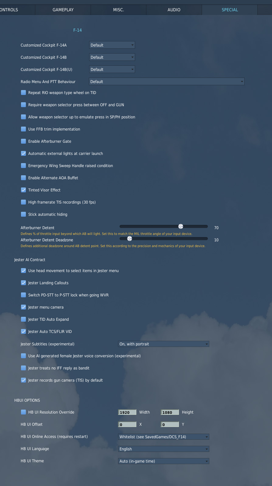
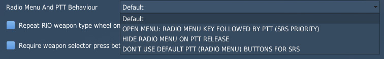
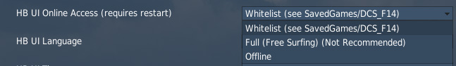
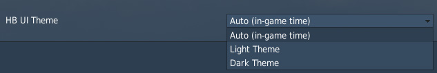

# Special Options

The Tomcat offers several options that can be set within the _Special Option_
menu in DCS.

## Customized Cockpit

Dropdown to select whether customized cockpits are used for the respective
models.

For the F-14A (all variants), the custom cockpit folder is located at
`C:\Users\John Doe\Saved Games\DCS\Liveries\F14A_Cockpit`.

For the F-14B, the custom cockpit folder is located at
`C:\Users\John Doe\Saved Games\DCS\Liveries\F14B_Cockpit`.

For the F-14B Upgrade, the custom cockpit folder is located at
`C:\Users\John Doe\Saved Games\DCS\Liveries\Cockpit_F14BU`.

## Radio Menu and PTT Behavior

Dropdown to select the behavior of the push to talk bind for the radio.

| Option          | Close Menu | Menu must be open | Export Voice |
| --------------- | ---------- | ----------------- | ------------ |
| Default         | ❌         | ❌                | ✅           |
| Open Menu       | ❌         | ✅                | ✅           |
| Hide on Release | ✅         | ❌                | ✅           |
| No Export       | ❌         | ❌                | ❌           |

The columns have the following effects:

- Close Menu - when releasing the key, the DCS communication menu is
  automatically closed
- Menu must be open - the key only works when the DCS communication menu is
  currently open
- Export Voice - when pressed down, voice is exported to tools like SRS

## Repeat RIO weapon type on TID

For easier visibility, since RIO weapon type window is as difficult to read
in-game as it was in real life. Shown in A/G mode with pilot weapon selector
off. The real F-14 could not repeat RIO weapon wheel on TID.

## Require weapon selector press between OFF and GUN

For enhanced realism, pilot weapon selector needs to be pressed while moving
between OFF and GUN positions. This may be impractical with many consumer
joysticks, hence it is an optional feature.

## Use FFB trim implementation

For enhanced realism when using a force feedback device for primary flight
control. Shifts FFB stick neutral position to match trim actuator position. This
option only has effect when FFB device is detected.

## Enable Afterburner Gate

Restricts throttle to MIL range unless AB gate key is pressed. While pressed,
full throttle movement into AB range is unrestricted. Once key is released, AB
operation continues until throttle is moved back to MIL range. Set MIL throttle
detent below.

## Automatic External Lights at Carrier Launch

Automatically turns on the external lights when saluting the catapult officer at
night, providing a nighttime launch signal.

## Emergency Wing Sweep Handle raised condition

Require the Emergency Wing Sweep Handle to be raised before moving it. In
reality handle can be moved regardless of its vertical position.

## Enable Alternate AOA Buffet

This option enables a more 'realistic' AOA buffet based on F-14 pilot SME
feedback.

## Tinted Visor Effect

When enabled, moving the pilots helmet visor down adds a graphical effect to
help against bright lighting conditions. By default, this option is unchecked.

## High Framerate TIS Recordings

Records Tactical Imaging Set video at 30 fps instead of the default 15 fps. This
results in smoother video at the cost of larger files and potentially worse
performance.

## Stick Automatic Hiding

When enabled, this allows for automatic hiding of the stick when the cursor is
above it.

## Afterburner Detent

Two options to define at which point of the physical hardware throttle input (0
to 100%) the aircraft will light the afterburner.

That is, if set to 80%, the MIL power range of the aircraft will be commanded
between 0% and 80% of your physical throttle, while the remaining 20% will
control the afterburner range.

The deadzone option can be used to split the points in the range at which the
afterburner will be turned on and off. For example, setting 20% for the deadzone
and 80% for the detent results in afterburner activation at 82% and deactivation
at 78% of throttle input.

## Jester AI Contract

### Use head movement to select items in Jester Menu

This option, when enabled, allows using your head movement for selection of menu
items.

### Jester Landing Callouts

This option enables Jester to give callouts to assist during landings.

### Switch PD-STT to P-STT lock when going WVR

P-STT is better suited in when close to target but does not allow AIM-54 data
link updates. If option is checked Jester will automatically try to switch
PD-STT lock to P-STT when close to enemy.

### Jester menu camera

This option shows Jester's camera in center of Jester menu.

### Jester TID Auto Expand

With this option enabled, Jester automatically expands TID, using the TID EXP
option, with overlapping hooked target.

### Jester Auto TCS/FLIR VID

When enabled, Jester automatically points the TCS (or LANTIRN in air-to-air) at
hooked targets to identify them visually.

### Jester Subtitles (Experimental)

Dropdown select to show subtitles for Jester's lines (experimental).

| Option               | Subtitles | Portrait |
| -------------------- | --------- | -------- |
| Off                  | ❌        | ❌       |
| On, with portrait    | ✅        | ✅       |
| On, without portrait | ✅        | ❌       |

### Use AI generated female Jester voice conversion (experimental)

The option replaces Jester's voice with an AI voice-converted version that
sounds female. These are the original Jester voice recordings (performed by
Grayson) run through AI voice conversion - no lines are AI-written or newly
generated, it is the same performance converted to a female-sounding voice. May
contain occasional AI conversion artifacts.

### Jester treats no IFF reply as bandit

When Jester interrogates IFF, a contact that does not reply is normally left as
an unknown bogey. With this option, Jester instead flags any contact that fails
to reply as hostile (bandit).

> 💡 A friendly with an inoperative or mis-set transponder, or one out of
> interrogation range, may be flagged as a bandit.

### Jester records gun camera (TIS) by default

When on, the Tactical Imaging Set comes up powered (except on a cold start) and
Jester records HUD gun-camera footage automatically when you hold the trigger
first detent. Turn off if you do not want gun-camera video recorded by default -
you can still switch the TIS on from the cockpit switch or the Jester wheel.

## HB UI

### Resolution Override

User interface elements, such as the Jester Wheel, the manual, virtual browser
and others are scaled and positioned via a fixed resolution that must match the
resolution of the in-game surface they are rendered on.

With the option unchecked, this resolution is automatically determined based on
screen settings. However, in certain situations, especially when using VR or
having a multi-monitor setup, this automatic detection might fail and compute an
incorrect resolution.

Should UI elements be misplaced, for example the Jester Wheel not being centered
or even cut off, check this setting and edit the resolution manually until the
UI is displayed properly.

### Offset

Allows to displace the UI horizontally and vertically. Positive values shift it
to the right or down, negative values to the left or up.

Normally, this should be kept at the default value of 0 px. However, in certain
cases (e.g. when using VR and setting it to render on the LEFT or RIGHT eye,
while having the checkbox for _"Use DCS System Resolution"_ not checked) it is
possible that the UI gets cut off. This setting then allows to move the UI back
into view, but therefore giving up proper alignment on the UI, such as the
Jester UI being centered on the screen.

### Domain Access

Defines which domains the HB UI is allowed to access.

**Full** allows for free browsing, allowing to visit any website with the
[Virtual Browser](virtual_browser.md).

The default option **Whitelist** defines which sites can be accessed by using a
whitelist file. Only domains passing the rules setup in the file are allowed.
The default rules are setup to support all HB UI features and a hand full of
useful websites for the Virtual Browser, such as _YouTube_.

This file is automatically created at

`C:\Users\John Doe\Saved Games\DCS_F14\hbui_whitelist.txt`

when launching the Tomcat for the first time.

> 💡 Deleting the file will lead to it being recreated on the next launch. That
> way, one can have it updated to the newest set of rules - should there have
> been any changes.

Selecting **Offline** will disable the Virtual Browser and any other HB UI
features and elements that require an active online connection.

### Language

Dropdown to select the language used for all HB UI elements. Available are:

- English
- Chinese (_中文_)
- German (_Deutsch_)
- Korean (_한국어_)

Affects for example the Jester UI, the Bombing Tool, but also the in-game
version of this Manual and more.

### Theme

Allows to select which color theme is used by the UI. All UI elements support a
light and a dark theme.

The default option **AUTO** will pick the theme dynamically based on the in-game
time. Light during the day and Dark for a night mission.
