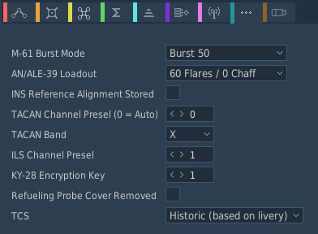
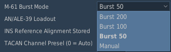
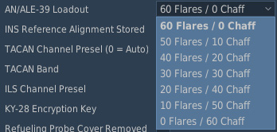

# Mission Editor

The F-14 has many aircraft-specific settings and waypoints that are configured
in the **Mission Editor**.

## Additional Aircraft Properties

Aircraft specific options are set up under the Additional Properties for
Aircraft page available when setting up an aircraft group containing F-14s.

### M-61 Burst Mode

This dropdown allows for changes in the M61's max burst length. The "Manual"
option fires until empty.

### AN/ALE-39 Loadout

This dropdown allows for changes in the AN/ALE-39 countermeasure loadout.

### INS Reference Alignment Stored

This sets whether INS reference is pre-aligned at spawn. This allows for a
stored alignment to be completed upon aircraft cold start.

### TACAN Channel Preset and Band

This allows the initial TACAN channel and band to be preset.

### ILS Channel Preset

This allows the initial ILS channel preset to be set.

### KY-28 Encryption Key

This allows the initial KY-28 encryption key to be preset.

### Refueling Probe Cover Removed

This option removes the refueling probe cover while loaded in the mission. This
option overrides the livery refueling probe cover option.

### TCS (F-14A Early and F-14A Late Only)

This dropdown selection, for the F-14A Early and F-14A Late, allows mission
editors to select the TCS or select no TCS with ability to select between
historic (based on livery) or override.

| Option                     | Description                                                                                                    |
| -------------------------- | -------------------------------------------------------------------------------------------------------------- |
| Historic (based on livery) | Uses the livery's set option                                                                                   |
| On                         | Enables the TCS and equips chinpod with TCS regardless of livery option                                        |
| Off (Historic Variant)     | Disables TCS and equips chinpod based on livery (if TCS was originally on livery, the bulletcover is equipped) |
| Off (Bulletcover Variant)  | Disables TCS and equips bulletcover chinpod regardless of livery option                                        |
| Off (Chinpod Variant)      | Disables TCS and equips the chinpod without TCS housing regardless of livery option                            |
