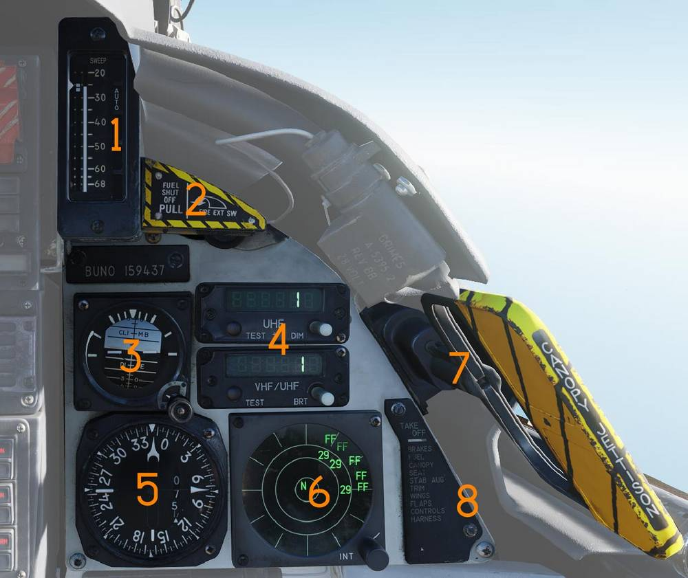
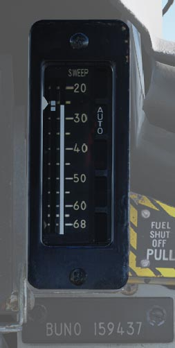
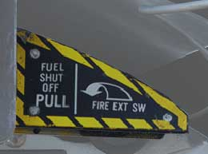
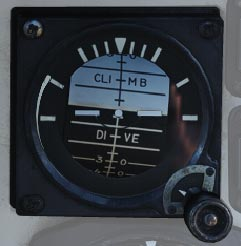
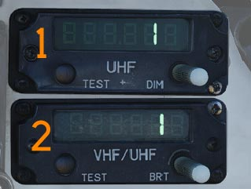
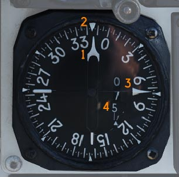
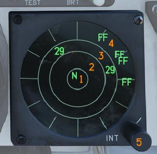
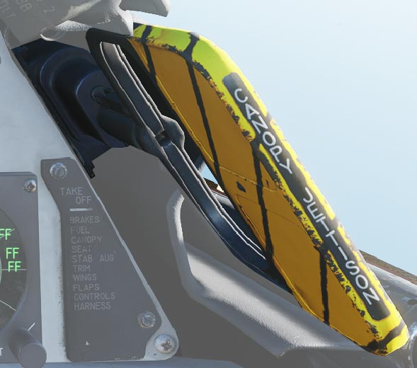
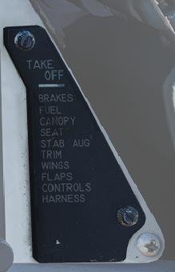

# Right Instrument Panel

> 💡 The Right Instrument Panel consists of the:
>
> - Wing-Sweep Indicator (<num>1</num>)
> - Right Engine Fuel Shutoff Handle (<num>2</num>)
> - Standby Attitude Indicator (<num>3</num>)
> - UHF/VHF Remote Indicators (<num>4</num>)
> - Bearing Distance Heading Indicator (BDHI) (<num>5</num>)
> - ALR-67 Indicator (<num>6</num>)
> - Canopy Jettison Handle (<num>7</num>)
> - Takeoff Checklist (<num>8</num>)

## Wing-Sweep Indicator

Indicator detailing status of the wing-sweep system (<num>1</num>).

Leftmost indicator pointer shows wing-sweep program position which is also the
max forward angle at present airspeed and altitude.

Middle tape shows commanded wing-sweep position.

Rightmost tape shows actual wing-sweep position.

The five indicator windows shows current operating mode.

## Right Engine Fuel Shutoff Handle

Emergency fuel shutoff handle for the right engine(<num>2</num>).

Pulling the handle shuts off fuel flow to the right engine. Pushing the handle
in restores fuel flow.

This handle should not be used for normal engine shutdown.

The right engine fire extinguishing button is located behind the handle and is
accessible when the handle is pulled outward.

## Standby Attitude Indicator

Standalone standby attitude indicator(<num>3</num>).

An OFF flag is visible on the left side when caged or when un-powered.

The knob below and to the right of the indicator cages/un-cages the indicator
and allows trim to correct pitch. In pulled out position the indicator is caged.
When pushed in un-cages the indicator and allows pitch trim by turning the knob.

## UHF/VHF Remote Indicators

Remote indicators display frequency or channel information for UHF 1 and V/UHF 2
radios(<num>4</num>).

### UHF 1 Remote Indicator

The UHF 1 remote indicator (<num>1</num>) displays the currently selected
frequency or channel for the AN/ARC-159.

### V/UHF 2 Remote Indicator

The V/UHF 2 remote indicator (<num>2</num>) displays the currently selected
frequency or channel for the AN/ARC-182.

The operation of the DIM and BRT knob as well as TEST button are the same for
both indicators.

The DIM and BRT knobs control display brightness.

The TEST button initiates a self-test. A correct test result displays 888.888.

## Bearing Distance Heading Indicator (BDHI)

Provides azimuth, bearing, and distance information(<num>5</num>).

### No. 2 Bearing Pointer

The No. 2 bearing pointer (<num>1</num>) indicates magnetic course to the tuned
TACAN station.

### Compass Rose

The compass rose (<num>2</num>) displays current aircraft magnetic heading.

### No. 1 Bearing Pointer

The No. 1 bearing pointer (<num>3</num>) indicates bearing to the tuned UHF/ADF
station.

### Distance Counter

The distance counter (<num>4</num>) displays slant range to the tuned TACAN
station in nautical miles (not visible in this image).

## ALR-67 Indicator

Displays radar emitters detected by the ALR-67 radar warning
receiver(<num>6</num>).

### Threat Display Bands

- Critical band (<num>2</num>) - Displays direct threats to own aircraft.
  Systems capable of engaging own aircraft and showing current intent of doing
  so.
- Lethal band (<num>3</num>) - Displays emitters capable of engaging own
  aircraft but not currently doing so.
  - Non-lethal band (<num>4</num>) - Displays emitters not considered an
    immediate threat due to range or lack of weapon capability.

### System Status Circle

The system status circle (<num>1</num>) is divided into three areas.

**Area I (upper left quadrant)** displays threat prioritization symbols:

- N - Normal.
- I - AI, Airborne interceptors prioritized.
- A - AAA, Anti-air artillery prioritized.
- U - Unknown emitters prioritized.
- F - Friendly emitters displayed in addition to threats.

**Area II (upper right quadrant)** indicates limited mode status.

- (Blank) - Limited mode not selected.
- L - Limited mode selected. Only the six highest-priority threats are shown.

**Area III (lower half)** displays system status and offset information:

- (Blank) - Normal operation.
- B - BIT failure.
- T - Thermal overload.
- O - Offset display selected. Threats will be separated to allow readout of
  overlapping symbols. Bearing accuracy degraded for displaced threats.

### Intensity Control Knob

The INT knob (<num>5</num>) adjusts display brightness.

## Canopy Jettison Handle

The canopy jettison handle (<num>7</num>) is used to manually jettison the
canopy during emergency egress.

## Takeoff Checklist

The Takeoff Checklist (<num>8</num>) serves as a quick reference reminder for
the pilot for the most critical steps of takeoff.

