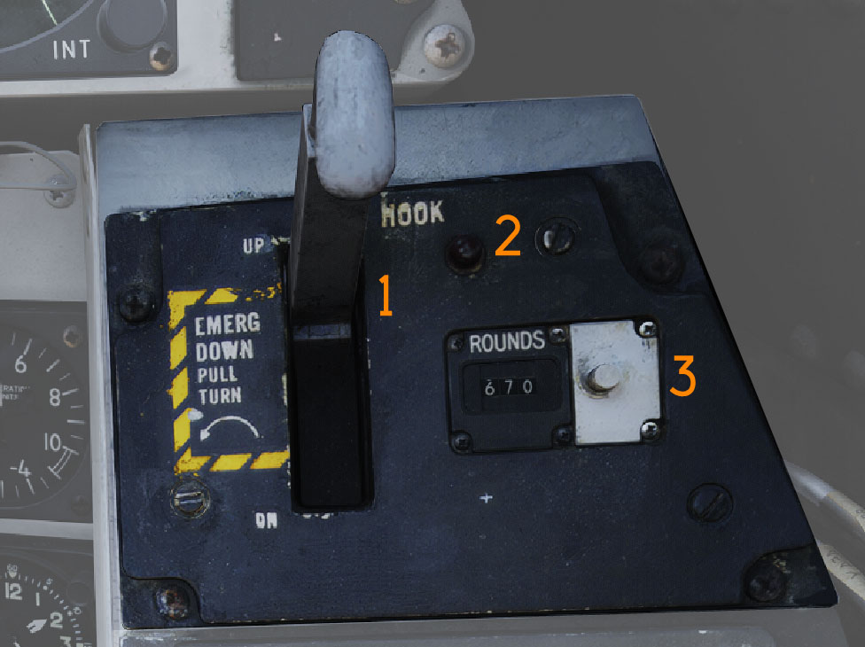
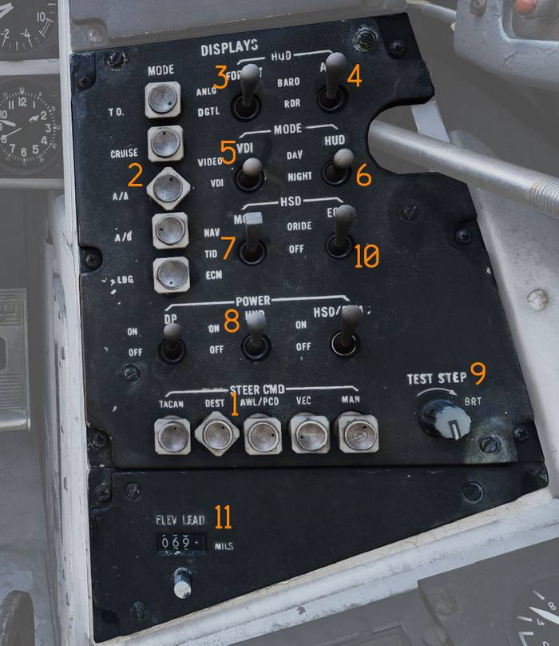
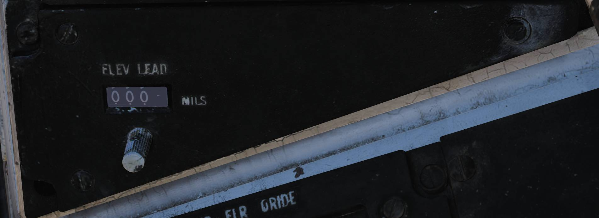

# Right Vertical Console

> 💡 The Right Vertical Console consists of the:
>
> - Arresting Hook Panel (<num>1</num>)
> - Pilot Display Control Panel (PDCP) (<num>2</num>)
> - Elevation Lead Panel (<num>3</num>)

## Arresting Hook Panel

Panel controlling arresting hook operation.

### Hook Handle

The HOOK handle (<num>1</num>) selects arresting hook position.

- UP - Electrically commands hydraulic retraction of the hook and locks it in
  the up-lock.
- DOWN - Electrically releases hydraulic pressure, allowing the hook to extend
  by dashpot pressure and gravity.
- EMERG DOWN - When the handle is pulled and rotated counter-clockwise, the hook
  is mechanically released for emergency extension.

### Hook Transition Light

The hook transition light (<num>2</num>) illuminates when hook position does not
correspond to handle position.

The light will not extinguish until the hook is fully extended and may remain
illuminated during high-speed extension due to hook blowback.

### Rounds Remaining Counter

The rounds remaining counter (<num>3</num>) displays remaining M61A1 gun
ammunition.

The counter normally counts down from 676 rounds and may be manually reset to a
desired value using the adjustment knob on the right side.

## Pilot Display Control Panel (PDCP)

Control panel for front cockpit display configuration.

### Steering Command Selectors

The STEERING CMD selectors (<num>1</num>) select the source of steering command
information.

The selectors are mutually exclusive and rotate to indicate the active
selection.

- TACAN - Provides TACAN steering and deviation from the selected TACAN radial,
  or To/From the selected CDNU Waypoint.
- DEST - Provides course to selected FMC destination point.
- AWL/PCD - Provides glideslope information during landing or precision course
  direction (vector) information during air-to-ground.
- VEC - Provides data link deviation steering.
- MAN - Displays manually selected course and heading.

### Mode Selectors

The MODE selectors (<num>2</num>) determine overall display mode.

Selectors are mutually exclusive and rotate to indicate the selected mode.

- T.O. - Selects takeoff symbology for the HUD/VDI.
- CRUISE - Selects cruise symbology for the HUD/VDI.
- A/A - Selects air-to-air attack symbology for the HUD/VDI.
- A/G - Selects air-to-ground symbology for the HUD/VDI.
- LDG - Selects landing (ILS, ACL) symbology for the HUD/VDI.

### HUD Format

The HUD format switch (<num>3</num>) selects between analog (ANLG) or digital
(DGTL) airspeed and altitude readouts on the HUD.

### HUD Baro switch

The HUD baro switch (<num>4</num>) selects between radar altimeter (RDR) or
barometric altimeter (BARO) readouts on the HUD. Above 5000 feet the HUD will
default to barometric readouts.

### VDI Mode Switch

In all modes except when in landing and AWL mode, the VDI MODE switch
(<num>5</num>) selects between the VDI HUD repeat or Video feed from either TCS
or LANTIRN (RIO can select between TCS or LANTIRN on the LCP).

- TV - Displays video from TCS or LANTIRN.
- NORM - Displays the VDI HUD repeat.

With PDCP LDG Mode and PDCP AWL Steering selected, the VDI Video Mode is
inhibited and the VDI is commanded to the VDI HUD repeat mode. If the VDI Mode
switch is set to VIDEO, ILS symbology is displayed on the HUD, otherwise the ILS
Vectors appear on the VDI display only. This effectively allows declutter of the
ILS vectors from the HUD by selecting PDCP VDI Mode switch to VDI while PDCP
Mode is set to LDG. The ACL Steering Indicator ("tadpole") is always displayed,
on both HUD and VDI, in PDCP LDG mode with AWL Steering while ACLS steering is
valid.

### HUD day/night switch

The HUD day/night switch (<num>6</num>) selects day or night mode for the HUD.

### HSD Mode Switch

The HSD MODE switch (<num>7</num>) selects the display content shown on the HSD.

- NAV - Presents navigation steering information associated with STEER CMD mode
  selected.
- TID - Repeats information from PTID except when RIO selects TV on the PTID;
  PTID attack symbology remains presented.
- ECM - Displays the ALR-67 ECM page.

### Display Power Switches

The POWER switches (<num>8</num>) control electrical power to the VDI, HUD, and
HSD/ECMD.

### The TEST Step knob

The TEST Step knob (<num>9</num>) is used to control the display of the SSI on
the VDI. Turning TEST STEP "up" (clockwise > 10%) displays the Store Status and
"down" (counter−clockwise − < 10%) blanks the Store Status Indicators’ display.

### HSD ECM Override Switch

The HSD ECM ORIDE switch (<num>10</num>) determines whether ECM information is
allowed to override the current HSD display when a threat is detected.

- ORIDE - Allows ECM override.
- OFF - Prevents ECM override.

## Elevation Lead Panel

The elevation lead panel (<num>11</num>) sets gun elevation lead in mils for
manual air-to-air and air-to-ground gun modes.

Adjustment range is from −263 to +87 mils.
