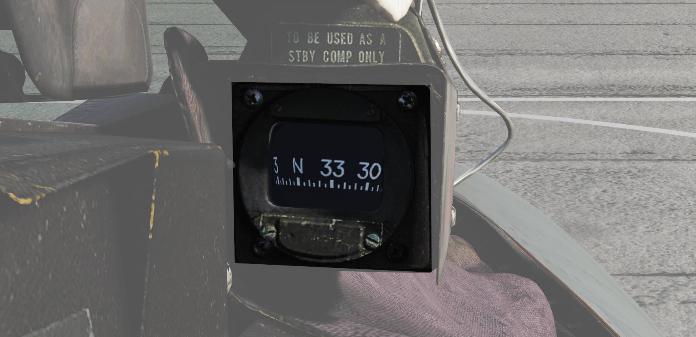

# Right Windshield Frame

## ECM Warning Lights

Warning lights connected to the ALR-67 indicating different types of threats.

### ALR-67

| Indicator | Function                                                                                                       |
| --------- | -------------------------------------------------------------------------------------------------------------- |
| SAM       | Steady illumination when detecting lock-on from a SAM tracking radar. Flashes when missile launch is detected. |
| AAA       | Steady illumination when detecting lock-on from a AAA tracking radar. Flashes when AAA firing is detected.     |
| AI        | Steady illumination when detecting lock-on from an airborne interceptor radar.                                 |

## Standby Compass

Conventional standby compass.
