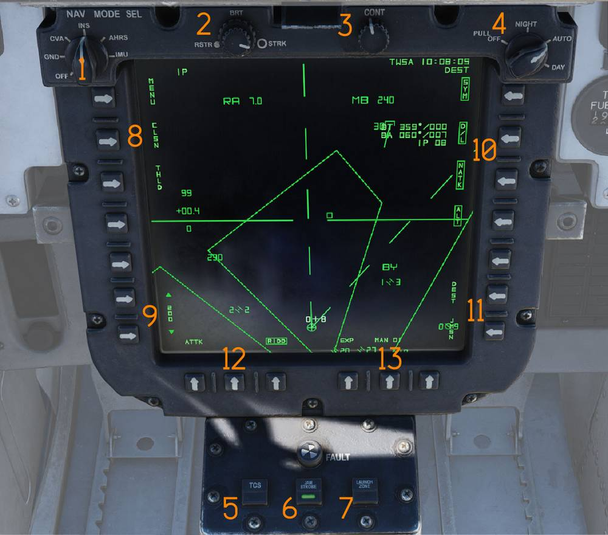
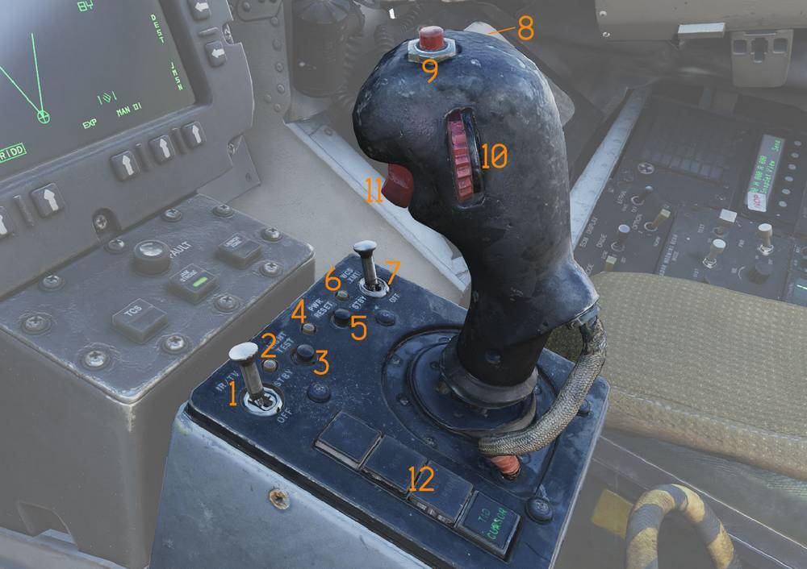

# Center Console

> 💡 The Center Console consists of the:
>
> - Programmable Tactical Information Display (PTID) (<num>1</num>)
> - Hand Control Unit (HCU) (<num>2</num>)

## Programmable Tactical Information Display (PTID)

The RIO's 8 inch by 8 inch Programmable Tactical Information Display (PTID)
replicates the functions of the non-F-14B Upgrade TID, however menu push-buttons
(PB) on the PTID provide the ability to select desired menus or select weapons
system functions. The PTID presents tactical, navigation, and data link
functions via multiple page and display formats.

### Navigation Mode Selector

The NAV MODE selector (<num>1</num>) selects navigation reference systems and
controls INS alignment and operating mode.

### Brightness Knobs

The STRK/RSTR knob (<num>2</num>) control PTID brightness. RSTR controls
brightness of TCS/LTS video feed, STRK controls brightness of PTID symbology.

### Contrast Knob

The CONTRAST knob (<num>3</num>) adjusts contrast of TCS video displayed on the
TID.

### PTID power switch

The PTID power switch (<num>4</num>) selects between Night, Auto and Day or Off.

### TCS Button

The TCS button (<num>5</num>) enables video (LANTIRN or TCS) display on PTID.

### JAM Strobe Button

The JAMMING Strobe button (<num>6</num>) toggles the display of JAMMING strobes
on and off.

### Launch Zone Button

The Launch Zone button (<num>7</num>) toggles the display of Launch Zones
display. Replaces velocity vectors when applicable. Automatically enabled by the
WCS 60 seconds prior to maximum missile launch range.

### PTID MENU, CLSN, THLD options

In the PTID Tactical (TAC) Page (<num>8</num>) the PTID full MENU is available
on PB 20.

The Collision Steering option (CLSN) is available on PB 19. Collision steering
selects collision steering toward a tracked target or the TWS centroid.

The Track Hold Option (THLD) is available on PB 18. Track hold extends the time
before a radar track is dropped after the last observation.

When selected, track retention time is increased to two minutes. Normal
retention time is approximately 14 seconds.

### Range Selector

The RANGE selector (<num>9</num>) selects the TID display scale.

The selected range corresponds to the diameter distance represented on the
display.

### PTID Declutter Options

Declutter options (<num>10</num>)

- ALT NUM — Toggles altitude numerics next to track symbols.
- SYM ELEM — Toggles supplementary track symbology. When deselected, only the
  track symbol dot is displayed.
- DATA LINK — Toggles display of all data link tracks.
- NON-ATTK — Toggles display of non-attackable tracks.

### DEST and JMSN

In the PTID TAC page (<num>11</num>) DEST steering can be selected on PB6, this
will enable a rotary waypoint selector on PB8 and PB9. JMSN selects the JDAM
mission page. - More details in GGW chapter.

### RIDD and EXPAND

Additional TAC page options (<num>12</num>):

- EXP - PTID Expand, enlarges area around PTID Hook.
- RID DISABLE — Not implemented.

### PTID Steering mode

Push Button (PB) 9 (<num>13</num>) on PTID toggles steering mode:

- DEST
- CDNU Mode (MAN/AUTO/OFLY)
- TGT
- LP

### INS Status Indicator (not visible)

The INS status indicator displays inertial navigation system alignment status.

- STBY — Power applied but alignment not complete.
- READY — Minimum alignment sufficient for AIM-54 launch criteria.

Both lights extinguish when an INS mode is selected. The indicator may also
display fault conditions.

## Hand Control Unit (HCU)

The hand control unit is the primary control stick for radar and TCS operation.

### IR/TV Switch

The IR/TV switch (<num>1</num>) controls TCS power.

- OFF/STBY — Applies power without full operation.
- ON — Enables full TCS operation.

### IR/TV Overtemperature Indicator

The IR/TV overtemp indicator (<num>2</num>) illuminates when an overtemperature
condition exists within the TCS.

### Light Test Button

The LIGHT TEST button (<num>3</num>) initiates a test of all AWG-9 indicator
lights.

### Power Reset Indicator

The PWR RESET indicator (<num>4</num>) illuminates when one or more secondary
power supplies are inoperative.

### Power Reset Button

The PWR RESET button (<num>5</num>) attempts to restore inoperative secondary
power supplies.

If the fault condition persists, affected supplies will remain inoperative.

### WCS Status Indicator

The WCS indicator (<num>6</num>) illuminates under the following conditions:

- STBY or XMT selected while radar warmup is incomplete.
- XMT selected while radar transmission remains inhibited.

### WCS Power Switch

The WCS switch (<num>7</num>) controls weapon control system power.

- STBY — Applies power to WCS and begins radar warmup without transmission.
- XMT — Enables radar transmission when warmup is complete.

Display warmup time is approximately 30 seconds. Radar warmup time is
approximately three minutes.

### Manual Rapid Lockon Button

The MRL button (<num>8</num>) selects manual rapid lock-on mode.

This mode overrides all other radar operating modes except PLM and VSL.

### Offset Button

The OFFSET button (<num>9</num>) offsets the TID display to the currently hooked
location.

### Antenna Elevation Thumbwheel

The ELEV thumbwheel (<num>10</num>) fine-tunes radar antenna elevation during
STT lock-on acquisition.

### HCU Trigger

The HCU trigger (<num>11</num>) is a two-stage trigger used to command various
WCS functions depending on selected mode.

- First detent — HALF ACTION.
- Second detent — FULL ACTION.

Functions include target acquisition and symbol hook.

### Hand Control Function Buttons

The hand control function buttons (<num>12</num>) select the active control mode
of the HCU stick.

The buttons are mutually exclusive and light up when selected.

Available functions are:

- IR/TV — Controls TCS azimuth, elevation, and tracking. Enables display of TCS
  elevation on the right elevation indicator on the DDD.
- RDR — Controls radar antenna elevation and STT acquisition or return to
  search. Displays commanded radar antenna elevation on the DDD.
- DDD CURSOR — Controls DDD cursor for marking geographic positions in pulse
  radar mode.
- TID CURSOR — Controls the TID cursor used to hook symbols on the TID.

When the DDD cursor is selected but the Pulse Radar mode is not selected the DDD
cursor functions as a cursor for the
[ECMD menu](../../systems/pmdig/programmable_multiple_display_indicator_group.md#ecmd-menu).
