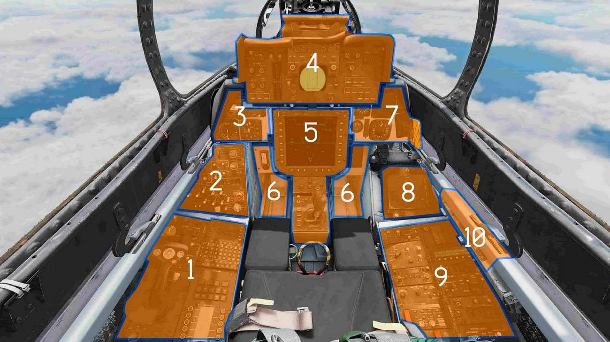

# RIO Cockpit Overview

## Layout

| Section | Name                                                       |
| :-----: | ---------------------------------------------------------- |
|   1.    | [Left Side Console](../rio/left_console.md)                |
|   2.    | [Left Vertical Console](../rio/left_vertical_console.md)   |
|   3.    | [Left Instrument Panel](../rio/left_instrument_panel.md)   |
|   4.    | [Center Panel](../rio/center_panel.md)                     |
|   5.    | [Center Console](../rio/center_console.md)                 |
|   6.    | [Footwells](../rio/footwells.md)                           |
|   7.    | [Right Instrument Panel](../rio/right_instrument_panel.md) |
|   8.    | [Right Vertical Console](../rio/right_vertical_console.md) |
|   9.    | [Right Side Console](../rio/right_console.md)              |
|   10.   | [Canopy Control Handle](../rio/canopy_control_handle.md)   |
