# Right Side Console

> 💡 The Right Side Console consists of the:
>
> - ECMD Display Control Panel (<num>1</num>)
> - Radar Warning Receiver Panel (<num>2</num>)
> - UHF 2 Control Panel (<num>3</num>)
> - ICS Control Panel (<num>4</num>)
> - AN/ALE-47 DCDU (<num>5</num>)
> - AN/ALE-47 Programmer (<num>6</num>)
> - Digital Data Indicator (DDI) (<num>7</num>)
> - FTI Control Panel (<num>8</num>)
> - Data Link Control Panel (<num>9</num>)
> - Data Link Reply COntrol Panel (<num>10</num>)
> - Interrogator Control Panel (<num>11</num>)
> - Interior Lights Control Panel (<num>12</num>)
> - Transponder Set Control Panel (<num>13</num>)
> - DECM Control Panel (<num>14</num>)
> - IFF Antenna Computer Test Control Panel (<num>15</num>)
> - Cabin Defog (<num>16</num>)

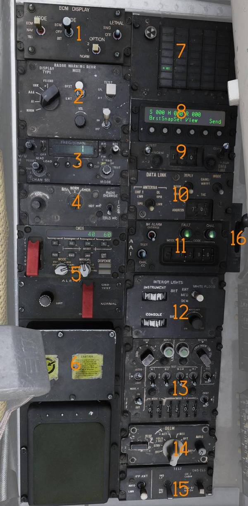

## ECM Display Control Panel

Control panel for the Electronic Countermeasure Display (ECMD) (<num>1</num>).

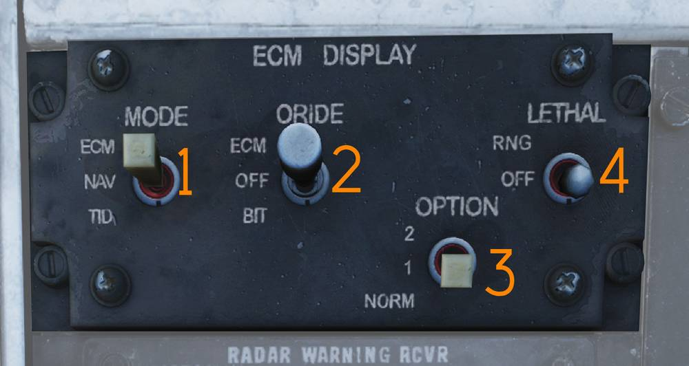

### ECM Mode Switch

The Mode switch (<num>1</num>) selects between the Electronic Countermeasure
display, The Navigation Display and the PTID repeat mode. As part of the
Programmable multiple display indicator group (PMDIG) the ECMD provides the same
displays as the HSD.

### Override switch

When in the ECM position the Override switch (<num>2</num>) will display the ECM
page, when a threat is detected on the RWR. This overrides any previously
selected page. In the OFF position the current display is not overridden when a
threat is detected.

### Option Switch

The Option switch (<num>3</num>) is non functional.

### Lethality Ring switch

The Lethality ring switch (<num>4</num>) toggles relative lethality rings ON or
OFF.

## Radar Warning Receiver Panel

Control panel for the ALR-67 radar warning receiver (<num>2</num>).

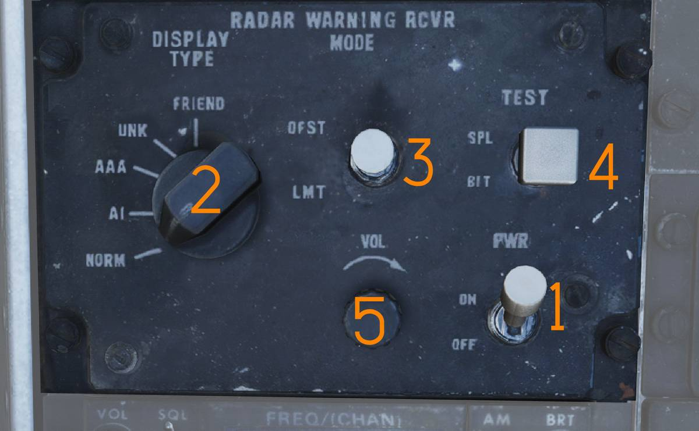

### Power Switch

The PWR switch (<num>1</num>) controls electrical power to the ALR-67.

### Display Type Selector

The DISPLAY TYPE selector (<num>2</num>) selects which threat types are
prioritized and displayed.

### Display Mode Switch

The MODE switch (<num>3</num>) is spring-loaded to the center (OFF) position.

It can be held to the following momentary positions:

- OFST - Enables offset display while held.
- LMT - Enables limited display while held.

### Test Switch

The TEST switch (<num>4</num>) is spring-loaded to center.

- BIT - Momentary selection initiates ALR-67 BIT.
- SPL - While BIT page 1 is displayed, holding SPL displays the special BIT
  status page while held and for three seconds after release.

### Volume Knob

The VOL knob (<num>5</num>) controls ALR-67 audio volume to the RIO headset.

## UHF 2 Control Panel

The UHF 2 (<num>3</num>) Radio control panel is the Radar Intercept Officers
Radio for all Inter-Flight communications also referred to as "PRI".

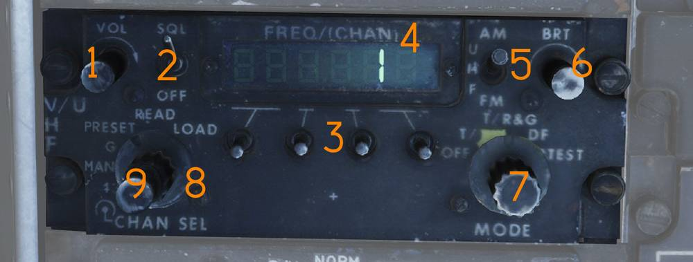

### V/UHF 2 Volume Knob

The VOL knob (<num>1</num>) controls V/UHF-2 audio volume.

### Squelch Switch

The SQL switch (<num>2</num>) enables or disables squelch.

### Frequency Select Switches

The frequency select switches (<num>3</num>) set the desired operating
frequency.

### Frequency / Channel Display

The FREQ/(CHAN) display (<num>4</num>) shows selected frequency or preset
channel.

### UHF Selector Switch

The UHF switch (<num>5</num>) selects modulation mode within the 225.000–399.000
MHz band.

### Brightness Knob

The BRT knob (<num>6</num>) controls display brightness.

### Mode Selector Knob

The MODE knob (<num>7</num>) selects ARC-182 operating mode.

### Frequency Mode Knob

The outer frequency mode dial (<num>8</num>) selects frequency tuning mode.

### Channel Select Knob

The inner CHAN SEL knob (<num>9</num>) selects preset channel.

> 💡 HAVE QUICK anti-jam functionality is not implemented in DCS.

## ICS Control Panel

Intercommunication (<num>4</num>) system control panel.

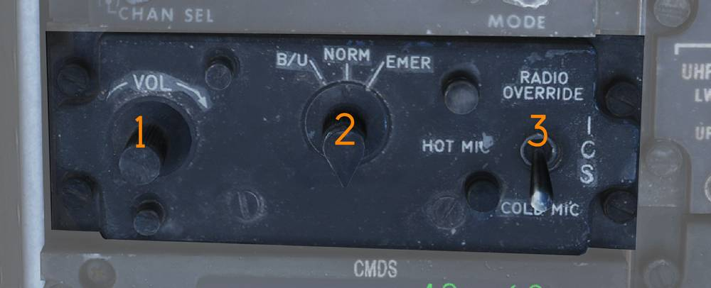

### ICS Volume Knob

The VOL knob (<num>1</num>) controls ICS audio volume from the pilot.

### Amplifier Selection Knob

The amplifier selection knob (<num>2</num>) selects which audio amplifier is
used.

- B/U - Backup amplifier.
- NORM - Normal amplifier.
- EMER - Emergency amplifier using pilot’s amplifier and volume settings.
  Disables RIO-only audio sources.

### ICS Function Switch

The ICS switch (<num>3</num>) selects ICS operating mode.

- RADIO OVERRIDE - ICS audio overrides radio audio.
- HOT MIC - Enables continuous intercom without PTT.
- COLD MIC - Intercom only when PTT is pressed.

## AN/ALE-47 Digital Control Display Unit (DCDU)

The AN/ALE-47 CMDS (<num>5</num>) control panel controls the selection of
Automatic, Semi-Automatic and manual modes for dispensing. The ALE-47s
countermeasure profiles are loaded via the Mission Data Cartridge and configured
in the mission editor.

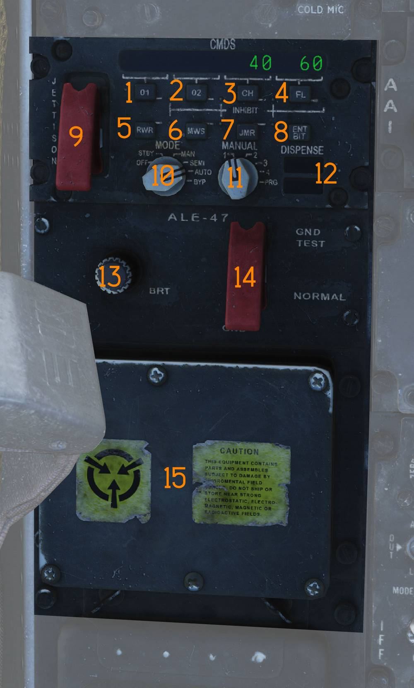

### INHIBIT Button Functions

The INHIBIT function is initiated by pressing one of seven expendable inhibit
buttons: Other 1, Other 2, Chaff, Flares, Radar Warning Receiver (RWR), Missile
Warning System (MWS), or Jammer (JMR). When depressed, the respective LED will
illuminate when the countermeasure type is inhibited from dispensing. The
INHIBIT functions are reset to the "not inhibited" mode during power up. During
normal operation, selected INHIBIT functions are retained in memory for
momentary power interruptions and are reset when powering up from the MODE
control switch OFF position.

#### OTHER 1 Button

The (O1) button (<num>1</num>) Inhibits countermeasure type O1.

> 💡 Not functional.

#### OTHER 2 Button

The (O2) button (<num>2</num>) Inhibits countermeasure type O1.

> 💡 Not functional.

#### CHAFF Button

The (CH) button (<num>3</num>) Inhibits countermeasure type chaff.

#### FLARES Button

The (FL) button (<num>4</num>) Inhibits countermeasure type flares.

#### Radar Warning Receiver Button

The RWR button is (<num>5</num>) not utilized.

> 💡 Not functional.

#### Missile Warning System Button

The MWS button (<num>6</num>) Inhibits dispense programs 7 and 8.

#### JAMMER Button

The JAMMER button is (<num>7</num>) Not utilized.

> 💡 Not functional.

#### ENTER/BUILT IN TEST Button

Actuating the ENT/BIT switch (<num>8</num>) results in initializing IBIT, or
advances past queries returning a "no" response when system queries are
presented on the DCDU. Queries are defined as statements prefaced with a "?".

> 💡 Not functional.

### Guarded JETTISON Switch

The guarded JETTISON switch (<num>9</num>) initiates a complete dispense of any
remaining DTM designated jettison-able countermeasures.

### MODE Control Switch

The Mode control switch (<num>10</num>) is a 6-position rotary switch is used to
select one of six modes of operation.

For a detailed discussion reference the [ALE-47 section](../../systems/defensive_systems/countermeasures/ale_47.md#mode-control-switch)
of this manual.

### MANUAL Switch

The Manual switch (<num>11</num>) is a 5-Position rotary that allows selection
of countermeasure dispense programs 1 through 4 and PROGRAM (PRG). For a detailed
discussion reference the [ALE-47 section](../../systems/defensive_systems/countermeasures/ale_47.md#manual-switch)
of this manual.

### READY/NO GO Display

The Ready display (<num>12</num>) is not utilized. Only illuminated during
system power-up.

The NO GO annunciator illuminates when the CMDS is NOT ready to dispense because
of a system failure, during initial power-up, and in BYP Mode.

#### Positions 1 through 4

Switch positions 1 through 4 are used to select one of four pre-programmed
dispense programs. The selected dispense program is initiated by a command from
the designated dispense switch in MAN, SEMI, and AUTO modes.

#### PROGRAM Position

If PRG is selected the ALE-47 system will default to manual program 4 for
dispense.

### Brightness knob

The BRT knob (<num>13</num>) controls DCDU panel brightness.

### Ground Test switch

The guarded ground test switch (<num>14</num>) enables the ground test mode.

> 💡 Not functional.

## AN/ALE-47 Programmer

The Programmer (<num>15</num>) is part of the Programmer Panel Assembly and is
the central processing, controlling and communications unit of the CMDS.

## Digital Data Indicator (DDI)

Digital data indicator (<num>7</num>) used to display commands received via the
data link.

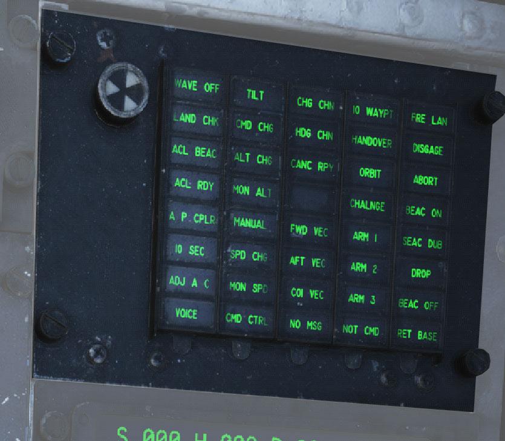

| Indicator  | Function                                                                                                                                           |
| ---------- | -------------------------------------------------------------------------------------------------------------------------------------------------- |
| AFT VEC    | Aircraft is being vectored to approach target from the rear hemisphere.                                                                            |
| COL VEC    | Aircraft is being vectored on a collision course to target.                                                                                        |
| NO MSG     | No message at this time, indicates presence of data link communication while not receiving a command.                                              |
| TO WAY PT  | Proceed to the point being indicated by target information.                                                                                        |
| HANDOVER   | TDS is handing own aircraft over to another control center.                                                                                        |
| ORBIT      | Assume orbit at present position maintaining maximum endurance.                                                                                    |
| CHALNGE    | Intercept and visually identify the target.                                                                                                        |
| ARM 1      | Intercept and destroy the indicated hostile target using AIM-54.                                                                                   |
| ARM 2      | Intercept and destroy the indicated hostile target using AIM-7.                                                                                    |
| ARM 3      | Intercept and destroy the indicated hostile target using AIM-9.                                                                                    |
| NOT CMD    | Ignore currently received heading, speed, and altitude. Also means valid command BIT not yet available.                                            |
| FRE LAN    | Free to attack the most suitable target.                                                                                                           |
| DIS’GAGE   | Cease fire.                                                                                                                                        |
| ABORT      | Abort action.                                                                                                                                      |
| BEAC ON    | Enable APN-154 tracking beacon.                                                                                                                    |
| BEAC DUB   | Set APN-154 to double-pulse mode.                                                                                                                  |
| DROP       | Command to release a weapon in data link A/G attack, manually or automatically if in data link attack mode.                                        |
| BEAC OFF   | Turn off APN-154 tracking beacon.                                                                                                                  |
| RET BASE   | Return to the indicated home base.                                                                                                                 |
| WAVE OFF   | Wave off, automatic AFCS disengagement.                                                                                                            |
| LAND CHECK | CATCC has a data link channel available for AFCS, complete landing checklist.                                                                      |
| ACL BEAC   | Directed by carrier to enable APN-154 beacon.                                                                                                      |
| ACL RDY    | ACL has locked onto aircraft APN-154 beacon and is transmitting zero pitch and bank signals. Glideslope information is now available to the pilot. |
| A/P CPLR   | ACL is ready to take control of the aircraft for the ACL approach, autopilot should be engaged.                                                    |
| 10 SECONDS | Indicates 10 seconds to arrival at the EGI Fly-To point. In ACL indicates that the ship's motion is taken into account for ACL.                    |
| ADJ A/C    | Indication from the control station of another aircraft near own aircraft.                                                                         |
| VOICE      | Indicates ACL not available, switch to voice procedures.                                                                                           |
| TILT       | Indicates no data link message received in the last 10 seconds. In ACL indicates no messages in the last 2 seconds, will disengage AFCS.           |
| CMD CHG    | Indicates imminent or recently changed command instructions.                                                                                       |
| ALT CHG    | Indicates imminent or recently changed altitude command.                                                                                           |
| MON ALT    | Message indicating altitude command not being followed with enough precision.                                                                      |
| MANUAL     | Indicates autopilot should not be engaged.                                                                                                         |
| SPD CHG    | Indicates imminent or recently changed speed command.                                                                                              |
| MON SPD    | Message indicating speed command not being followed with enough precision.                                                                         |
| CMD CTRL   | Indicates aircraft under data link control for landing.                                                                                            |
| CHG CHN    | Command to change data link channel.                                                                                                               |
| HDG CHN    | Indicates imminent or recently changed heading command.                                                                                            |
| CANC RPY   | TDS has canceled reply messages.                                                                                                                   |
| FWD VEC    | Aircraft is being vectored to approach the target from the front hemisphere.                                                                       |

> 💡 The majority of the DDI lights depend on data link reply messages not
> currently modelled in DCS.

## The Fast Tactical Imaging Control Panel

The Tactical Imaging Set (<num>8</num>) (also called FTI), captures, digitizes,
and compresses imagery from an external video source, then stores and/or
transmits it over a secure communications link. Find more in the
[FTI section](../../systems/nav_com/com/fast_tactical_imaging_set.md) of this
manual.

### Remote control unit (RCU)

The RCU display contains 2 lines of 24 green, night vision compatible,
alphanumeric characters each. The top line provides status and messages. The
bottom line provides a command menu. Find more in the
[FTI section](../../systems/nav_com/com/fast_tactical_imaging_set.md) of this
manual.

## Data Link Control Panel

Control panel (<num>9</num>) for data link operation.

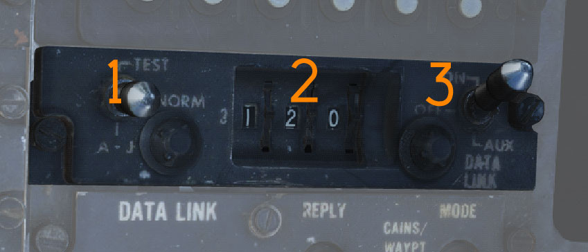

### Transmission Mode Switch

The transmission mode switch (<num>1</num>) selects data link transmission mode.

- TEST - Initiates system test.
- NORM - Normal operational mode.
- A/J - Anti-jam transmission mode.

### Frequency Select Wheels

The frequency select thumbwheels (<num>2</num>) set the data link frequency.

### Data Link Power Switch

The data link power switch (<num>3</num>) applies power to the data link and is
also used to select AUX (auxiliary) mode.

## Data Link Reply and Antenna Control Panel

Panel (<num>10</num>) controlling data link alignment, reply, and antenna
selection.

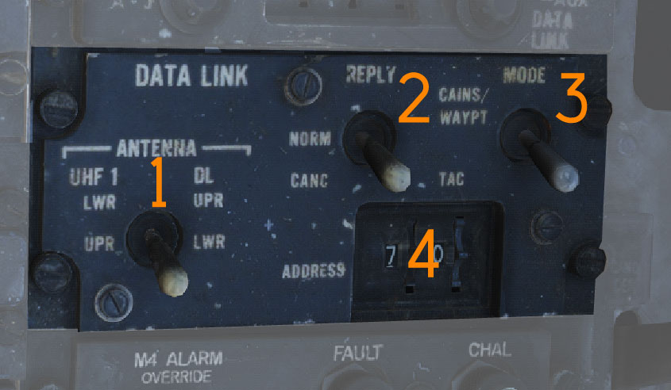

### Antenna Switch

The ANTENNA switch (<num>1</num>) selects the antenna used for UHF 1 and the
data link.

### Reply Switch

The REPLY switch (<num>2</num>) controls data link reply transmission.

- NORM - Reply transmission enabled.
- CANC - Reply transmission disabled (cancelled).

### Datalink Mode Switch

The MODE switch (<num>3</num>) is spring-loaded to TAC and held by solenoid.

- CAINS/WAYPT - Enables data link alignment and waypoint update.
- TAC - Enables manual frequency selection and stops alignment/waypoint update.

### Address Thumbwheel

The ADDRESS thumbwheel (<num>4</num>) sets the aircraft data link address.

This sets the two least-significant digits; remaining digits are set by ground
crew.

## AA1 Control Panel

AN/APX-76 interrogator control panel(<num>11</num>).

AN/APX-76 interrogator control panel.

> 💡 Due to DCS limitations in regards to IFF the AA1 control panel is currently
> non-functional.

### M4 Alarm Override Switch

The M4 ALARM OVERRIDE switch (<num>1</num>) disables the Mode 4 tone alarm in
the RIO headset.

### Test / Challenge CC Switch

The TEST-CHAL CC switch (<num>2</num>) is spring-loaded to center and controls
IFF test and challenge functions.

- TEST - Momentary actuation interrogates own transponder. With matching codes,
  two solid lines appear on the DDD at 3 and 4 miles.
- CHAL CC - Momentary actuation starts a 10-second interrogation cycle. Only
  returns with correct mode and code are displayed on the DDD.

### Code Selector Thumbwheels

The CODE selector thumbwheels (<num>3</num>) set interrogation mode and code.

The first wheel sets mode, and the last four wheels set code.

### Challenge Light

The CHAL light (<num>4</num>) illuminates during active interrogation.

### Fault Light

The FAULT light (<num>5</num>) indicates an AN/APX-76 fault.

## Interior Light Control Panel

Panel controlling RIO cockpit lighting (<num>12</num>).

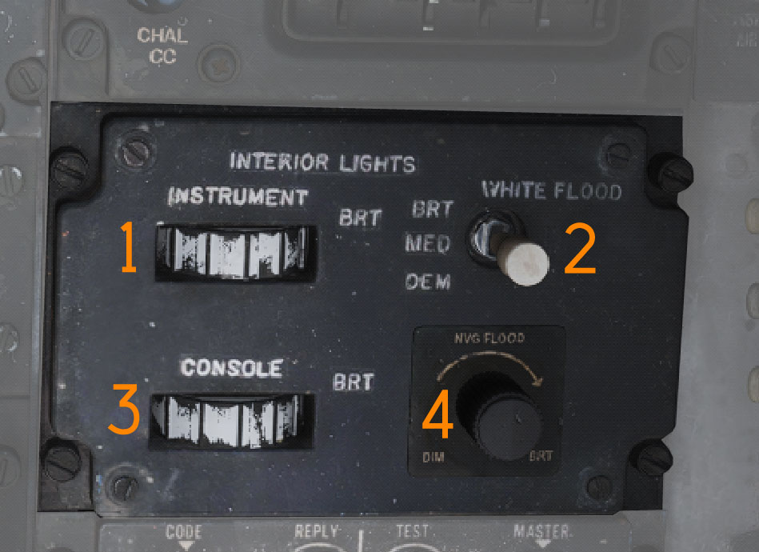

### Instrument Lighting Thumbwheel

The INSTRUMENT thumbwheel (<num>1</num>) controls instrument panel lighting
intensity.

- 0 - Off
- 1–14 - Increasing brightness

### White Flood Switch

The WHITE FLOOD switch (<num>2</num>) enables white flood lighting.

DIM and BRT settings are available. The switch is locked to OFF unless pulled
out.

### Console Lighting Thumbwheel

The CONSOLE thumbwheel (<num>3</num>) controls console lighting and green flood
lighting.

- 0 - Console and green flood off
- 1–14 - Increasing console brightness

### NVG Flood Switch

The NVG FLOOD rotary (<num>4</num>) controls green instrument and console flood
lighting.

## IFF Transponder Control Panel

Control panel for the AN/APX-72 IFF transponder (<num>13</num>).

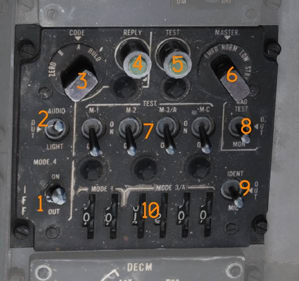

### Mode 4 Switch

The MODE 4 switch (<num>1</num>) enables Mode 4 operation.

### Mode 4 Audio/Light Switch

The MODE 4 AUDIO/LIGHT switch (<num>2</num>) enables Mode 4 audio monitoring
and/or reply light monitoring.

- AUDIO - Enables Mode 4 audio monitoring and reply light monitoring.
- OUT - Disables audio and light monitoring.
- LIGHT - Enables reply light monitoring only.

### Mode 4 Code Selector

The MODE 4 CODE selector (<num>3</num>) selects which cipher code is used.

- ZERO - Erases both ciphers.
- B - Selects B cipher.
- A - Selects A cipher.
- HOLD - Non-functional.

### Mode 4 Reply Light

The MODE 4 REPLY light (<num>4</num>) illuminates when a Mode 4 reply is
generated and transmitted.

The light can be pressed to test.

### Test Light

The TEST light (<num>5</num>) illuminates to indicate a successful test when a
mode test is performed.

The light can be pressed to test illumination.

### Master Selector

The MASTER selector (<num>6</num>) selects AN/APX-72 operating state.

- OFF - No power.
- STBY - Standby for immediate operation when another mode is selected.
- LOW - Low sensitivity replies; responds only to strong nearby interrogators.
- NORM - Normal reply operation.
- EMER - Emergency replies to Mode 1, 2, and 3/A and normal reply to Mode C,
  regardless of mode switch settings.

### Mode Switches

The MODE switches (<num>7</num>) control individual IFF mode operation.

- TEST - Tests the respective mode; correct operation indicated by TEST light.
- ON - Enables the mode.
- OUT - Disables the mode.

### Rad Test / Out / Mon Switch

The RAD TEST-OUT-MON switch (<num>8</num>) controls ground test and monitoring
of non-Mode 4 replies.

- RAD TEST - Not used by aircrew.
- OUT - Disables test and monitoring.
- MON - Monitors Mode 1, 2, 3, and C by illuminating the TEST light when replies
  are generated and transmitted.

### Ident / Out / Mic Switch

The IDENT-OUT-MIC switch (<num>9</num>) controls Mode 1–3 IDENT functionality.

- IDENT - Momentary; enables IDENT replies for 15–30 seconds after release.
- OUT - IDENT disabled.
- MIC - Transfers IDENT control to crewmember UHF PTT; IDENT replies occur when
  PTT is keyed.

### Code Thumbwheels

The code thumbwheels (<num>10</num>) set Mode 1 and Mode 3 codes.

Six thumbwheels are provided.

## DECM Control Panel

Control panel for the AN/ALQ-126 DECM jammer (<num>14</num>).

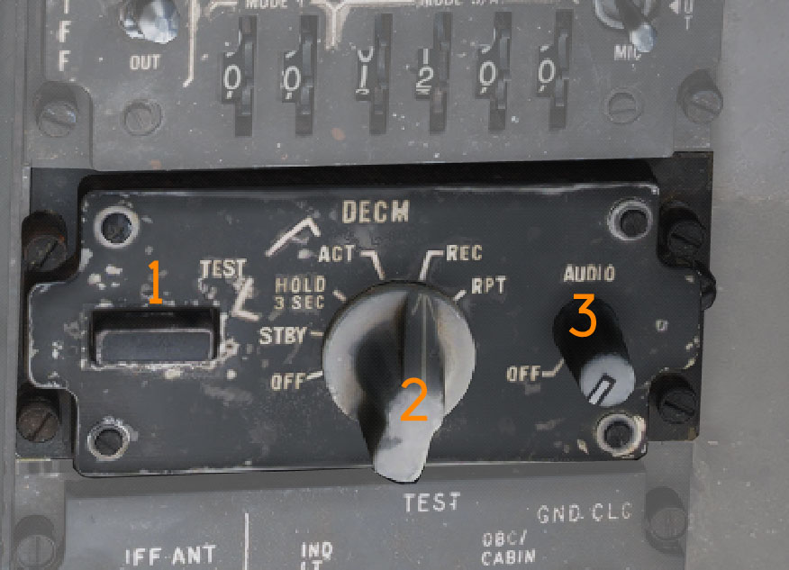

### Standby Light

The STANDBY light (<num>1</num>) is an orange warm-up indication when the system
is placed in STBY.

The light extinguishes after warm-up. Illumination during test or operation
indicates a fault.

### DECM Selector

The DECM selector (<num>2</num>) controls AN/ALQ-126 power and operating mode.

Selectable modes are:

- OFF - Removes power from the AN/ALQ-126.
- STBY - Standby warm-up mode.
- TEST/HOLD 3 SEC - Hold for three seconds to arm the system test.
- TEST/ACT - Initiates AN/ALQ-126 BIT after the TEST/HOLD 3 SEC step.
- REC - Receive and analyze threat signals. Missile launch detection may force
  the system into repeat.
- RPT - Repeat mode, transmits programmed responses to detected threats.

### Audio Knob

The AUDIO knob (<num>3</num>) sets jammer audio volume to the RIO headset.

## IFF Antenna Control / Test Panel

Panel containing (<num>15</num>) IFF antenna selection, BIT controls, and ground
cooling control.

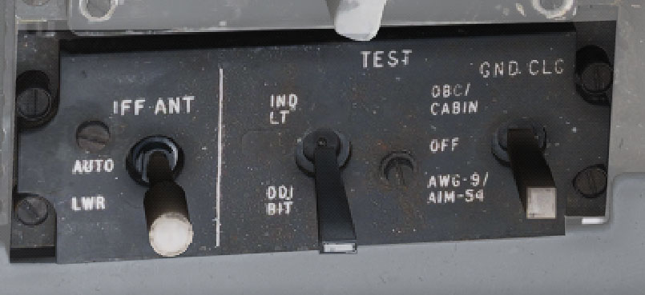

### IFF Antenna Switch

The IFF ANT switch (<num>1</num>) selects which antenna the IFF transponder
uses.

- AUTO - Automatic selection.
- LWR - Forces lower antenna selection.

### Indicator Light / DDI BIT Switch

The IND LT/DDI BIT switch (<num>2</num>) initiates DDI BIT and tests RIO
indicator lights.

### Ground Cooling Switch

The GND CLG switch (<num>3</num>) enables external air cooling while on the
ground.

- OBC/CABIN - External air into cabin and electronics cooling with reduced OBC
  performance.
- OFF - External air not used.
- AWG-9/AIM-54 - External air used to cool AWG-9/AIM-54 more effectively;
  disables external cabin air.

### Left and Right Test Lights

The left and right test lights (<num>1</num>) illuminate during an MCB test to
indicate successful test results for the respective engine circuits.

### MCB Test Switch

The MCB test switch (<num>2</num>) initiates the MCB circuit test.

## Canopy Defog / Cabin Air Lever

The canopy air diffuser lever (<num>16</num>) controls distribution of
conditioned cabin air.

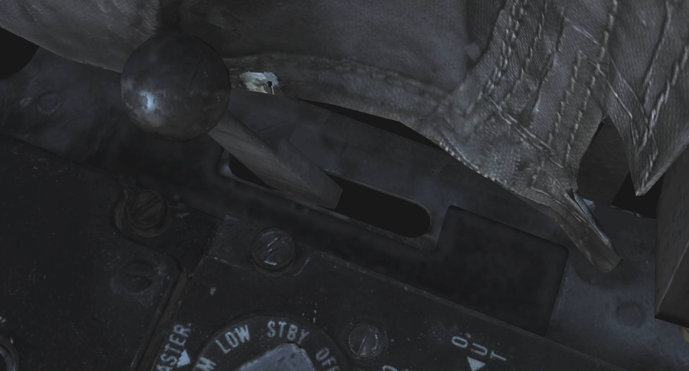

- CABIN AIR - Normal position. Directs approximately 70% of airflow through
  cockpit air diffusers and 30% through canopy diffusers.
- CANOPY DEFOG - Directs all airflow through canopy diffusers for canopy defog.
