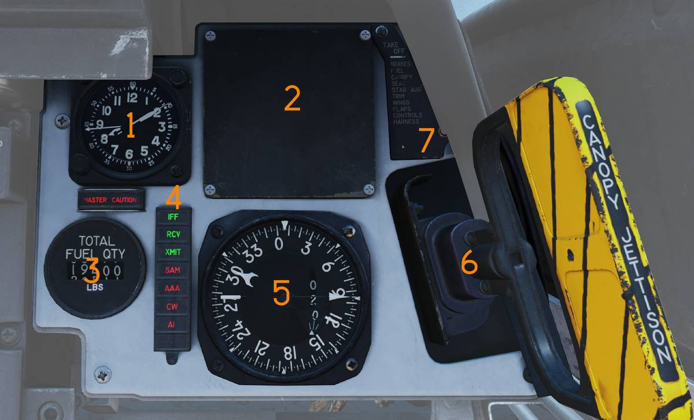
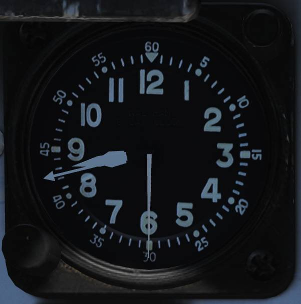
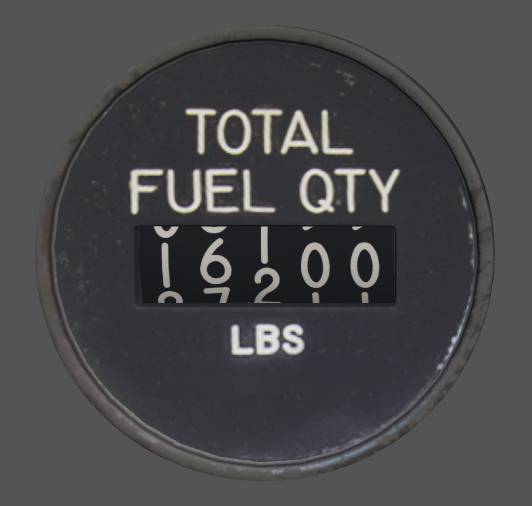
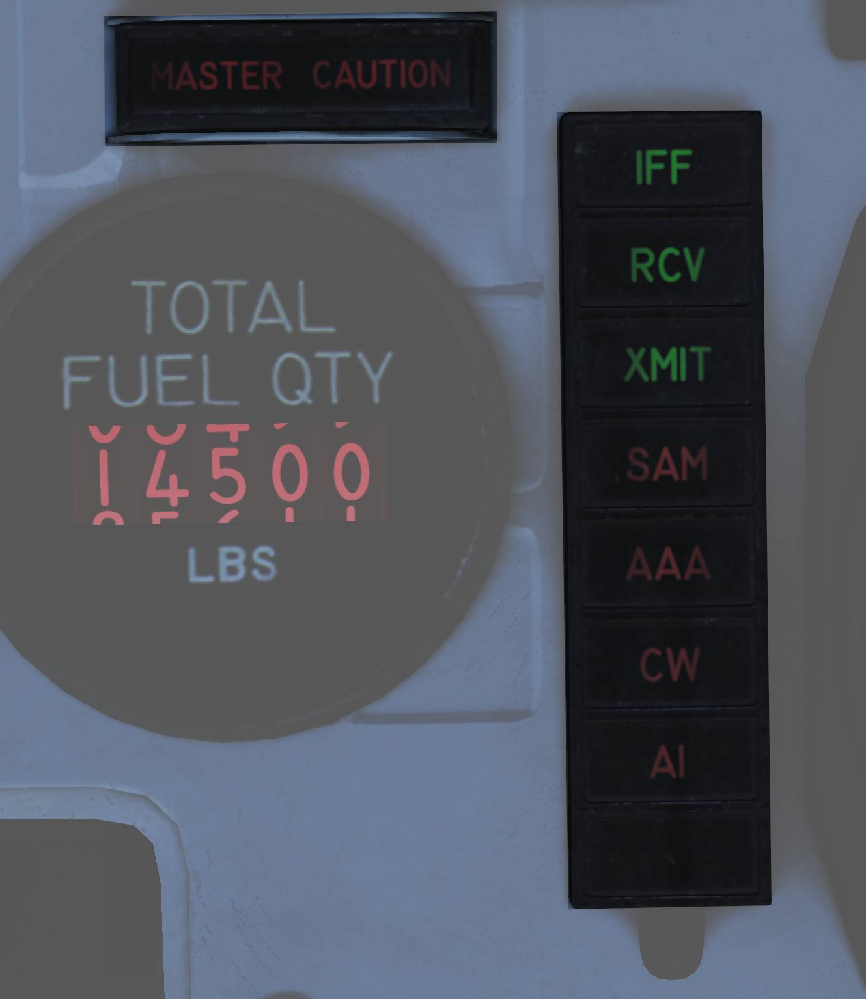
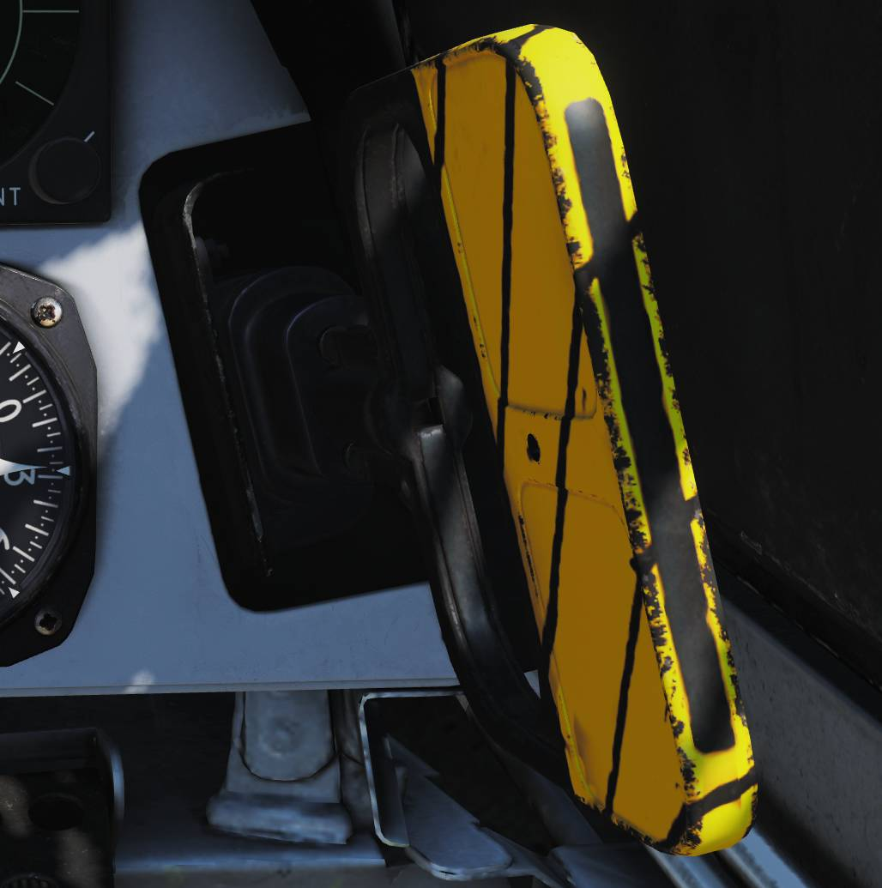

# Right Instrument Panel

> 💡 The Right Instrument Panel consists of the:
>
> - Clock (<num>1</num>)
> - ALR-67 Indicator (<num>2</num>)
> - Fuel Quantity Totalizer (<num>3</num>)
> - Threat Advisory and Master Caution Lights (<num>4</num>)
> - Bearing Distance Heading Indicator (BDHI) (<num>5</num>)
> - Canopy Jettison Handle (<num>6</num>)
> - Landing Checklist (<num>7</num>)

## Clock

Mechanical wind-up clock(<num>1</num>).

The wind/set knob (<num>1</num>) is located on the lower left corner.

- Rotate clockwise to wind the clock.
- Pull out and rotate to set the hour and minute hands.

The elapsed-time control (<num>2</num>) is located on the upper right corner and
is used to start, stop, and reset the 1-hour elapsed time counter.

## ALR-67 Blank (RWR now displayed on ECMD)

The [PMDIG](../../systems/pmdig/overview.md) section of this manual has a
detailed explanation of the ECMD RWR symbology.

## Fuel Quantity Totalizer

The fuel quantity totalizer (<num>3</num>) displays total fuel quantity in all
aircraft tanks.

## Threat Advisory and Master Caution Lights

Master caution light and ECM/IFF advisory and warning indications(<num>4</num>).

The MASTER CAUTION light and reset button flashes to indicate a status change on
the RIO caution/advisory panel.

Press to acknowledge and extinguish the light until the next event.

### ALR-67 Caution Lights

| Indicator | Function                                                                                                                       |
| --------- | ------------------------------------------------------------------------------------------------------------------------------ |
| IFF       | Advisory light indicating received mode 4 interrogation without own system generating a reply.                                 |
| RCV       | Advisory light indicating ALQ-126 is receiving a threat identification signal.                                                 |
| XMIT      | Advisory light indicating ALQ-126 is transmitting.                                                                             |
| SAM       | Warning light, steady illumination when detecting lockon from a SAM tracking radar. Flashes when a missile launch is detected. |
| AAA       | Warning light, steady illumination when detecting lockon from a AAA tracking radar. Flashes when AAA engagement is detected.   |
| CW        | Warning light indicating detection of a continuous wave emitter.                                                               |
| AI        | Warning light, steady illumination when detecting lockon from an airborne interceptor radar.                                   |

## Bearing Distance Heading Indicator (BDHI)

Display indicating azimuth, distance and bearing information (<num>5</num>).

### No. 2 Bearing Pointer

The No. 2 bearing pointer (<num>1</num>) indicates magnetic course to the tuned
TACAN station.

### Compass Rose

The compass rose (<num>2</num>) indicates aircraft magnetic heading.

### No. 1 Bearing Pointer

The No. 1 bearing pointer (<num>3</num>) indicates bearing to the tuned UHF/ADF
station.

### Distance Counter

The distance counter (<num>4</num>) indicates slant range to the tuned TACAN
station in nautical miles.

(Not visible in the referenced image.)

## Canopy Jettison Handle

The canopy jettison handle (<num>6</num>) is used to manually jettison the
canopy.

