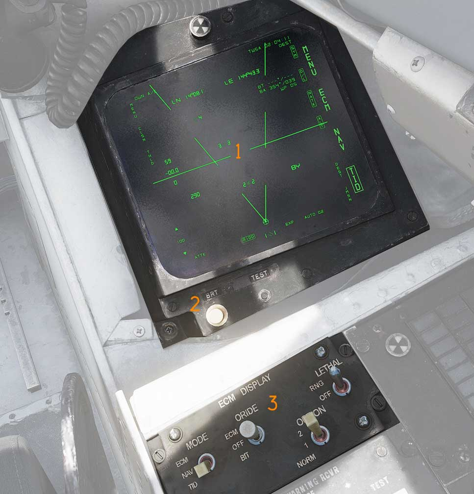

# Right Vertical Console

## Electronic Countermeasures Display (ECMD)

The ECMD (<num>1</num>) a brightness control kno (<num>2</num>), test button and
a BIT indicator showing the status of the display (solid black when operational,
showing white flags when indicating a fail condition).

The ECMD is controlled via the ECMD control panel (<num>3</num>). For a detailed
description of the ECMD reference the
[PMDIG Section](../../systems/pmdig/overview.md).
