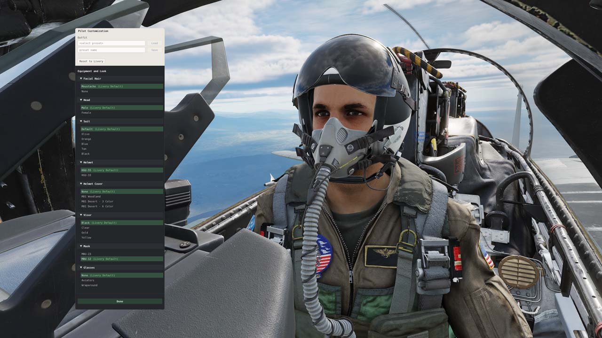
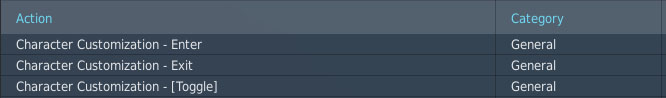
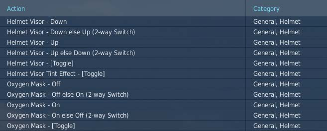
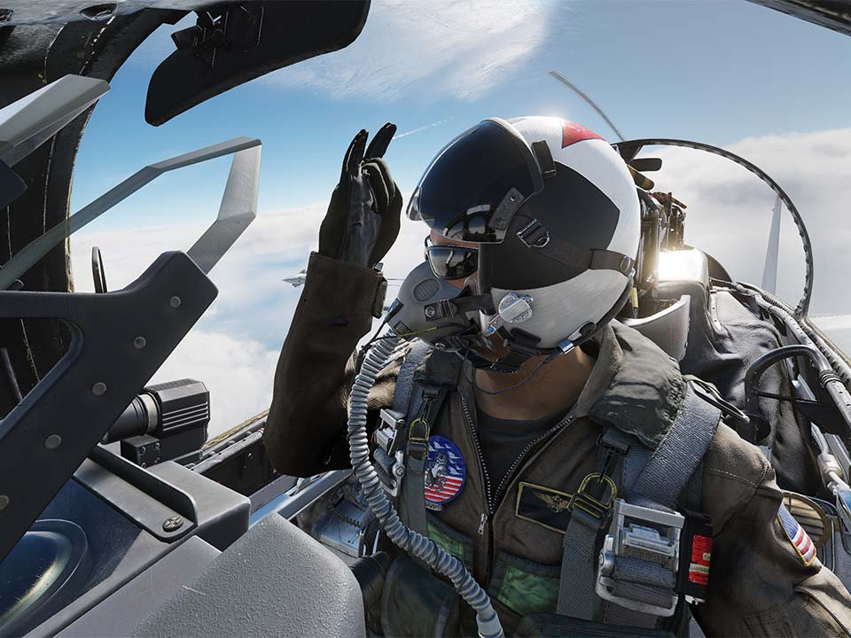
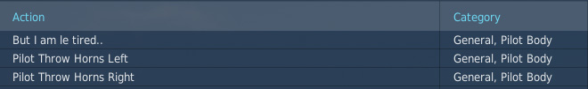
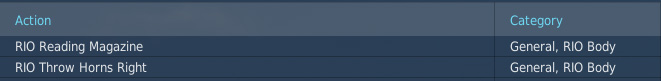

# Character

## Customization

The Pilot and RIO character can be customized through an in-game menu which
allows, for example, selecting one of the many flight suit variations. This menu
can be entered via an assignable special bind.

The outfit presets can be saved and loaded using the in-game menu. They are
saved locally at `C:\Users\John Doe\Saved Games\DCS_F14\character_presets`.
Presets already stored in that folder can be loaded using the select preset
dropdown.

The defaults for the currently selected aircraft livery as shown with the
`(Livery Default)` text next to the customization option. If one desires to
reset their customization back to the livery's defaults, pressing the
`Reset to Livery` button will reset the Pilot/RIO customization back to the
livery's defaults.

### Options

Customization options currently include:

- Facial Hair
  - Moustache
  - None
- Head
  - Male
  - Female
- Flight Suit
  - Default
  - Olive
  - Orange
  - Blue
  - Tan
  - Black
- Helmet
  - HGU-55
  - HGU-33
- Helmet Cover
  - None
  - M81 Woodland
  - M81 Desert - 3 Color
  - M81 Desert - 6 Color
- Visor
  - Black
  - Clear
  - Gold
  - Yellow
- Mask
  - MBU-23
  - MBU-12
- Glasses
  - None
  - Aviators
  - Wraparound

## Visor and Oxygen Mask Visibility

In addition to the ability to customize the visor and oxygen mask, the visor can
be lowered and the oxygen mask can be removed using assignable special binds.

> 💡 Lowering the visor with the
> "[Tinted Visor Effect](special_options.md#tinted-visor-effect)" special option
> enabled will result in the tinted visor effect being shown.

## Selfie Mode

To enable great screenshots, a special _Selfie Mode_ can be entered via an
assignable special bind.

In this mode, the character model is rendered even though the player is
currently in First-Person-View (<kbd>F1</kbd>).

The camera can then be moved for example to the front via standard DCS controls:

- <kbd>RCtrl</kbd> + <kbd>RShift</kbd> + <kbd>8</kbd> (Numpad): Move up
- <kbd>RCtrl</kbd> + <kbd>RShift</kbd> + <kbd>2</kbd> (Numpad): Move down
- <kbd>RCtrl</kbd> + <kbd>RShift</kbd> + <kbd>4</kbd> (Numpad): Move left
- <kbd>RCtrl</kbd> + <kbd>RShift</kbd> + <kbd>6</kbd> (Numpad): Move right
- <kbd>RCtrl</kbd> + <kbd>RShift</kbd> + <kbd>/</kbd> (Numpad): Move forward
- <kbd>RCtrl</kbd> + <kbd>RShift</kbd> + <kbd>\*</kbd> (Numpad): Move aft

The view can be turned back to face the pilot by using <kbd>LAlt</kbd> +
<kbd>C</kbd> and then using the mouse.

Additionally, another special bind exists to freeze the character model
movement.

By default, the cameras movement area is restricted to avoid glitching the view
during normal flight (for example when moving the head into a panel during VR).
This restriction can be lifted by editing
`<DCS Install Folder>/Mods/aircraft/F14/Entry/Views.lua`, allowing moving the
camera anywhere in the cockpit.

## Crew Animations

There are several special binds available to the Pilot and RIO for special
animations to be played using the character models.

