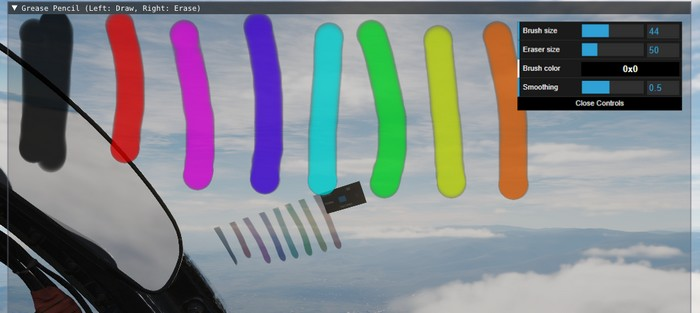
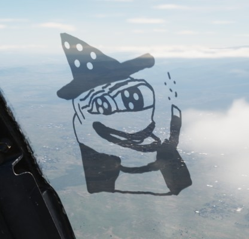

# Grease Pencil

Both crew members can use a grease pencil to draw on the side of their canopy.

The interface can be opened by clicking on the corresponding spot on the right
front side of the canopy.

Holding down left click allows drawing, while right click will use the eraser.

After closing the window by clicking on the canopy spot again, the results are
rendered on the canopy.

