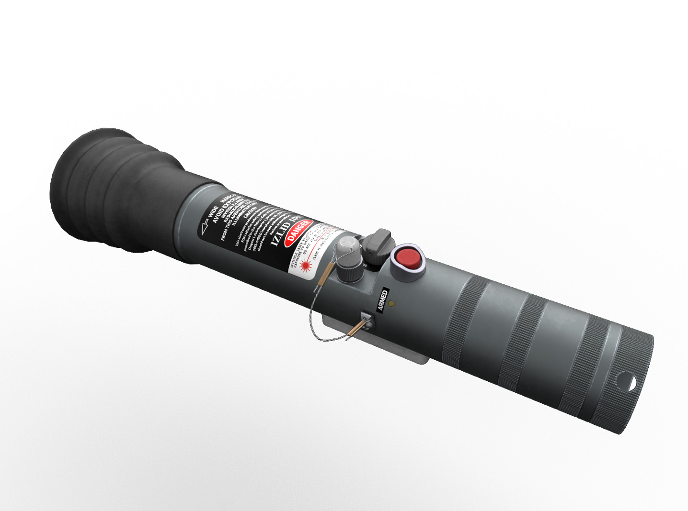
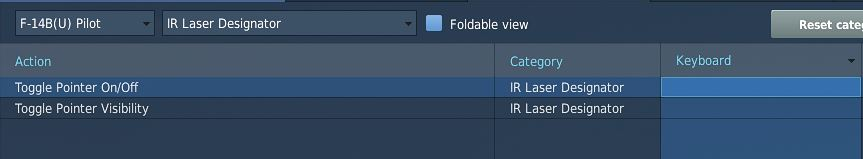
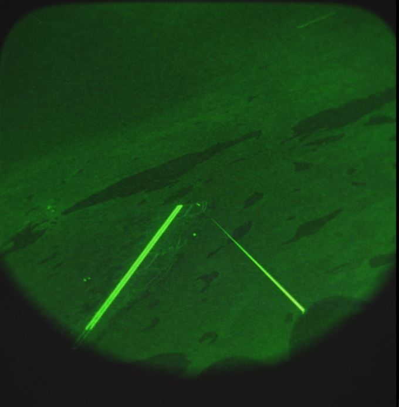

# Laser Pointer Designator

As the Tomcat became the Navy's premier FAC(A) platform in the late 1990s, the
Infrared Zoom Laser Illuminator Designator was introduced to provide FAC(A)
aircrews with the ability to visually designate targets from the air. First
operationally combat-tested during Operation Allied Force in 1999, the IZLID
proved its usefulness by enabling the instantaneous designation of tactical
targets to other Night Vision Goggle (NVG)-equipped aircraft, resulting in
immediate target identification and weapons delivery at night. This capability
was primarily used for target talk-ons and the visual designation of targets.

In DCS, the Laser Pointer designator can be enabled with a keybind and activated
with a separate keybind. It is slaved to the player's line of sight. The IR
laser is only visible through night vision goggles during nighttime operations.

Below a usage example of using the laser pointer designator under night vision
googles.

