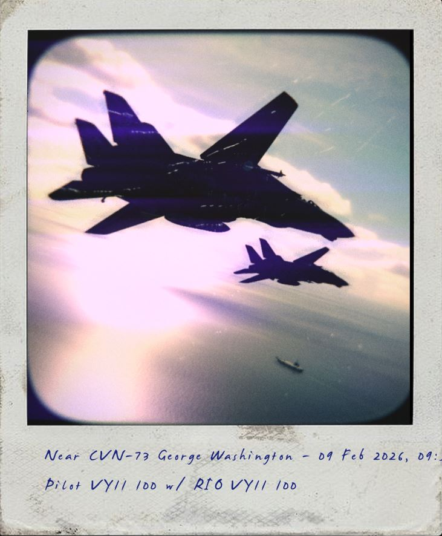
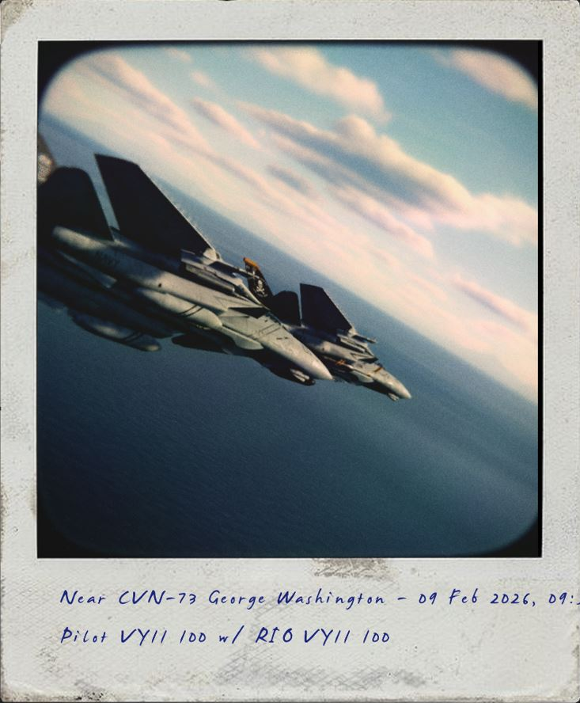
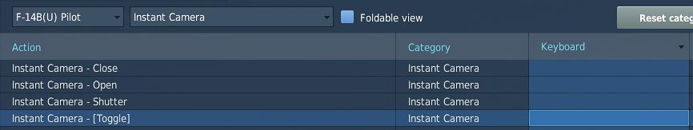
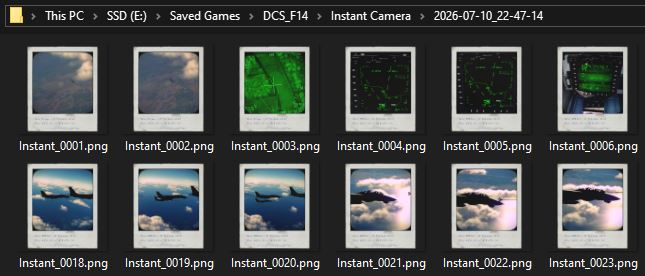

# Instant Camera

Cameras such as those made by Polaroid were a common sight before the widespread
adoption of digital cameras. They were often personally purchased by aircrew for
capturing memorable images, but they also served a practical purpose. Instant
cameras allowed crews to quickly document subjects such as intercepted aircraft,
mission events, and other items of interest without the delay associated with
traditional film processing.

|                                                                    |                                                                       |
| :----------------------------------------------------------------: | --------------------------------------------------------------------- |
|  |  |

In DCS, the instant camera can be opened with a keybind, and the shutter can be
activated with a separate keybind. The text below the image can be modified
during flight by selecting the text field with the mouse cursor.

Your Instant Camera shots are stored in the `Saved Games/DCS_F14/Instant Camera`
directory.

