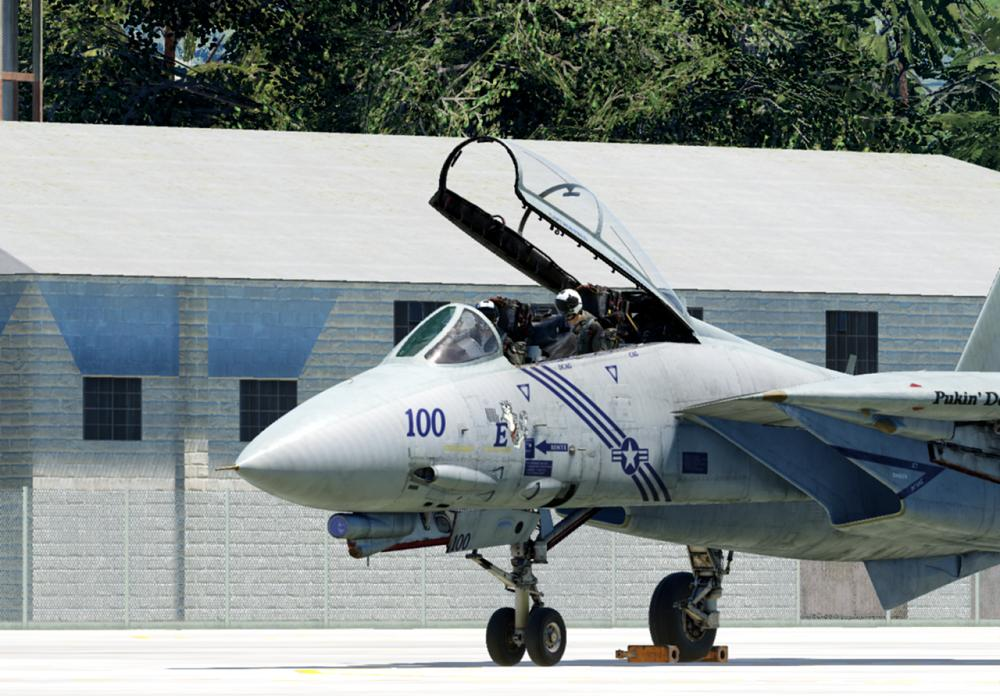

# Lesson 02a: F-14B(U) Cold Start Airfield PILOT

## Lesson 02a: Introduction

Welcome to the cold & dark startup of the F-14B(U) Tomcat on an airfield! Your
aircraft is spawned cold on the apron in Batumi airfield, and you are placed in
the PILOT seat. It is not possible to switch seats during the course of the
lesson.

## Objectives

The instructor will guide you through an extremely abbreviated INTERIOR
INSPECTION procedure, the full PRESTART procedure, the full ENGINE START
procedure, and the full POSTSTART procedure for land-based operations, until
reaching "ready for taxi". You will then have the choice to either taxi &
takeoff on your own discretion without guidance, or to end the lesson.

## Prerequisites

For the procedures covered in this lesson you do not need experience on the
older versions of the Tomcat.

It is recommended that you first glance over the procedures in order to get a
first overview. Look into your kneeboard or the pictures in the briefing window.
Following the procedures from top to down, you may then read through the
respective sections in the aircraft manual for each aircraft system, although
this takes a considerable amount of time and is not really required for
accomplishing the lesson. Another option is to hop into the jet, start over with
the lesson, and in case you are interested in more details on a certain system,
open up the in-game manual and read after while going through the procedures.

## System tests

As you will notice, many steps during the course of the procedures are system
tests. If you don't want to perform them, you may bypass them by pressing
SPACEBAR during the explanations. For the purpose of DCS, these tests are in
fact not necessary, because in DCS the aircraft is always spawned in a perfect
condition. All such steps are introduced with the phrase "SYSTEM TEST" in the
on-screen text of the DCS window. Please note that during such steps, certain
levers / switches / controls still must be set according to the procedure, so
look out for the label "REQUIRED: " in the on-screen text. This means that you
have to set the levers / switches / controls to a certain position, but it is
not necessary to perform a system test. The reason behind is that systems
covered in subsequent steps might need the specific levers / switches / controls
set to this very position in order to work properly on their side.

## Interaction

Considering you set everything correctly, you can skip instructions by pressing
SPACEBAR, although for many steps it's better to listen carefully before taking
action!

## Duration

Considering you listen to all instructions and perform all system tests
carefully, this lesson takes about 30 minutes. If you skip the instructions and
leave out all system tests, this lesson takes about 10 minutes.

## Lesson 02a: Keybindings

Before flying the lesson, check & assign all necessary actions and keybindings
for the F-14B(U) Pilot! Take special care for bindings that have no clickable
control elements in the cockpit!

### F-14B(U) Pilot → Category → Axis Commands

| Command         | Suggested Assignment                                                   |
| --------------- | ---------------------------------------------------------------------- |
| Pitch           | To be assigned                                                         |
| Roll            | To be assigned                                                         |
| Rudder          | To be assigned                                                         |
| Throttle Left   | To be assigned                                                         |
| Throttle Right  | To be assigned                                                         |
| Throttle (both) | Alternatively assign this if you only have one throttle axis available |

### F-14B(U) Pilot → Category → Stick

| Command                                         | Suggested Assignment   |
| ----------------------------------------------- | ---------------------- |
| Autopilot Reference / Nosewheel Steering Toggle | <kbd>N</kbd>           |
| DLC Toggle / Countermeasure Dispense            | To be assigned         |
| DLC Thumbwheel Forward                          | To be assigned         |
| DLC Thumbwheel Aft                              | To be assigned         |
| Trigger                                         | De-assign **Spacebar** |

### F-14B(U) Pilot → Category → Throttle

| Command                           | Suggested Assignment |
| --------------------------------- | -------------------- |
| Exterior Lights Master Switch ON  | To be assigned       |
| Exterior Lights Master Switch OFF | To be assigned       |
| Left Engine Cutoff - ON           | To be assigned       |
| Right Engine Cutoff - ON          | To be assigned       |
| Wing Sweep Forward                | To be assigned       |
| Wing Sweep Aft                    | To be assigned       |
| Wing Sweep Auto Mode              | To be assigned       |
| Wing Sweep Bomb Mode              | To be assigned       |

### F-14B(U) Pilot → Category → Communications

| Command            | Suggested Assignment |
| ------------------ | -------------------- |
| Communication Menu | <kbd>\\</kbd>        |

### F-14B(U) Pilot → Category → Flight Control

| Command         | Suggested Assignment                 |
| --------------- | ------------------------------------ |
| Flaps Up        | <kbd>Left Shift</kbd> + <kbd>F</kbd> |
| Flaps Down      | <kbd>F</kbd>                         |
| Trim Pitch Up   | <kbd>Right Ctrl</kbd> + <kbd>.</kbd> |
| Trim Pitch Down | <kbd>Right Ctrl</kbd> + <kbd>;</kbd> |

### F-14B(U) Pilot → Category → Gears, Brakes, and Hook

| Command                    | Suggested Assignment                 |
| -------------------------- | ------------------------------------ |
| Gears Up                   | <kbd>Left Shift</kbd> + <kbd>G</kbd> |
| Gears Down                 | <kbd>Left Ctrl</kbd> + <kbd>G</kbd>  |
| Speed Brake Extend         | <kbd>Left Ctrl</kbd> + <kbd>B</kbd>  |
| Speed Brake Retract        | <kbd>Left Shift</kbd> + <kbd>B</kbd> |
| Wheel Brake Both (Gradual) | To be assigned                       |

### F-14B(U) Pilot → Category → Jester AI

| Command     | Suggested Assignment                |
| ----------- | ----------------------------------- |
| Toggle Menu | <kbd>A</kbd>                        |
| Command 3   | <kbd>Left Ctrl</kbd> + <kbd>3</kbd> |
| Command 4   | <kbd>Left Ctrl</kbd> + <kbd>4</kbd> |

### F-14B(U) Pilot → Category → Systems

| Command              | Suggested Assignment                                       |
| -------------------- | ---------------------------------------------------------- |
| Seat Adjustment Up   | <kbd>Left Shift</kbd> + <kbd>S</kbd>                       |
| Seat Adjustment Down | <kbd>Left Alt</kbd> + <kbd>Left Shift</kbd> + <kbd>S</kbd> |

## Lesson 02a: Audio & Text

Always listen carefully to the instructor. Assume that everything he says is
important. All text is displayed at the top right corner of the screen. The text
remains visible on the screen for a maximum of 1000 seconds, until it either
disappears after that time, or is replaced by new text. You can access the
message log by pressing the ESC key, and then selecting MESSAGES HISTORY
anytime.

## Lesson 02a: Tips & tricks

_To be filled in once fellow pilots send some feedback ..._
